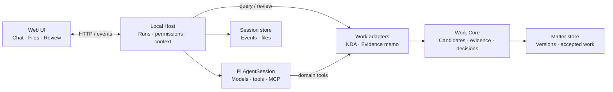

# CourtWork

让 AI 参与的工作持续推进。

CourtWork 是一个本地 AI 工作空间，把材料、执行过程、文件与审阅放在同一件工作里。你可以从一次对话开始，检查工具调用和生成的文件，再把工作接入事项：逐条审阅候选，打开引用的原文，留下决定，跨会话继续。

[体验 CourtWork](https://lesprivilege.github.io/Courtwork/) · [阅读论文](https://lesprivilege.github.io/Schema-Engineering/) · [运行文档](app/README.md)

## 工作如何留下来

一次运行会结束，专业工作往往需要多次交接、修订与确认。CourtWork 把每次执行留下的内容组织成可继续使用的工作状态。

- **过程可见。** 工具调用、提问、回答与运行状态按时间呈现。写入批准包含具体路径、内容与大小。
- **材料可追溯。** 生成文件保留字节身份；候选引用明确的来源版本与原文片段。
- **审阅有落点。** 接受、退回或要求补证据。每次决定绑定候选版本，修订与历史一起保留。
- **工作可续行。** 将 Chat 接入 Matter，在新的会话里继续处理同一事项，查看既有成果、决定与待办义务。
- **运行由你配置。** 选择 provider 或本地模型，管理资源、权限与 MCP。工作数据保存在本地。

仓库内含一个完整的 NDA 审阅场景，贯通材料、逐规则候选、证据引用、人工决定与修订。

## 本地运行

需要 Node.js 22.19+、Python 3 和 Git 2.36+。

```sh
git clone https://github.com/lesPrivilege/Courtwork.git
cd Courtwork
npm --prefix app ci
npm --prefix app start -- --data-dir /absolute/path/outside-repo/courtwork-data --port 8845
```

打开终端显示的地址。默认运行本地确定性 provider；在 Settings → Models 配置你的模型连接。详细配置、数据迁移与备份见 [运行文档](app/README.md)。

## 架构

Web UI 通过本地 Host 发起运行、查询与审阅。Host 编排 Pi AgentSession、权限和上下文；领域适配器把 NDA 等工作接入同一个 Work Core。Core 保存候选、证据、版本与决定。



CourtWork 将 [Schema Engineering 9.6](PAPER.md) 的工作状态模型落实为可运行的系统。模块入口与数据归属见 [架构文档](engineering/architecture.md)。

## 项目结构

| 目录 | 内容 |
|---|---|
| [app/](app/README.md) | Web UI、本地 Host、运行集成与 Work Core |
| [docs/](docs/README.md) | API、数据与界面契约 |
| [site/](site/README.md) | Pages 源码与交互样本 |
| [brand/](brand/README.md) | 独立 SVG 符号包 |
| [benchmarks/](benchmarks/README.md) | 可复现的符合性评测 |
| [engineering/](engineering/README.md) | 架构、设计与工程进展 |
| [evidence/](evidence/README.md) | 交付与验证记录 |
| [tools/](tools/README.md) | 检查与维护工具 |

## License

[MIT](LICENSE)
