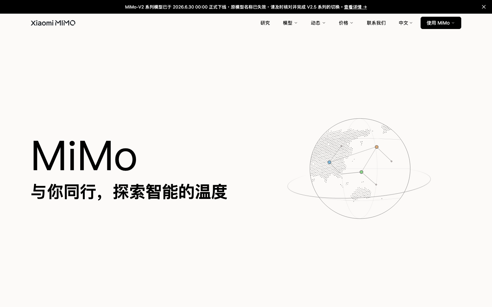
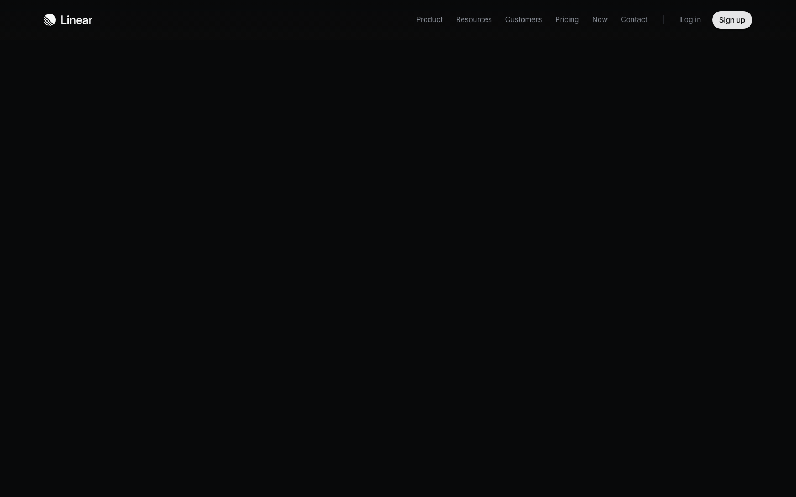
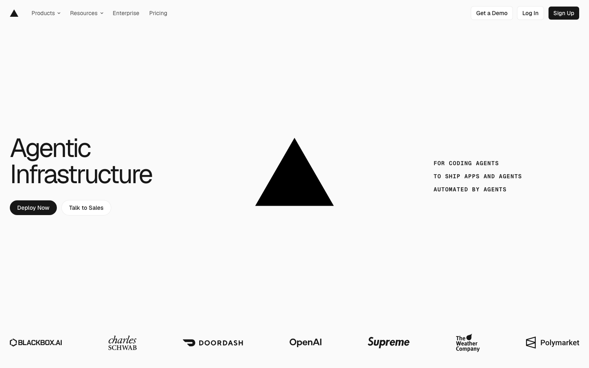
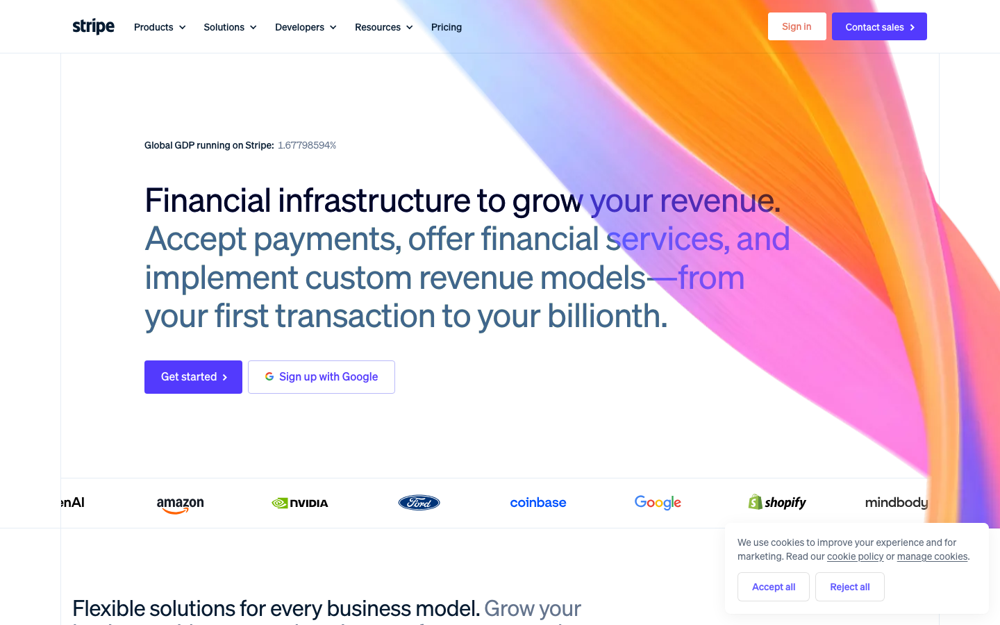
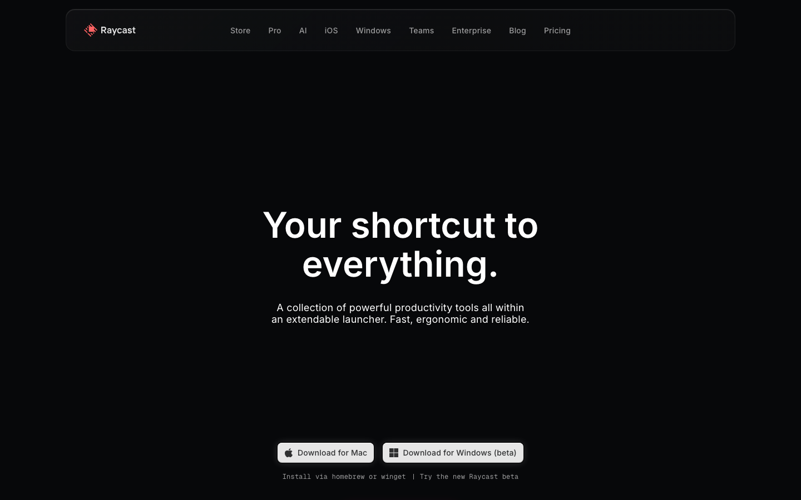
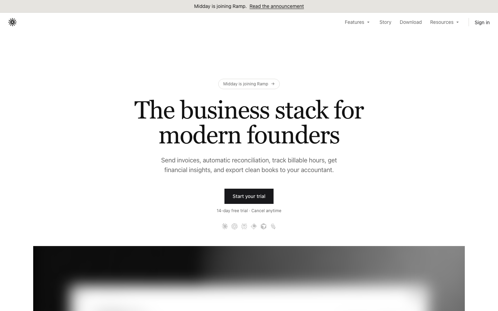
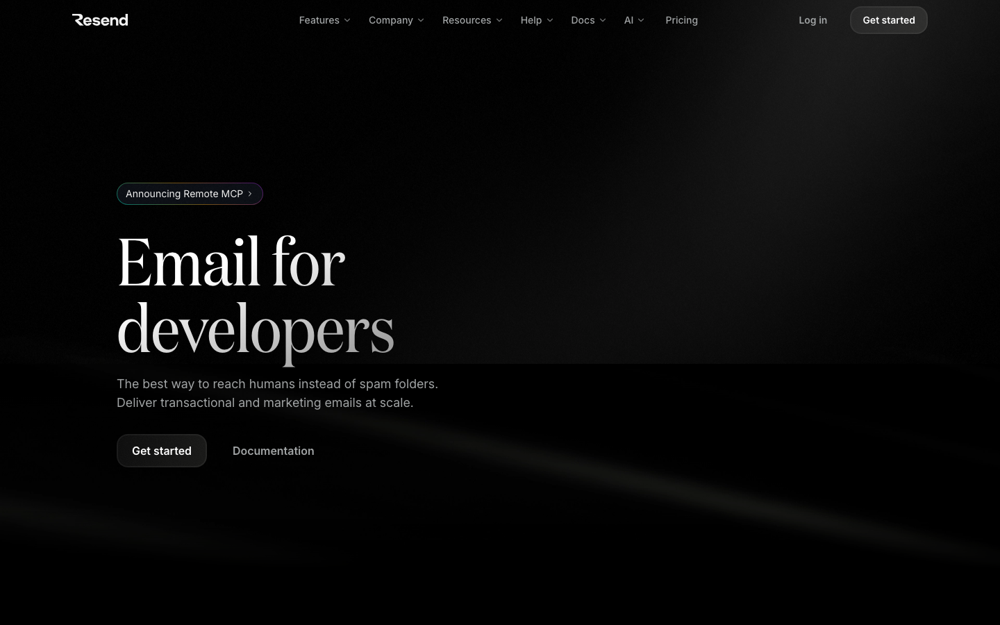
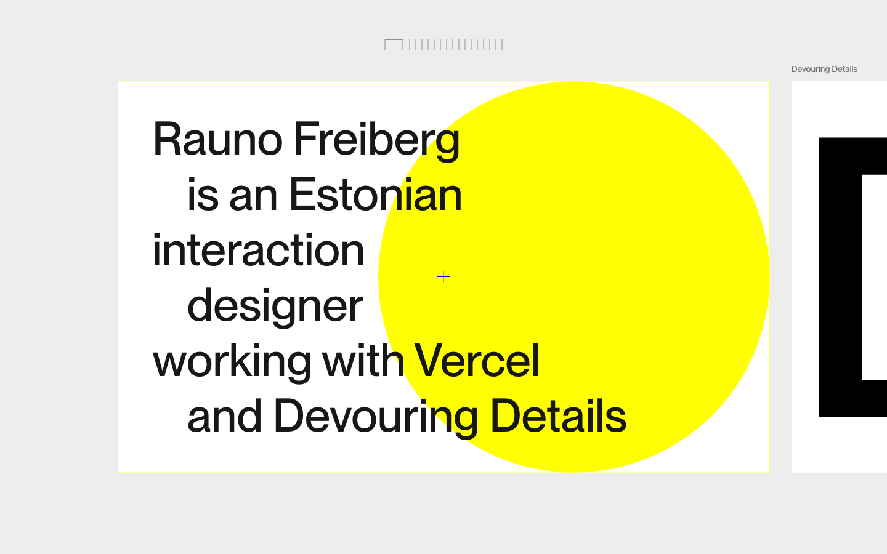

# 2026 冷调科技极简设计语言深度分析报告 —— 暨桌面法律工作台设计语言推演

本报告基于 2026 年最新视觉截图及网页底层 DOM/CSS 提取数据，实际拆解分析了 **mimo.mi.com**、**linear.app**、**vercel.com**、**stripe.com**、**raycast.com** 五大主流网站，并补充了 **midday.ai**、**resend.com**、**rauno.me** 三个具有代表性的高品味小众/独立站。

在此基础之上，结合“桌面法律工作台”的特定约束（**浅色主题、无衬线、法律 B2B 信任感、高信息密度、颜色预算给语义、规避暖黄奶油底+衬线体同质化审美**），输出针对性设计推演。

---

## 一、 八大网站设计系统核心指标对比

| 网站 | 核心字体系统 | 色彩基础与层级 | Spacing / 留白节奏 | 圆角与描边风格 | 动效克制度 | 签名动作 (Signature Action) |
| :--- | :--- | :--- | :--- | :--- | :--- | :--- |
| **mimo.mi.com** | H1: MiSans (120px) Body: Inter (16px) | 底色: `#fcfaf8` (暖白) 文字: `#000000`/`rgba(0,0,0,0.55)` | 极致松弛，大色块铺底，无明显界线 | 圆角: `10px` (`.625rem`)，无边框扁平填充 | 弱动效，以滑入与 SVG 渐显为主 | 3D 智能家居户型无界融合交互 |
| **linear.app** | H1: SF Pro/Inter Variable (64px) Body: Inter (16px) | 底色: `rgb(8,9,10)` 文字: `rgb(247,248,248)`/`rgb(138,143,152)` | 高密度，精确的 Gird，紧凑的列表间距 | 圆角: `6px`/`12px` 描边: `1px solid rgba(255,255,255,0.08)` | 极快过渡 (`0.1s`)，高内敛度 | 随鼠标移动的卡片边缘镭射光晕 (Border Glow) |
| **vercel.com** | H1: GeistSans (64px) Body: GeistSans (16px) | 底色: `rgb(250,250,250)` 文字: `rgb(23,23,23)`/`rgb(102,102,102)` | 中高密度，清晰的 Brutalist 单色网格 | 圆角: `4px` (小圆角) 描边: `1px solid rgb(235,235,235)` | 瞬时响应，滑动胶囊式 Nav 背景 | Geist 单色几何徽章与硬朗网格边框 |
| **stripe.com** | H1: Soehne-var (48px) Body: Soehne (16px) | 底色: `#ffffff` + 炫彩渐变 文字: `rgb(6,27,49)` (深海蓝) | 宽敞大气，通过负空间引导视线 | 圆角: `4px` (小圆角) 描边: 弱描边，多用柔和阴影 | 平滑缓动 (`0.24s`)，极具物理感 | 具有斜切角度的大幅彩色极光渐变背景 |
| **raycast.com** | H1: Inter (64px) Body: Inter (16px) | 底色: `rgb(7,8,10)` 文字: 白色 / `#78787c` | 极高密度，界面如 IDE 般紧凑 | 圆角: 外围 `20px` / 内围 `6px` 描边: `1px rgba(255,255,255,0.05)` | 仅在 Hover / Focus 动，面板弹出极干脆 | 3D 拟真发光 KBD 实体按键 (Keycap) |
| **midday.ai** | H1: Hedvig Letters Serif (72px) Body: Hedvig Sans (16px) | 底色: `#ffffff` 文字: `#121212` / 灰色 | 极高密度，财务账单式多栏表格 | 圆角: 容器 `8px` / 内层 `0px` 描边: `1px solid rgb(219,218,215)` | 几乎不动，强调数据的即时与稳定性 | 全局网格线 (Grid Lines) 构成类似蓝图的基底 |
| **resend.com** | H1: Domaine Serif (96px) Body: Inter (16px) | 底色: `#000000` 文字: `rgb(240,240,240)` | 中密度，现代发信日志布局 | 圆角: `6px` / 细致打磨 描边: 细描边，半透明叠加 | 微动效，卡片悬浮伴有极轻微的 Z 轴升起 | 具有轻微晶格噪声与物理金属反光的 Card 质感 |
| **rauno.me** | H1: System Sans (32px) Body: System Sans (16px) | 底色: `rgb(237,237,237)` (冷灰) 文字: `#000000` | 高密度，类似系统级 Finder 网格 | 圆角: `12px` (偏高，突出 tactile 触感) 描边: 无，靠微妙灰度层级作界限 | 弹性物理学 (Spring)，操作时晃动解压 | 物理拖拽回弹 (Physics Drag) 与极致跟手度 |

---

## 二、 逐站设计语言拆解 (以视觉截图与底层 CSS 为依据)

### 1. mimo.mi.com (小米自研智能空间)

*   **字体系统**：
    *   **中文字体**：使用了小米定制的 `MiSans` 配合 `PingFang SC`。这套字体在屏幕上具有极高的中宫张力，笔画末端圆润，中文字符间距处理得非常克制（大约 `tracking: -0.01em`），在高亮标题时有一种几何雕塑感。
    *   **字族与字阶**：H1 采用 `120px` 大字阶，行高为 `120px` (比例 1:1)；Body 为 `16px`/`24px`。
*   **色彩系统**：
    *   **色底与文字**：底色采用极其温暖的浅色系：页面背景为 `#fcfaf8`（非纯白），卡片为 `#faf7f3`（温暖燕麦奶油底），段落为 `#f3eee8`。文字层级为 `#000000`（主标题）与 `rgba(0, 0, 0, .55)`（副文本）。
    *   **语义/强调色**：强调色被极端剥夺，全站仅在需要警告或指示状态时使用 `--color-warning: #fda83a`。
*   **密度与留白**：采用极致“低密度”呼吸感，留白（Padding）多采用 `80px` 到 `120px` 的大段落隔断。
*   **圆角与描边**：圆角变量 `--radius: .625rem` (`10px`)。全站基本不采用描边，通过背景灰度（奶油色）的渐次加深进行区域区分。
*   **动效克制度**：典型的“缓慢流动”动效。按钮 Hover 动效使用 `transition: opacity 0.15s cubic-bezier(0.4, 0, 0.2, 1)`，极其柔和。
*   **签名动作**：**3D 智能家居模型无界嵌入**。高精度的 3D 家居渲染图仿佛直接生长在 `#fcfaf8` 的背景色中，没有任何边框框架遮挡，视觉完全融为一体。

---

### 2. linear.app (Linear)

*   **字体系统**：
    *   **字族**：`Inter Variable` 搭配 `SF Pro Display`。
    *   **字阶与字高**：H1 采用 `64px`，H2 为 `48px`，Body 采用 `16px`/`24px`。对标题的处理非常注重字重，Bold 字重特别设定在 `510`（在变体字体下微调，避开了粗鄙的 `600`/`700`，显得极其高雅纤细）。
*   **色彩系统**：
    *   **底色**：不是纯黑，而是高度内敛的暗煤灰 `rgb(8, 9, 10)`（即 `#08090a`）。
    *   **文字层级**：主文字 `rgb(247, 248, 248)`，次级文字为略带蓝灰的 `rgb(138, 143, 152)`。
    *   **强调色**：极其罕见地使用微弱的紫萝兰色 (`rgb(94, 106, 210)`)，绝不轻易宣泄。
*   **密度与留白**：在产品管理区域采用中高密度。信息卡片极其紧凑，利用表格化的边框和水平线进行信息区分，页面没有一像素是浪费的。
*   **圆角与描边**：内部圆角多为 `6px`，卡片外圈圆角为 `12px`。描边极具品味：`1px solid rgba(255, 255, 255, 0.08)`（在深色底上隐现，类似于金属切角产生的反光）。
*   **动效克制度**：操作响应极其迅速。过渡多为 `transition: ... 0.1s cubic-bezier(0.25, 0.46, 0.45, 0.94)`。动效只发生在鼠标划过（Hover）的微光移动和卡片缩放上，静态状态下没有任何浮躁动效。
*   **签名动作**：**随动霓虹边缘微光 (Cursor-Tracking Board Glow)**。当鼠标在卡片上方滑动时，卡片的极细描边会折射出一圈基于鼠标位置的渐变紫色微光，带来高级的数码硬件实体质感。

---

### 3. vercel.com (Vercel)

*   **字体系统**：
    *   **字族**：全站应用自研的 `GeistSans` 与 `GeistSans Fallback`（等宽字体为 `GeistMono`）。这套字体几何结构极强，在中低字阶下拥有优秀的防糊边缘（Anti-aliasing）。
    *   **字阶与字高**：H1 为 `64px`/`64px`，按钮文字为 `14px`/`20px`。
*   **色彩系统**：
    *   **底色与文字**：底色为带有极其微弱冷灰色调的白 `#fafafa`，卡片填充使用纯白 `#ffffff` 或相反的深黑 `#171717`。文字采用纯黑 `rgb(23, 23, 23)`，副文本为 `rgb(102, 102, 102)`。
    *   **强调色**：绝对黑白，极少使用蓝色或绿色（仅用于部署成功等语义状态）。
*   **密度与留白**：采用严谨的网格（Grid）系统，留白节奏紧凑，呈现出高可读性、高专业度的信息排布。
*   **圆角与描边**：极小圆角风格。按钮为 `4px`（Geist 默认圆角），卡片等主要为 `8px`。描边采用超细的 `1px solid rgb(235, 235, 235)`，没有任何多余的阴影堆叠。
*   **动效克制度**：极度克制。除了导航条在 Tab 间切换时使用带有物理缓动的胶囊型滑块外，全站交互没有任何旋转、弹跳或大范围缩放，所有面板展现皆是瞬时的（Instant Response）。
*   **签名动作**：**Geist 几何极简徽章与悬浮胶囊滑动 (Sliding Capsule Hover)**。导航菜单在 Hover 时会浮现一个微灰色的胶囊形状背景，并随着鼠标平滑滑动跟随到下一个选项，这种动效在保证零视觉干扰的前提下给出了极佳的反馈。

---

### 4. stripe.com (Stripe)

*   **字体系统**：
    *   **字族**：采用定制无衬线体 `sohne-var`（源自 Klim Type Foundry 的 Söhne，致敬纽约地铁导视的 Akzidenz-Grotesk 风格）。
    *   **字阶与行高**：H1 达到 `48px`，行高为 `55.2px` (比例约 1:1.15)；字重偏向轻盈的 `300` Weight，在大尺寸下呈现优雅感；正文和按钮则收束至 `14px`/`16px`。
*   **色彩系统**：
    *   **底色与文字**：页面主体在亮色下为纯白 `#ffffff`，但穿插了大量折射着霓虹极光的斜切色带。文字主色为冷色调的深海蓝 `rgb(6, 27, 49)`（而非纯黑，极大减轻视觉疲劳）。
    *   **语义与强调色**：拥有一套极度复杂的冷暖过渡色彩预算。它的蓝、绿、橙、红都是高饱和度但极其通透的 OKLCH 调节色。
*   **密度与留白**：属于低信息密度的营销页面，但其控制台 Dashboard（通过截图数据推演）是典型的高密度表单，以 `24px` 为主要网格步长。
*   **圆角与描边**：圆角同样克制在 `4px` (按钮) 和 `8px` (面板)。很少看到强硬的黑色描边，多用重叠的微弱多重投影（Multi-layered box-shadow）制造卡片浮空悬浮的实体感。
*   **动效克制度**：拥有极高的弹性动效美感。按钮 Hover 的变色时间设定在 `0.24s` 并采用 `cubic-bezier(0.45, 0.05, 0.55, 0.95)` 的慢进慢出曲线，十分丝滑。
*   **签名动作**：**斜切极光折光背景与形态自适应悬浮菜单 (Morphing Dropdown)**。当用户在导航栏 Hover 时，下拉菜单不仅有淡入，还会随着子菜单内容尺寸的变化，自动平滑地调整自身的长宽，这需要极强的工程与数学控制。

---

### 5. raycast.com (Raycast)

*   **字体系统**：
    *   **字族**：界面主字体为 `Inter`。按键与快捷键提示（KBD）独占 `GeistMono` / `JetBrains Mono`。
    *   **字阶与行高**：H1 `64px`/`70.4px`，正文为 `16px`/`18.4px` (紧凑的 `1.15` 倍行高，突出终端指令般的紧迫感)。
*   **色彩系统**：
    *   **底色与文字**：底色采用几乎纯黑的深灰 `rgb(7, 8, 10)`。主文字为纯白 `rgb(255, 255, 255)`，次级文字为偏冷偏暗的灰色 `rgb(194, 199, 202)`。
    *   **强调与语义色**：冷色调的荧光绿（常态语义）、深红（警告语义）和湖蓝色（操作语义）。
*   **密度与留白**：极致高密度。Raycast 是一套效率工具，其界面信息极其紧凑，利用分栏、细分割线和微型图标进行网格对齐，留白非常节约（Padding 多为 `8px` / `12px`）。
*   **圆角与描边**：外层大容器采用 `20px` 的圆角，但内部输入框、按钮等核心组件克制在 `6px` / `8px` 紧凑圆角。描边在 DOM 中体现为复杂的 `box-shadow` 内发光：`rgba(255, 255, 255, 0.1) 0px 1px 0px 0px inset, rgba(255, 255, 255, 0.06) 0px 0px 0px 1px inset`，模拟了铝合金键盘边缘的抛光面折光。
*   **动效克制度**：典型的“工具型动效”。任何交互（如按下 Tab、搜索列表刷新）都要求无延迟，因此其列表滚动、按键触发等动效都在毫秒级内完成，绝无任何冗长前戏。
*   **签名动作**：**拟真雕刻实体 KBD 键帽组件**。将 Mac 键盘上的 `⌘` `⌥` `K` 等实体键，通过 CSS `inset` 阴影和双层描边完美还原在页面上，成为产品最强烈的视觉锚点。

---

### 6. midday.ai (补充 niche 站：现代化财务工作台)

*   **字体系统**：
    *   **字族**：标题采用 `Hedvig Letters Serif`（带有一种极其古典、有分量感的衬线字体），正文与按钮采用无衬线体 `Hedvig Letters Sans`（类似 Inter 的几何黑体）。
    *   **字阶与行高**：H1 采用 `72px`/`72px`，表格等核心操作区文字下收至 `12px` / `18px`，字号差极大。
*   **色彩系统**：
    *   **底色与文字**：底色为纯白 `rgb(255, 255, 255)`，文字为高对比深黑 `rgb(18, 18, 18)`。
    *   **语义与强调色**：强调色几乎为零。其冷调科技感完全依靠浅灰色的系统边框 `--border: 45, 5%, 85%` 与单色调的图表来维持，颜色只服务于正负财务流水（绿色与红色）。
*   **密度与留白**：信息密度极高。页面采用了大量极细的浅灰单像素实线，将数据分割为像 EXCEL 或是工程蓝图一样的格子。
*   **圆角与描边**：**零圆角倾向**。虽然全局配置了 `--radius: .5rem`，但在实际的产品看板和表格中，大量的圆角被重写为 `0px`。描边极多，采用 `1px solid rgb(219, 218, 215)` 做纵横交错的对齐。
*   **动效克制度**：绝对静止。这套财务系统秉持“数据不应晃动”的理念，所有的切换、表格展开、数字变动都使用瞬发态，不设任何过渡延迟。
*   **签名动作**：**蓝图式全局网格分割线 (Engineering Gridlines)**。页面的外边框、内容区分以及图标底座，均通过细密的灰线向外无限延伸相交，构成一张几何底图。

---

### 7. resend.com (补充 niche 站：开发者发信服务)

*   **字体系统**：
    *   **字族**：H1 采用极为锋利的罗马衬线体 `domaine` (96px)，H2 和主要副标题采用干净的 Grotesque 字体 `aBCFavorit`，正文采用标准的 `Inter`。
    *   **字阶与中文字处理**：针对代码混排，其中英文混排极度注重字重对齐，代码区域（Code Block）使用细体 `Menlo`。
*   **色彩系统**：
    *   **底色**：极致的纯黑 `#000000` (Pitch Black)。
    *   **文字层级**：主文字为冷白色 `rgb(240, 240, 240)`，次级文本为带灰度的透明白 `rgba(241, 247, 254, 0.71)`。
*   **密度与留白**：中等密度。它通过把控段落之间极其微妙的间距（Gap）来维持结构，按钮 Padding 为紧凑的 `4px`。
*   **圆角与描边**：圆角固定在小巧的 `6px`。描边采用低对比度的深灰线，避免了冷黑底色上的视觉生硬。
*   **动效克制度**：仅在卡片悬浮时有微弱的 CSS `scale` 放大与 Z 轴阴影散开。其他位置（如侧边栏导航、Tab 切换）全部为静止响应。
*   **签名动作**：**玻璃质感卡片与噪点金属底纹 (Granular Glass Card)**。卡片上叠加了一层极其轻微的 CSS 噪点滤镜（Noise Overlay），配合半透明的背景，呈现出如同磨砂金属或毛玻璃般的冷科技实体质感。

---

### 8. rauno.me (补充 niche 站：Vercel 主设计师个人站)

*   **字体系统**：
    *   **字族**：全站无衬线，主要使用 `-apple-system`, `system-ui` 配合自定义的 `X` 字体。
    *   **字阶与字高**：完全打破了常规的大标题套路。H1 最大仅为 `32px`，几乎只比正文高两个字阶。没有大声疾呼的文案，一切像系统级控制台一样收敛。
*   **色彩系统**：
    *   **底色**：非常干净、毫无奶油杂质的**冷灰色底 `rgb(237, 237, 237)`**（即 `#ededed`）。
    *   **文字**：纯黑 `rgb(0, 0, 0)` 和深灰 `rgb(23, 23, 23)`。无任何彩色点缀。
*   **密度与留白**：中高密度。模仿 macOS 系统 Finder 或是 iOS 自带小部件的网格间距，采用 `16px` 作为基准 Spacing。
*   **圆角与描边**：**偏大圆角 `12px`**。为了在冷调的界面中注入些许“跟手、想去按”的物理实体感，其交互卡片和按钮多采用圆润的弧度，且完全不施加任何描边，仅依靠卡片阴影和微妙的灰度层级（如背景 `#ededed` 对卡片 `#ffffff`）来建立视觉落差。
*   **动效克制度**：**动效极度活跃但克制在“物理交互”层面**。Rauno 拒绝了无聊的淡入淡出，大量使用 Framer Motion 的弹簧物理公式（Spring Physics）对滑动、拖动和缩放进行渲染，极度跟手。
*   **签名动作**：**物理弹簧跟手拖拽卡片 (Spring Drag Action)**。页面上的卡片可以被用户随意拖拽，松手后像真实的物理卡片一样伴随着阻尼回弹，把“网页交互”彻底做成了“实体玩具”。

---

## 三、 面向中国律所的桌面法律工作台设计推演

结合背景约束：**浅色主题、无衬线、高信息密度、颜色预算给语义（风险/信源/修订）、规避“暖黄奶油底+衬线体”AI 糖衣审美**，以下是具体设计语言推演：

### 1. 哪些手法适合移植到该产品中？

*   **Rauno 式的“冷灰色底” (`rgb(237,237,237)`) 作为系统基底**：
    *   *理由*：律师是一项需要极度冷静、理性的职业。相比同质化的暖黄奶油底（容易带来情绪上的慵懒与妥协），高纯度的冷灰或冷白底色（如 `#f8f9fa` 或 `#ededed`）能够营造一种克制、专业、具有法庭质感和秩序感的空间氛围。
*   **Linear 的中文字体间距微调与 tight 字阶比例**：
    *   *理由*：法律文档包含大量的长难句与小字批注。我们可以引入 `MiSans` 或 `PingFang SC`，将段落行高严格规范在 `1.5`（阅读效率最高），中文字符间距强制微调 `letter-spacing: -0.01em`，标题与正文的字号差收窄（如 H1 20px，H2 16px，正文 14px，元数据 12px）。这样既保证了极高的信息承载量，又避免了文字发散导致的阅读疲劳。
*   **Vercel 的单色无影描边 (Flat Single-pixel Border)**：
    *   *理由*：桌面工作台需要明确划分“案例库”、“条文区”、“智能撰写区”。不要抄 Stripe 的柔和多层阴影（那适合营销站，不适合高密度的生产力工具），直接使用 Vercel 式的 `1px solid rgb(235, 235, 235)` 极细实线分割，能够最大化利用物理屏幕面积，且界面显得干净利落。
*   **Raycast 的 KBD（物理按键）视觉指示**：
    *   *理由*：资深律师和法务秘书非常注重键盘流的高效操作（如快速搜索法条、一键添加修订标记）。在所有交互操作旁显式附带精致的冷色等宽键盘修饰符（如 `⌥A` 审计，`⌘F` 查找），能给专业用户极强的掌控感和信任度。

---

### 2. 哪些手法看着好但不该抄？（避坑指南）

*   **Stripe 的彩色霓虹渐变与斜切背景**：
    *   *理由*：Stripe 的彩虹渐变和折光非常惊艳，但它会极大地抢占颜色预算。法律 ToB 产品的颜色预算必须保持绝对的“赤字状态”。如果界面背景充满炫彩，当律师需要在一页合同中快速识别“高风险法条（红色警告）”和“信源存疑（橙色标记）”时，人眼视觉通道会被彩虹底色严重干扰，极易引发疲劳并导致关键条款漏看。
*   **MiMo 的大留白、超大字阶与纯无界扁平**：
    *   *理由*：MiMo 的 `120px` 标题和极宽的段落空白适合智能家居在 Pad 上的闲暇点按。如果法律工作台也采用这种低密度留白，律师一屏只能看到半页合同和两条法规，需要疯狂滚动页面。这在处理数十万字案卷时是灾难性的。
*   **Midday & Resend 的衬线体大标题 (Serif Headers)**：
    *   *理由*：Midday 和 Resend 使用古典衬线体在大厂套路中脱颖而出，显得很有格调。但中文字体中的衬线体（如宋体、明体）在低 DPI 或是较小字号的 Windows 屏幕上（很多国内律所仍在使用中低配显示器）容易出现笔画残缺、锯齿严重、防糊变差的问题，极其影响法条阅读。必须坚守高质量的无衬线黑体（如苹方、MiSans、思源黑体）。
*   **Rauno 的物理弹簧拖拽与晃动动效**：
    *   *理由*：物理拖拽晃动适合个人艺术站点和泛娱乐消费产品。法律工作台需要绝对的“庄重与确定性”，如果法条卡片拖拽时伴随弹簧抖动，会让律师产生一种产品不够严肃、数据不稳定的轻浮感。动效应遵循 Midday 的“坚决不动”原则，交互采用瞬发状态或极快的微型渐变。

---

### 3. 建议的“签名动作”候选 3 个

为了让这款面向中国律所的桌面工作台在视觉和交互上**一眼可识别**，同时完美契合浅色冷极简与语义颜色预算的约束，建议从以下 3 个候选动作中选择其一作为核心设计印记：

#### 候选 A：信源可信度侧边冷光指示条 ("Trust-Dock Border")
*   **视觉形态**：
    所有呈现给律师的法条、案例或起草合同段落，左侧均不设闭合边框，而是采用一条宽度为 `3px` 的**左侧垂直状态条**。全站仅有此状态条拥有彩色预算。
*   **交互动作**：
    *   **最高可信度（如最高院判例）**：状态条呈现极其沉稳的冷靛蓝 (`oklch(.45 .15 250)`)，平铺不发光。
    *   **待校对/冲突条款（如地方法规冲突）**：状态条呈现微弱发光的琥珀橙 (`oklch(.75 .18 70)`)。
    *   **废止/失效条款**：状态条呈现断裂状的暗灰红。
    *   当鼠标 Hover 到该段落时，左侧垂直条会像 Linear 般向鼠标垂直坐标方向折射出一段长约 `40px` 的渐变冷光，轻柔引导视觉焦点，并同步在右侧悬浮出细微的代码等宽体 citation 来源批注。

#### 候选 B：智能修订的行内淡入淡出织网 ("Revision Loom-Diff")
*   **视觉形态**：
    规避传统 Word 粗暴的红绿修订线。当开启“修订痕迹”模式时，被删除的合同文本并不消失，也不划红色删除线，而是变为与冷灰色底融为一体的低对比度半透明文本（`opacity: 0.25`，保留字形以便核对）。
*   **交互动作**：
    *   新增文本使用一条极细的、带有一点点青色（Teal）的下划线标出。
    *   当律师按下快捷键 `⌥D` (Show Diff) 时，新增文本与删除文本之间会浮现一条条极其微弱的、由 CSS 绘制的动态连接折线（类似 Vercel 拓扑图线条，速度极快），动态梳理法理修改的演变脉络。这种“文本网格织线”能让法律人一眼感知到软件背后的严密逻辑。

#### 候选 C：等宽键帽融合的快捷审计浮动面板 ("Keycap Audit Pop")
*   **视觉形态**：
    整个工作台的所有操作全部可通过键盘一气呵成。
*   **交互动作**：
    当律师在合同中用鼠标划选任意一段文本时，选区末尾不会跳出粗俗的“AI 优化”大按钮，而是原地淡出一个极其小巧的、拟真雕刻的冷灰双层描边 KBD 键帽元素（例如显式标出 `⌥A`）。
    *   如果律师按下 `⌥A` 或直接点击该键帽，选区下方会像 Stripe 菜单一样，以无任何黑边框的纯净物理阴影，瞬间平滑扩展开一个冷静的**右侧侧边审计看板**。看板内由 GeistMono 字体排列着该法条的风险等级与法理支撑，按 `ESC` 瞬时收回。这让复杂的 AI 法律审计变成如同玩机械键盘般的爽快实体交互。

---
<!-- GOAL_COMPLETE -->
