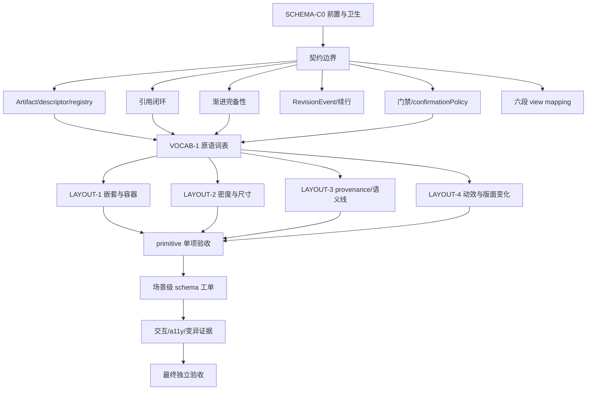

# SCHEMA-UI/UX 验收工单册

> 版本：2026-07-12 · 状态：验收施工单（只定义工作，不代表已实现或已放行）  
> 范围：schema 工作面 UI、UX、视觉 polish、协议消费与验收证据。  
> 非范围：provider 实现、harness/core 逻辑、场景契约拍板、外部 UI/图表/表格依赖引入。

本册是本 session 的最终产出。后续实现会话按工单领取，验收会话必须与实现会话分离；每条工单都有独立的变异红测、消费端证据和放行结论。

## 0. 总则

### 0.1 权威输入

工单执行前必须阅读：

- [CLAUDE.md](../CLAUDE.md)
- [AGENTS.md](../AGENTS.md)
- [docs/10 实施切分](./10-实施切分-层与工单.md)
- [docs/11 会话唤醒 prompt](./11-会话唤醒prompt.md)
- [docs/22 范式泛化边界](./22-架构观察-范式泛化边界.md)
- [docs/23 编辑面与单向编译](./23-架构决定-编辑面与单向编译.md)
- [docs/24 场景注册表定位](./24-架构决定-场景注册表定位与skill兼容.md)
- [docs/30 设计 brief](./30-W9设计brief与handoff规范.md)
- [docs/32 设计语言包](./32-设计语言包)
- [docs/36 schema 空间设计](./36-schema空间设计分册.md)
- [docs/38 素材库典范集](./38-素材库典范集)
- [docs/43 场景 UI 可视化选型](./43-调研报告-场景UI可视化选型.md)
- [docs/44 组件与图标库](./44-调研报告-组件与图标库.md)
- [docs/45 composer 惯例](./45-调研报告-composer输入区惯例.md)
- [docs/46 控件全量清单](./46-控件全量清单.md)
- [docs/49 通用底座与垂类路由](./49-架构决定-通用底座与垂类路由.md)
- [docs/53 schema 握手协议](./53-架构决定-schema握手协议.md)
- [docs/57 schema 渲染形态全谱](./57-调研-schema渲染形态全谱.md)
- [docs/60 法律场景调研](./60-调研-法律垂类竞品场景普查.md)
- [docs/61 PM 场景调研](./61-调研-PM垂类场景与包定义.md)
- [docs/63 三垂类可行性](./63-调研-三垂类可行性评估.md)
- [docs/65 HR 场景调研](./65-调研-HR垂类全谱.md)

### 0.2 不可越过的边界

1. **契约归架构会话**：schema 字段、字段语义、跨层接口、确认纪律、view mapping 语义有疑问时，标 `[需架构拍板]`，不得在 UI 会话里自行改变。
2. **实现与验收分离**：实现者不能验收自己或自己的前身会话；审美判断只能回报差异，不能以“看起来不错”替代证据。
3. **无外部依赖**：本线不新增 npm、Rust、Python、图表、表格、UI 组件库；只消费已经存在的底层接口、tokens、HTML/SVG 能力。底座暂不支持的原语记为 deferred，不用安装依赖填空。
4. **core 零 diff**：schema UI 只能路由到垂类包 renderer；不得把法律、PM、HR、招投标语义写入 core、通用 PreviewHost 或 UtilityRail。
5. **原件只读**：UI 不提供原件编辑入口；所有编辑走工作稿/RevisionEvent；冻结产出不回流为可编辑状态。
6. **不采信回执**：测试必须看到真实用例计数、原始输出、实际截图、实际 wire/事件消费；静态 HTML 只能作设计迁移源，不能作协议验收证据。
7. **共享工作树卫生**：提交前显式检查暂存清单，不使用 `git add -A`、`git add .`、共享 dev server 或共享端口。

### 0.3 验收证据等级

| 等级 | 证据 | 是否可独立放行 |
|---|---|---|
| E0 | 实现会话自述、静态截图、单包局部测试 | 不可 |
| E1 | 真实 fixture 驱动的 renderer 单测/协议测试 | 部分 |
| E2 | 变异删改后测试真实变红 + 到消费端的事件/DOM/wire 证据 | 必须 |
| E3 | 独立 worktree、独立端口、全仓 build、真实截图、可访问性与回归 | 最终放行必须 |

### 0.4 工单关系



## 1. 工单模板与完工格式

每张工单都必须包含以下字段；缺一项不算可领取：

```text
工单 ID：
目标层：
实现会话：
验收会话：
前置工单：
允许修改路径：
禁止修改路径：
契约疑问：[需架构拍板] 项目
原子检查：
变异动作：
消费端证据：
失败/降级证据：
截图/日志/命令原件：
SPEC/ACCEPTANCE 留痕：
放行下游：
```

每个原子检查使用 `PASS / FAIL / BLOCKED / [需架构拍板]`，不得使用“基本通过”“视觉上没问题”。

## 2. C 组：契约与边界工单

### SCHEMA-C0｜前置、角色、工作区与依赖卫生

**目标**：确保后续 UI 工单不会在错误 worktree、错误端口或错误角色上执行。

**前置**：无。  
**允许修改**：工单记录、验收报告。  
**禁止修改**：产品代码、schema 契约、tokens。

原子检查：

- [ ] C0.1 记录实现会话、验收会话、模型、worktree 路径、端口号。
- [ ] C0.2 验收会话确认不是实现会话及其前身。
- [ ] C0.3 `git status --short` 原样记录；识别并列出其他会话的脏文件。
- [ ] C0.4 `git diff --name-only` 与工单允许路径逐项比对。
- [ ] C0.5 `package.json`、lockfile、workspace manifest 无新增依赖。
- [ ] C0.6 `rg` 检查 UI 层没有 import 新增 renderer/UI 库。
- [ ] C0.7 启动独立 dev server，确认端口不被其他会话占用。
- [ ] C0.8 记录浏览器/桌面 shell 的实际版本与 viewport。

变异验证：

- [ ] 删除一个允许路径外的 import，守卫必须变红；复原后再跑绿。
- [ ] 将端口改回共享端口，验收脚本必须拒绝或记录污染风险。

放行条件：E2 以上；否则所有后续工单只能 BLOCKED。

### SCHEMA-C1｜通用宿主与垂类 renderer 边界

**目标**：证明 PreviewHost 是领域无关的装配宿主，垂类 renderer 才拥有 schema 语义。

原子检查：

- [ ] C1.1 PreviewHost 只接收通用 `Artifact/Descriptor/ViewMapping/Projection` 数据。
- [ ] C1.2 PreviewHost 内无法律、PM、HR、招投标字段名、门禁文案或专业枚举。
- [ ] C1.3 UtilityRail、chat、composer 不 import 垂类 renderer。
- [ ] C1.4 垂类 renderer 不 import UtilityRail 内部实现。
- [ ] C1.5 renderer 通过公开底层接口接收状态，不读取 provider/core 私有对象。
- [ ] C1.6 通用壳只负责位置、滚动、焦点、宿主生命周期，不负责领域判断。
- [ ] C1.7 场景选择来自 registry/descriptor，不由模型自由决定 renderer。
- [ ] C1.8 用户文本不直接注入 renderer props；修改必须经 RevisionEvent 或声明的交互事件。

变异验证：

- [ ] 人为加入一个越界 import，边界测试/grep 守卫变红。
- [ ] 人为删除 descriptor 的字段映射，UI 不得 fallback 到机器字段名；测试必须变红。
- [ ] 人为把法律字段名注入通用 PreviewHost，静态守卫必须变红。

证据：import 边界扫描、真实 renderer 挂载截图、事件 payload、反例运行输出。

### SCHEMA-C2｜ArtifactType namespaced ID 与 descriptor 注册

**目标**：保证每种 schema 的身份来自垂类包，通用基座只保留公民形状，不维护中央 artifact 清单。

原子检查：

- [ ] C2.1 artifact ID 使用 namespaced 形式，如 `legal.risk-list`、`pm.prd-review`。
- [ ] C2.2 注册表校验 namespace 非空、id 合法、descriptor 必填字段齐全。
- [ ] C2.3 同 namespace 内重复 id 被拒。
- [ ] C2.4 双 namespace 使用同一 id 时按既有准入规则处理，不发生静默覆盖。
- [ ] C2.5 `SourceAnchor`、`RevisionEvent`、信源等级等跨包基础形状仍来自中央 schemas。
- [ ] C2.6 UI 不依赖中央 exhaustive artifact enum。
- [ ] C2.7 未知 artifact renderer 不得静默渲染为通用文本卡；应出现可解释的未支持态。
- [ ] C2.8 descriptor 中的字段、状态、动作均可追溯到包声明。

变异验证：

- [ ] 删除 namespace，注册测试红。
- [ ] 修改 id 使其重复，registry 测试红。
- [ ] 注入未知字段，strict 校验红。
- [ ] 将合法 artifact ID 改成旧中央枚举，消费端兼容性测试红。

### SCHEMA-C3｜“模型出引语，系统出坐标”引用闭环

**目标**：模型只能指认证据，系统确定坐标；UI 绝不信任模型自报 offset。

原子检查：

- [ ] C3.1 模型输出最小形状为 `fileId + page/blockId + exactQuote`。
- [ ] C3.2 resolver 在对应页/块做唯一精确匹配。
- [ ] C3.3 resolver 确定性铸造 `start/end/textLayerVersion`。
- [ ] C3.4 多义匹配拒收，不选择“最像”的一处。
- [ ] C3.5 未命中进入受限修复重试，不伪造坐标。
- [ ] C3.6 `end < start` 被 schema 拒绝；`end === start` 按拍板语义验证。
- [ ] C3.7 UI 显示文件名、页/块、人类可读引语；不显示机器 offset 作为权威事实。
- [ ] C3.8 点击引用能跳原文并高亮准确范围；未接原件时显示有理由的禁用态。
- [ ] C3.9 quote 与 source slice 做 `quote === slice` 不变量验证。
- [ ] C3.10 golden 使用同一套确定性规范化匹配，不另写视觉层规则。

变异验证：

- [ ] 删除 `refine` 或 range 校验，非法区间测试必须红。
- [ ] 改变模型自报 offset 但不改变 exactQuote，最终坐标不得改变。
- [ ] 将 exactQuote 改成不存在文本，resolver 必须拒收。
- [ ] 制造两处相同引语，必须返回 ambiguous，不得随机选一处。

### SCHEMA-C4｜渐进完备性、索证态与 out-of-coverage

**目标**：UI 让用户看到真实进度和缺口，不把“有字”冒充“有内容”。

原子检查：

- [ ] C4.1 字段状态至少覆盖：已填（带锚）、待补（缺失原因 + requiredSources）、不适用。
- [ ] C4.2 artifact 状态至少覆盖：空/索证、partial、完备、失败、未覆盖。
- [ ] C4.3 空数据模块不渲染假卡片或假计数。
- [ ] C4.4 partial 计数真实，例如 `3/6 已核`，不显示“完成”。
- [ ] C4.5 已填字段不被未填字段阻塞。
- [ ] C4.6 requiredSources 由声明投影，不由模型临时编写。
- [ ] C4.7 out-of-coverage 显示人类词语，例如“未能归类”，不显示机器枚举。
- [ ] C4.8 空内容/访问拒绝/扫描件未识别等语义失败必须独立显示。
- [ ] C4.9 索证态给出缺失原因、所需材料和下一步入口。
- [ ] C4.10 失败字段不能进入“已确认”或下游产出门禁。

变异验证：

- [ ] 删除 requiredSources，索证态测试红。
- [ ] 把失败字段改成空字符串但保持 completed，测试必须红。
- [ ] 把 out-of-coverage 强行塞进主题/风险列表，完整性测试红。
- [ ] 删除一个输入材料，partial 计数必须变化且截图可见。

### SCHEMA-C5｜RevisionEvent、用户修正与续行投影

**目标**：用户修正是事件，不是静默覆盖；重新打开工作时按 artifact 与事件恢复。

原子检查：

- [ ] C5.1 每个用户修正含 artifact ID、fieldPath、actor、时间、reason（若声明需要）和来源引用。
- [ ] C5.2 修改路径使用 JSON Pointer/声明的字段路径，不接受任意 prompt 拼接。
- [ ] C5.3 修正事件追加写入账本，原 artifact 可回放。
- [ ] C5.4 用户修正优先级高于模型建议。
- [ ] C5.5 默认不自动重新推理；只有显式声明的动作才触发重算。
- [ ] C5.6 重算后产生新 artifact 事件，旧事件仍可见。
- [ ] C5.7 续行投影从 schema/artifact/event 恢复，不依赖 transcript 猜测。
- [ ] C5.8 projection 顺序确定且 byte-stable。
- [ ] C5.9 关闭/重开 Preview 后，用户已确认、驳回、修正状态不丢失。

变异验证：

- [ ] 直接改 artifact JSON 而不写 RevisionEvent，回放测试必须红。
- [ ] 删除一条 RevisionEvent，续行状态必须与原状态不一致并被检测。
- [ ] 把用户修正替换成模型建议，优先级测试必须红。
- [ ] 重开时清空 transcript，schema 状态仍应正确恢复。

### SCHEMA-C6｜confirmationPolicy、门禁与副作用边界

**目标**：包可以声明 `none`，但 core 对写文件、MCP 副作用、外发、权威态变更强制要求 gate。

原子检查：

- [ ] C6.1 policy 形状为 `none | gates[]`，声明可被 registry 校验。
- [ ] C6.2 `none` 只对纯读取、纯分析、零外部写入场景合法。
- [ ] C6.3 写文件、MCP 副作用、外发、改权威态时，core 强制至少一个 gate。
- [ ] C6.4 包不能通过 `none` 放宽 core 底线。
- [ ] C6.5 gate 状态覆盖 pending/confirmed/rejected/amended（如契约已拍板）。
- [ ] C6.6 高风险、含未核验依据、外部副作用项不得进入批量确认。
- [ ] C6.7 驳回不能批量处理。
- [ ] C6.8 确认前下游动作不可用，并显示剩余项。
- [ ] C6.9 gate 动作只改变 artifact/事件状态，不直接执行不可逆外部动作。
- [ ] C6.10 “确认”与“已核对”视觉语义不得未经拍板混用。

变异验证：

- [ ] 将写文件场景 policy 改成 `none`，registry/core 测试必须红。
- [ ] 删除 gate 守卫，副作用测试必须红。
- [ ] 把高危项加入批量集合，批量边界测试必须红。
- [ ] 删除确认事件，输出管线不得产生最终交付文件。

### SCHEMA-C7｜握手六段与输出即视图契约

**目标**：UI 读取完整的六段组装结果：契约、声明、租户、投影、会话、视图映射。

原子检查：

- [ ] C7.1 contract 段提供 schema、证据规则、门禁底线。
- [ ] C7.2 declaration 段提供步骤、模块、uiTemplate/renderer 声明。
- [ ] C7.3 tenant 段提供容器词表、域文案、包级映射。
- [ ] C7.4 projection 段提供续行顺序和显示字段投影。
- [ ] C7.5 session 段提供本次输入、状态、事件关联。
- [ ] C7.6 view mapping 段提供“每类输出落在哪里”的稳定映射。
- [ ] C7.7 下层 session/material 不得覆盖 contract/declaration 的纪律。
- [ ] C7.8 相同 artifact 在不同场景下只能通过声明改变组合，不复制 core renderer。
- [ ] C7.9 view mapping 不依赖 DOM 位置猜测。
- [ ] C7.10 内容更新时视图位置保持稳定，除非声明明确改变布局。

变异验证：

- [ ] 删除 view mapping，UI 必须进入明确未映射态，不把内容塞到聊天流。
- [ ] 改变 session 文案但不改 schema，renderer 结构不得变化。
- [ ] 注入 material 中的伪指令，contract/declaration 不得被覆盖。

## 3. V 组：原语词表与版式工单

### VOCAB-V0｜有限 renderer vocabulary 与零自由布局

- [ ] V0.1 只允许 docs/57 已登记原语。
- [ ] V0.2 原语的布局由 renderer 决定，模型不能生成 CSS/HTML/坐标。
- [ ] V0.3 不提供 delete/regenerate/free-layout/无限缩放等未声明动词。
- [ ] V0.4 拖拽只能产生 proposal 状态；不可直接改变权威态。
- [ ] V0.5 graph 才允许 zoom；table/document/list 不复用 graph zoom 心智。
- [ ] V0.6 新 primitive 先写 VOCAB 提案并标 `[需架构拍板]`，不得在包内私发明。
- [ ] V0.7 每个 primitive 有消费凡例、输入 shape、状态集、动作集和禁用动作。

变异验证：注入一个未登记 primitive ID，registry/renderer 必须拒绝；注入 `style`/自由定位字段，strict schema 必须红。

### LAYOUT-V1｜五级嵌套与宿主结构

目标结构：`PreviewHost → section → semantic block → row → field`，最多五级。

- [ ] V1.1 PreviewHost 只承担宿主边界、滚动、焦点和工作面生命周期。
- [ ] V1.2 section 有标题、计数和分隔线，不重复渲染内部块头。
- [ ] V1.3 semantic block 有明确语义，不把异构内容塞进一个大卡片。
- [ ] V1.4 row 负责对齐、状态线、选中和展开；field 负责值与来源。
- [ ] V1.5 超过五级的内容拆为 L2/详情或 subordinate view。
- [ ] V1.6 左栏 outline 与 schema card 共享 row/section/indent/selected/end badge 规则。
- [ ] V1.7 不通过额外边框、阴影或嵌套卡片表达层级。
- [ ] V1.8 schema 区可以独立滚动；聊天流不承载完整 artifact 详情。

变异验证：构造六级 DOM/descriptor，静态结构测试红；把字段详情移入聊天流，view mapping 测试红。

### LAYOUT-V2｜密度、尺寸、栅格与宽度

- [ ] V2.1 使用 4/8px 基阶；所有间距可回溯 token。
- [ ] V2.2 dense 正文 13px/1.5，meta 12px/1.5，禁止产品 UI 小于 12px（素材库标注层例外需明文）。
- [ ] V2.3 reading 面 15px/1.6，文书预览不得为密度缩小。
- [ ] V2.4 控件高度只用 28/32px 档；图标 16px，gap 6px。
- [ ] V2.5 列头 28px，数据行 28–32px，默认约 30px。
- [ ] V2.6 数字、金额、日期、序号使用 mono + tabular-nums。
- [ ] V2.7 grid 只使用声明的 1:1、2:1、1:1:1 等有限组合。
- [ ] V2.8 组合页 sectionGap/columnGap 使用 token，不在 HTML/CSS 散落裸值。
- [ ] V2.9 窄档不发生横向溢出；文本按声明 ellipsis 或换行。
- [ ] V2.10 展开行、索证卡、gate 卡不得挤压发送按钮或覆盖右栏。

变异验证：改一个 token 值后 golden/visual contract 必须检测 drift；将正文改成 11px 或任意裸 7px，静态扫描必须红。

### LAYOUT-V3｜provenance、信源等级与法理之线

- [ ] V3.1 A/B/C 信源角标为 16px 方格、12px mono，使用包声明的解释。
- [ ] V3.2 A=权威、B=维护库、C=网络参考的具体语义由包提供，底座只消费 tier。
- [ ] V3.3 verified 内容使用 mono + verifiedBg；AI 解释使用 sans + generatedBg。
- [ ] V3.4 两通道不混用颜色表达；颜色预算留给语义状态。
- [ ] V3.5 provenance 至少显示文件名、引语/值和跳转动作。
- [ ] V3.6 未接原文时，跳转按钮保留位置并以禁用 tooltip 说明原因。
- [ ] V3.7 法理之线只出现在声明的审阅语义，不出现在通用 chat、静态数据或任意装饰卡。
- [ ] V3.8 线宽 2px，每个语义卡最多一条；状态颜色只来自白名单。
- [ ] V3.9 中低危待处理不得误用高危线；驳回为中性退出工作集。
- [ ] V3.10 G11“已核对”绿线规则必须先拍板，再实现。

变异验证：将 generated 文本加 verifiedBg、将普通 hover 加语义色、将法理线放到 chat，deslop/视觉守卫必须红。

### LAYOUT-V4｜动效、状态硬切与版面变化

- [ ] V4.1 状态本体变化 0ms。
- [ ] V4.2 hover 只变化 background/border，120ms。
- [ ] V4.3 press 70ms，不缩放、不位移。
- [ ] V4.4 panel switch 0ms；内容不 crossfade。
- [ ] V4.5 settleFlash 只作为独立 150ms 光效层。
- [ ] V4.6 长任务使用既有 glow/breath；数据区绝对静止。
- [ ] V4.7 continuation 只动 opacity + ≤4px translateY。
- [ ] V4.8 禁止 layout property animation、spring、overshoot、scale(0)。
- [ ] V4.9 展开/收起不改变无关区域的几何边界。
- [ ] V4.10 reduced-motion 下去除非必要动效但保留状态可辨识度。

变异验证：把数据表加入 transform/opacity 动画，动效守卫必须红；把状态切换改成 120ms，computed style/时序测试必须红。

## 4. P 组：原语级验收工单

每个原语均需完成“合法输入、每个状态、每个动作、失败态、窄档、键盘、变异”的完整闭环。

### PRIM-P1｜table / matrix

- [ ] P1.1 header 28px、row 28–32px、列线 hairline。
- [ ] P1.2 单元格形态封闭为中性文本 / 语义 chip / 修订 chip。
- [ ] P1.3 单元格不承载法理之线，行级状态承载处置语义。
- [ ] P1.4 数字右对齐、mono、tabular；文本省略后可展开。
- [ ] P1.5 默认不斑马；选中只用 bg.selected，不加框。
- [ ] P1.6 matrix 单元格点击显示依据或明确未连接态。
- [ ] P1.7 偏离、缺漏、未提供、算术修正分别可辨。
- [ ] P1.8 只看差异、筛选、排序等动作若未在 descriptor 声明，不得出现。
- [ ] P1.9 大数据量未达到触发式引入条件时不得新增 AG Grid。
- [ ] P1.10 变异：删除一格来源锚，UI 必须变为未覆盖/待补，不能保留绿色响应。

### PRIM-P2｜list / master-detail

- [ ] P2.1 同质数据优先紧凑列表，不做卡片流。
- [ ] P2.2 行选中只改变 selected fill，不加框。
- [ ] P2.3 展开详情在行内或声明的 detail 区，保留原行索引。
- [ ] P2.4 详情中同时显示问题、依据、来源、动作。
- [ ] P2.5 高危条目展开后才能确认。
- [ ] P2.6 驳回后退出工作集但保留历史可查。
- [ ] P2.7 keyboard J/K、Enter、Esc 或包声明的等价动作有焦点反馈。
- [ ] P2.8 变异：删除展开 handler，展开断言必须红；删除来源显示，provenance 断言必须红。

### PRIM-P3｜document / revision

- [ ] P3.1 reading 15px/1.6，纸面 radius 0，文书面 justify 仅在合法阅读面使用。
- [ ] P3.2 生成解释与已核事实双通道不混。
- [ ] P3.3 修订红删蓝增，保留原字形可核对。
- [ ] P3.4 选中风险/发现可联动定位文书段落。
- [ ] P3.5 冻结态显示定稿时间与只读状态。
- [ ] P3.6 冻结后只提供打开产出文件，不提供“转回编辑”。
- [ ] P3.7 编辑只存在于工作稿轨，保存/编译路径可追踪。
- [ ] P3.8 变异：去掉冻结守卫，冻结态编辑测试必须红；删除一个 revision，golden diff 必须红。

### PRIM-P4｜timeline

- [ ] P4.1 使用表格式时间线，不做没有语义的轨道图。
- [ ] P4.2 日期列 mono + tabular，排序规则来自 descriptor。
- [ ] P4.3 事实事件与前瞻义务不混：timeline 回看，schedule 前瞻。
- [ ] P4.4 矛盾行可展开，显示双方来源与处置动作。
- [ ] P4.5 筛选态常显，避免用户误以为数据不存在。
- [ ] P4.6 事件缺来源时显示缺口，不进入已核对态。
- [ ] P4.7 变异：互换两事件日期，排序/冲突测试必须红；删除一方依据，矛盾门禁必须红。

### PRIM-P5｜compare

- [ ] P5.1 固定三列：字段名 / 左 / 右。
- [ ] P5.2 相同字段退后，差异默认突出。
- [ ] P5.3 “只看差异”状态常显；不能因筛选隐藏而失去认知。
- [ ] P5.4 差异复用 revision.insert/delete，不新增色相。
- [ ] P5.5 结构化字段对照与文档流 revision 不混为一个原语。
- [ ] P5.6 变异：删除一个 diff，差异计数和筛选结果必须红。

### PRIM-P6｜form / calculation

- [ ] P6.1 预填值必须带来源；无来源置空或显示档位区间。
- [ ] P6.2 模型不得提供无锚精确数值。
- [ ] P6.3 公式版本、参数表版本和计算时间可见。
- [ ] P6.4 计算核心由确定性接口执行，零 LLM 参与。
- [ ] P6.5 分项、依据、锚、总计可展开核对。
- [ ] P6.6 裁量项显示建议区间，不能伪装裁决单值。
- [ ] P6.7 缺口不会被“继续计算”按钮掩盖。
- [ ] P6.8 变异：修改公式脚本/参数，golden 必须红；删除 basis，精确值必须退为区间/空值。

### PRIM-P7｜checklist / schedule

- [ ] P7.1 勾选只记录核对事实，不直接执行动作。
- [ ] P7.2 已核、待核、缺材料、无需核对分别可辨。
- [ ] P7.3 schedule 三档色彩封闭；具体阈值由包声明。
- [ ] P7.4 日期、星期、剩余天数使用 mono/tabular。
- [ ] P7.5 到期提示不自动发外部通知或改权威状态。
- [ ] P7.6 全部核对后才解锁声明的下游 gate。
- [ ] P7.7 变异：删一项 checklist，解锁状态必须红；把 schedule 变成自动通知，副作用守卫必须红。

### PRIM-P8｜narrative / report page

- [ ] P8.1 只允许 statement / bullets / figure-left / figure-right 四种版式。
- [ ] P8.2 repeat 声明一次，实例数据定型，不由模型自由排版。
- [ ] P8.3 AI 叙事 sans + generatedBg；数字/引语 mono + verifiedBg。
- [ ] P8.4 叙事不提供自由 edit 动词；修改走工作稿/RevisionEvent。
- [ ] P8.5 数字在 verified 通道显示，叙事不得改写数字。
- [ ] P8.6 变异：把 verified 数字改成叙事文本，通道测试必须红。

### PRIM-P9｜gate

- [ ] P9.1 gate 三态/四态与事件状态一一对应。
- [ ] P9.2 每个 gate 同时显示对象、理由、依据、影响范围。
- [ ] P9.3 动作只有声明的确认/驳回/修正；不提供自由执行。
- [ ] P9.4 高危、C 级依据、外部副作用逐条确认。
- [ ] P9.5 批量范围与排除理由同屏。
- [ ] P9.6 确认后状态 0ms 落定，叠加独立 150ms settle flash。
- [ ] P9.7 驳回无批量，历史仍可查。
- [ ] P9.8 变异：绕过 gate 直接调用下游 writer，测试必须红。

### PRIM-P10｜relation / graph / tree / flow

- [ ] P10.1 节点、边、层级均来自 schema，禁止模型直接给坐标和颜色。
- [ ] P10.2 节点/边点击显示来源与详情。
- [ ] P10.3 图例筛选只有 descriptor 声明的关系类型。
- [ ] P10.4 graph 才允许 zoom；tree/flow 不复用无限缩放。
- [ ] P10.5 图谱规模不足时不引入新图形依赖。
- [ ] P10.6 变异：删除一条边的 evidenceRef，边不得显示为已核实关系。

### PRIM-P11｜statcard / chart / progress

- [ ] P11.1 statcard 三行式：label / value / context。
- [ ] P11.2 metric 28px mono；delta 不消费红绿。
- [ ] P11.3 单序列图表使用 `color.data.mono` 阶。
- [ ] P11.4 百分比优先水平条，不默认 donut。
- [ ] P11.5 坐标刻度 mono，不低于允许的标注层字号。
- [ ] P11.6 数据区无入场动画。
- [ ] P11.7 变异：把上升箭头染红/绿，deslop 扫描必须红；删除真实数据源，图表必须显示无数据而不是 0。

## 5. S 组：场景级 schema 工单

每张场景工单必须从“工作语义”出发，不能从法律页复制布局。每张都要交：场景 UI 设计单、真实 fixture、事件流记录、状态矩阵、截图矩阵、变异日志。

### SCENE-S1｜法律 S1 阅卷整理（样板，不是通用语义）

- [ ] S1.1 输入区只读卷宗材料，显示摄取进度和材料计数。
- [ ] S1.2 右栏时间线事件均带 SourceAnchor 或诚实缺口。
- [ ] S1.3 关系图节点/边均可追溯；无主体核验不得伪装权威。
- [ ] S1.4 矛盾事件逐条展开、双方依据可见。
- [ ] S1.5 partial 卷宗显示 `已摄取/总量`，不提前显示完成。
- [ ] S1.6 失败 OCR/拒绝访问/扫描件未识别分开呈现。
- [ ] S1.7 事件点击只打开详情/原文，不自动修改卷宗。
- [ ] S1.8 变异：删除一份材料，时间线计数、状态和门禁均应变化。

### SCENE-S3｜法律 S3 合同审查（样板主案）

- [ ] S3.1 matrix 风险行字段：风险、等级、依据、定位、状态、操作均来自 descriptor。
- [ ] S3.2 高危项展开后才能确认；中低危且依据已核验才可批量。
- [ ] S3.3 C 级依据进入产出前必须逐条确认。
- [ ] S3.4 修订预览与风险项双向定位。
- [ ] S3.5 删除/驳回/修正的语义不混；驳回只退出工作集，不代表系统错误。
- [ ] S3.6 docx 产出前 gate 未清空时按钮保持禁用并说明剩余项。
- [ ] S3.7 文书冻结后只读，打开 Word/文件夹路径符合安全白名单。
- [ ] S3.8 变异：删高危 gate、删依据、把驳回改为确认，三条测试均须红。

### SCENE-PM1｜PM-1 反馈归集与洞察

- [ ] PM1.1 反馈主题名/摘要属于 generated 通道。
- [ ] PM1.2 反馈条数、渠道、版本、声量属于确定性/verified 通道。
- [ ] PM1.3 代表引语逐字、带来源锚；原声不得被改写后冒充引语。
- [ ] PM1.4 matrix 主题×版本、list 主题详情、chart 声量三者计数一致。
- [ ] PM1.5 out-of-coverage 噪声独立显示“未能归类”。
- [ ] PM1.6 主题改判必须产生 RevisionEvent。
- [ ] PM1.7 未确认主题不得写入需求池或作为后续引用。
- [ ] PM1.8 变异：删除一条反馈，主题 volume、矩阵、图表必须同步变化。

### SCENE-PM2｜PM-2 PRD 评审

- [ ] PM2.1 评审维度集合由声明封闭，不由模型新增列。
- [ ] PM2.2 每项 finding 有章节定位、severity、问题、建议、evidenceRefs。
- [ ] PM2.3 高危 finding 展开后显示全部依据才能确认。
- [ ] PM2.4 评审矩阵计数与 list 计数一致。
- [ ] PM2.5 C 级竞品/网络依据不得进入批量确认。
- [ ] PM2.6 确认后才能生成 revision 预览。
- [ ] PM2.7 驳回不删除原 finding，保留处置历史。
- [ ] PM2.8 变异：删除章节锚或证据引用，finding 必须退为待补/不可确认。

### SCENE-PM3｜PM-3 需求优先级打分

- [ ] PM3.1 公式、版本、权重表展示在计算面。
- [ ] PM3.2 Reach/Impact/Confidence/Effort 每项预填值带 basis/anchor。
- [ ] PM3.3 无锚的 Confidence/Impact 显示区间或置空，不编精确值。
- [ ] PM3.4 score/rank 由确定性脚本生成，显示“排序建议”。
- [ ] PM3.5 低把握条目输出区间，不输出伪精确单值。
- [ ] PM3.6 采纳排序写回需求池必须经过 gate。
- [ ] PM3.7 需求池写回产生事件且可续行恢复。
- [ ] PM3.8 变异：改公式或权重后得分 golden 必须红；删 basis 后单值必须退化。

### SCENE-PM4｜PM-4 会议纪要行动项

- [ ] PM4.1 行动项、决议、悬而未决分列。
- [ ] PM4.2 负责人和截止日是提案，不是系统指派。
- [ ] PM4.3 每个行动项带纪要段落锚。
- [ ] PM4.4 期限板由确定性日期字段驱动。
- [ ] PM4.5 carryOver 能跨纪要续行比对，变化有依据。
- [ ] PM4.6 确认后才进入项目日程台账。
- [ ] PM4.7 系统不调用外部协作者、不自动发送通知。
- [ ] PM4.8 变异：删除 owner/due 的来源，UI 不得把提案显示成已指派。

### SCENE-TENDER-S9｜招投标响应性核对

- [ ] T9.1 容器词表为标段/项目，不出现案件/卷宗法律词。
- [ ] T9.2 要求×投标人的 matrix 单元格三形态一致。
- [ ] T9.3 重大偏离只生成废标提案，不作废标裁决。
- [ ] T9.4 评委评分只作为预填建议，逐项确认后才能进入报告。
- [ ] T9.5 checklist 勾选只记录核对事实，不触发交易动作。
- [ ] T9.6 资质核对、报价算术复核、偏离状态的计数互相一致。
- [ ] T9.7 资格性缺口展开时显示招标要求与投标响应双方原文。
- [ ] T9.8 变异：把“确认生成废标提案”改成“确认废标”，契约/文案测试必须红。

### SCENE-HR-H12｜HR 处分证据链

- [ ] H12.1 容器词表为档案袋/员工材料，不暴露法律包内部 ID。
- [ ] H12.2 时间线事件带证据等级和来源。
- [ ] H12.3 矛盾事件展示双方材料，不直接进入处分事实。
- [ ] H12.4 处分决定必须满足制度依据、证据锚、法条锚三锚。
- [ ] H12.5 缺任一锚只显示索证态，不生成决定草案。
- [ ] H12.6 员工敏感信息按最小必要原则展示，fixture 全部虚构。
- [ ] H12.7 决定草案送达前是 gate，不自动外发。
- [ ] H12.8 变异：删制度依据/删证据/删法条，三种缺口均不得出稿。

### SCENE-XVERT｜跨垂类兼容性审计

- [ ] XVERT.1 同一 PreviewHost 装载 PM、Tender、HR fixture，无 core 改动。
- [ ] XVERT.2 左栏容器词表随包变化，结构与密度不漂移。
- [ ] XVERT.3 同一 primitive 的语义色、状态、动作纪律不因垂类改变。
- [ ] XVERT.4 法律特有词汇不泄漏到 PM/Tender/HR。
- [ ] XVERT.5 PM/Tender/HR 不要求新增 primitive 才能完成最小场景。
- [ ] XVERT.6 任一包声明新字段时，renderer 不出现未知字段 fallback。
- [ ] XVERT.7 变异：删除法律包，PM/Tender/HR 仍能加载并渲染。

## 6. I 组：交互状态、按钮与版面变化

### INTER-I1｜字段与 artifact 状态矩阵

为每个字段和 artifact 填写下表，不能只验默认态：

| 状态 | 必须可见 | 必须可做 | 禁止行为 |
|---|---|---|---|
| empty | 缺失原因、下一步 | 提供材料/开始 | 显示假完成 |
| pending | 生成中/待确认原因 | 查看过程或等待 | 执行下游副作用 |
| partial | 真实计数、已填与缺口 | 继续补材料、逐项处理 | 把 partial 说成 complete |
| filled | 值、来源、状态 | peek/goto/amend（按声明） | 隐藏来源 |
| failed | 失败原因、恢复路径 | retry/补材料 | 静默降级为模型猜测 |
| out-of-coverage | 未覆盖原因 | 提供替代路径 | 强行归类 |
| confirmed | 确认时间/actor | 查看历史 | 再次伪装 pending |
| rejected | 驳回原因/历史 | 重新提出修正（若声明） | 批量驳回 |
| amended | 新旧差异、事件 | 继续确认 | 覆盖旧版本 |
| frozen | 定稿时间、只读 | 打开产出 | 返回编辑 |

原子检查：

- [ ] I1.1 每种状态都有 fixture。
- [ ] I1.2 每种状态都有截图或 DOM 断言。
- [ ] I1.3 状态改变事件可在账本/事件流找到。
- [ ] I1.4 失败与 partial 不共享一个“灰色占位”而失去语义。
- [ ] I1.5 未知状态进入安全未支持态，不显示 completed。

### INTER-I2｜Button 状态与副作用

每个按钮至少覆盖：default、hover、focus、pressed、disabled、loading、success、failed、确认后。

- [ ] I2.1 按钮文案使用工作语义，不出现 terminal/path/token/API/OCR 等技术词。
- [ ] I2.2 disabled 仍能 focus，使用 `aria-disabled` + tooltip 解释原因。
- [ ] I2.3 disabled 不等于隐藏；未来能力保留位置。
- [ ] I2.4 发送按钮空输入时不可用，输入法组合态 Enter 不发送。
- [ ] I2.5 上传失败在文件 chip 本体提供单文件 retry。
- [ ] I2.6 文件作用域“仅本条/已存入卷宗”是显式单向确认。
- [ ] I2.7 gate 按钮显示影响范围，不把确认伪装成普通提交。
- [ ] I2.8 外发、写文件、改权威态动作必须在 gate 后。
- [ ] I2.9 成功/失败状态 0ms 切换，确认光效不移动数据区。
- [ ] I2.10 变异：删掉单飞行守卫、gate 守卫、IME 守卫，各自测试必须红。

### INTER-I3｜二级按钮、展开与版面变化

- [ ] I3.1 二级按钮只在所属 row/card 的语义范围出现，不漂浮到无关区域。
- [ ] I3.2 展开详情保留当前行、标题、来源和返回路径。
- [ ] I3.3 展开不覆盖发送区、面板头、状态条和其他交互命中区。
- [ ] I3.4 局部展开只改变所属 semantic block 的高度。
- [ ] I3.5 gate 卡展开后操作区仍在可视范围或提供明确滚动锚。
- [ ] I3.6 panel 切换不重置用户选中项，除非 descriptor 声明新 session。
- [ ] I3.7 popover/overlay 有焦点陷阱、Esc、点外收起和恢复焦点。
- [ ] I3.8 状态栏、composer、PreviewHost 右缘不互相重叠。
- [ ] I3.9 变异：删除展开后高度/焦点处理，几何和键盘测试必须红。

### INTER-I4｜错误、长任务、重试与恢复

- [ ] I4.1 2–5 秒任务显示事件/骨架，不使用裸 spinner。
- [ ] I4.2 超过阈值显示真实进度或阶段，不伪造百分比。
- [ ] I4.3 单文件失败可单独 retry，已成功文件不重复上传。
- [ ] I4.4 解析失败说明用户下一步，不抛内部错误码。
- [ ] I4.5 引用未命中只重试受限修复，不重跑整个场景无提示。
- [ ] I4.6 provider/底层失败不得转为“已完成” artifact。
- [ ] I4.7 retry 产生新事件/attempt 记录，旧失败可查。
- [ ] I4.8 变异：把失败分支改成成功空 artifact，事件与 UI 测试必须红。

### INTER-I5｜键盘、焦点、IME 与可访问性

- [ ] I5.1 所有可操作元素可键盘到达且有可见 focus ring。
- [ ] I5.2 `aria-label` 使用人类语义，机器枚举不出现在辅助技术名称中。
- [ ] I5.3 disabled tooltip 通过 focus 也可获得。
- [ ] I5.4 Enter 发送、Shift+Enter 换行遵守 `compositionstart/compositionend`。
- [ ] I5.5 gate 确认/驳回快捷键与屏幕提示一致。
- [ ] I5.6 展开/收起、列表移动、原文跳转焦点可预测。
- [ ] I5.7 reduced-motion 下仍能感知 loading、成功、失败和选中态。
- [ ] I5.8 对比度满足既定 AA 目标；不能用颜色作为唯一状态信号。
- [ ] I5.9 图表/图谱有文本替代或可访问摘要。
- [ ] I5.10 变异：移除 focus ring、移除 aria-label、强制 composition 中发送，各测试必须红。

## 7. D 组：视觉 polish 工单

### POLISH-D1｜tokens 单源与 drift

- [ ] D1.1 所有颜色、间距、字号、圆角、动效来自 tokens 或明确的 renderer token。
- [ ] D1.2 组件内无重复颜色字面量、无散落硬编码尺寸。
- [ ] D1.3 `tokens.json` 版本与 docs/38 README 版本一致；不一致先 `[需架构拍板]`。
- [ ] D1.4 `color.semantic` 的 graphic/fg/bg 分轨不被互换。
- [ ] D1.5 `motion.dataRegion = none` 在实际 computed style 可证。
- [ ] D1.6 阴影只允许既定 L1 白名单；chat/composer/artifact/数据区零影。
- [ ] D1.7 tokens 变更能触发所有典范/renderer drift 检查。

变异验证：改一个 token，至少一条视觉/contract 测试变红；恢复后全绿。

### POLISH-D2｜视觉平衡与对齐

- [ ] D2.1 标题栏、工具栏、面板头、状态条高度与 token 一致。
- [ ] D2.2 三栏纵向分隔线贯通，不出现断层或双横带。
- [ ] D2.3 schema 右栏的主工作面有明确主次层级，不被对话流抢权重。
- [ ] D2.4 发送区、provider chip、schema 面板右缘无重叠。
- [ ] D2.5 文字基线、数字列、来源角标、状态 chip 对齐。
- [ ] D2.6 低密度首页 token 不泄漏到 dense schema 区。
- [ ] D2.7 schema 区不出现大面积空白卡、重复标题或无内容模块。
- [ ] D2.8 选中态不加额外边框，不改变邻近行宽度。
- [ ] D2.9 四档窗口宽度均无横向溢出。

### POLISH-D3｜颜色、状态线与双通道

- [ ] D3.1 中性底色来自单源锚色派生，不混入暖灰。
- [ ] D3.2 semantic 色只用于 tier/severity/revision/gate/usage。
- [ ] D3.3 普通 hover、selected、controlHover 三者可区分但不消费语义色。
- [ ] D3.4 generated/verified 通道即使去色也可由字体/底纹辨识。
- [ ] D3.5 绿色“已确认/已核对”语义遵守 G11 拍板。
- [ ] D3.6 驳回使用中性灰，不表现为错误红。
- [ ] D3.7 法理之线每张卡只有一条，线色与状态一致。

### POLISH-D4｜排版与字阶

- [ ] D4.1 dense 正文不小于 13px。
- [ ] D4.2 meta 不小于 12px；素材库说明层的例外已书面化。
- [ ] D4.3 reading 文书 15px/1.6，中文断行规则正确。
- [ ] D4.4 标题最多到工作台允许的 title/display 档，不用巨型 hero 字。
- [ ] D4.5 中文标题字距、行高、基线统一。
- [ ] D4.6 数字列无比例跳动，tabular-nums 生效。
- [ ] D4.7 长文本 ellipsis/换行有明确规则，不能截掉关键状态或来源。

### POLISH-D5｜图标、SVG 与状态图形

- [ ] D5.1 图标来自既有 SVG/Lucide 管线，不在组件内临时画一套。
- [ ] D5.2 SVG 为 currentColor、24×24 基准、约定 stroke 宽度。
- [ ] D5.3 不使用 inline 色值、任意 transform、滤镜或装饰性 3D。
- [ ] D5.4 图标状态不承担唯一语义；必须配文本/tooltip/结构状态。
- [ ] D5.5 法理之线颜色不被 SVG 作用域污染。
- [ ] D5.6 预留功能图标保持位置，禁用态有可访问说明。

## 8. E 组：真实协议、测试与证据工单

### EVID-E1｜真实 fixture 与虚构纪律

- [ ] E1.1 每个场景有唯一 project/case bible 或等价 fixture 来源。
- [ ] E1.2 fixture 全部虚构，不含真实当事人、真实员工敏感信息或真实凭证。
- [ ] E1.3 fixture manifest 记录文件、页/块、预埋考点和预期状态。
- [ ] E1.4 quote、slice、计数、日期、公式可从 fixture 重算。
- [ ] E1.5 访问拒绝、乱码、缺页、重复引语、缺来源等负例入库。
- [ ] E1.6 PM/Tender/HR fixture 不借用法律字段名掩盖未做适配。

### EVID-E2｜事件到 UI 消费端

- [ ] E2.1 从真实事件流产生 `artifact_produced`/`RevisionEvent`/gate 事件。
- [ ] E2.2 renderer 接收的 props 与事件 payload 可追溯。
- [ ] E2.3 UI 计数、状态线、来源角标、动作禁用由事件驱动，不是静态写死。
- [ ] E2.4 用户动作产生事件并能回放。
- [ ] E2.5 关闭/重开宿主仍能从 projection 恢复相同视图。
- [ ] E2.6 事件异常进入明确错误态，不静默吞掉。
- [ ] E2.7 变异：把事件字段改名/删掉，renderer contract 必须红。

### EVID-E3｜变异红测总账

每个场景至少完成以下变异；报告记录命令、退出码、失败断言和复原：

- [ ] E3.1 删除 SourceAnchor → 引用/门禁测试红。
- [ ] E3.2 伪造 start/end → schema/resolver 测试红。
- [ ] E3.3 删除 requiredSources → 索证态测试红。
- [ ] E3.4 删除 gate 守卫 → 副作用测试红。
- [ ] E3.5 删除 RevisionEvent 写入 → 续行测试红。
- [ ] E3.6 把失败改成 success → 事件/UI 测试红。
- [ ] E3.7 把 generated 改成 verified → provenance 测试红。
- [ ] E3.8 删掉高危排除批量规则 → gate 边界测试红。
- [ ] E3.9 删除键盘/IME/focus 守卫 → a11y 测试红。
- [ ] E3.10 删除核心视觉 token → drift/截图断言红。

### EVID-E4｜视觉截图与协议真实性

- [ ] E4.1 截图来自真实 app/PreviewHost，不来自静态 docs/38 HTML。
- [ ] E4.2 每个场景至少截：默认、partial、展开/详情、待确认、高危/缺口、已确认/已驳回、失败/索证。
- [ ] E4.3 截图记录 viewport、平台、commit、fixture、端口。
- [ ] E4.4 截图前确认没有连接到其他会话的 server。
- [ ] E4.5 同一场景前后截图只比较声明范围，不把设计变更误判为功能回归。
- [ ] E4.6 visual-audit 中记录每个差异的 token/凡例出处。

### EVID-E5｜全仓构建、依赖与提交卫生

- [ ] E5.1 干净 worktree 或独立 worktree 安装依赖。
- [ ] E5.2 `pnpm -r build` 真实通过，输出含真实 tsc 产物。
- [ ] E5.3 定向测试与全仓测试都记录真实计数。
- [ ] E5.4 无新增外部依赖、无 lockfile 非预期变更。
- [ ] E5.5 import 边界、deslop、motion、SVG、token drift 守卫均实际执行。
- [ ] E5.6 暂存前执行 `git diff --cached --name-only`，只含本工单文件。
- [ ] E5.7 每个实现级修复独立 `fix-by-acceptance` commit。
- [ ] E5.8 验收报告 append-only 写入对应层 ACCEPTANCE.md。

## 9. FINAL 组：最终放行工单

### FINAL-F1｜单 schema 放行

单个 schema 必须同时满足：

- [ ] F1.1 契约工单 C1–C7 全部 PASS 或已有架构裁决。
- [ ] F1.2 所消费原语工单全部 PASS。
- [ ] F1.3 场景工单对应项全部 PASS。
- [ ] F1.4 状态矩阵无空白状态。
- [ ] F1.5 至少一轮 E3 变异红测。
- [ ] F1.6 真实协议截图和 a11y 证据齐全。
- [ ] F1.7 无 core diff、无新依赖、无越界 import。
- [ ] F1.8 schema 的 ACCEPTANCE.md 写明“放行/不放行下游”。

### FINAL-F2｜跨垂类兼容放行

- [ ] F2.1 法律样板、PM、招投标、HR 至少各有一个真实 fixture。
- [ ] F2.2 同一宿主按 descriptor 切换，core 与通用 renderer 不改。
- [ ] F2.3 各包容器词表、阶段词表、依据词表正确替换。
- [ ] F2.4 任何包都不需要新增外部依赖。
- [ ] F2.5 各包 partial/out-of-coverage/gate 语义不退化。
- [ ] F2.6 画廊/静态 HTML 只作设计对照，不作放行证据。

### FINAL-F3｜整线放行与真机 debug 前置

- [ ] F3.1 所有 schema UI 工单的原始命令输出归档。
- [ ] F3.2 所有截图有 commit/fixture/viewport/端口标识。
- [ ] F3.3 所有 `[需架构拍板]` 已有明确裁决，不留口头结论。
- [ ] F3.4 `pnpm -r build` 通过。
- [ ] F3.5 全量 UI 回归通过，floor 只升不降。
- [ ] F3.6 未把真机 provider/API debug 混入 schema UI 验收结论。
- [ ] F3.7 视觉线与 schema 线的改动范围可从 git 路径清楚分离。
- [ ] F3.8 架构会话给出最终“可进入真机 debug / 不可进入”的明确结论。

## 10. Emil Design skill 对拍与冲突裁决

来源：已安装的 `emil-design-eng` skill（`/Users/lesprivilege/.codex/skills/emil-design-eng/SKILL.md`）。本节只把 skill 作为 polish 输入；优先级固定为：**架构拍板 / docs/32 / docs/36 → 本册 → skill**。skill 与既有规范冲突时，以下裁决生效。

### 10.1 可直接吸收的输入

| skill 输入 | 对拍结果 | 适用边界 |
| --- | --- | --- |
| reduced-motion 支持 | **采纳** | 保留状态可辨识度；去除移动/位移，不改变 schema 语义 |
| hover 只在 fine pointer 生效 | **采纳** | `@media (hover: hover) and (pointer: fine)`；触屏不模拟 hover |
| transition 优先于可快速打断的 keyframes | **采纳** | 仅用于已有允许的 hover/overlay/回执；数据区仍静止 |
| popover 从触发点 origin 展开 | **有条件采纳** | 只消费现有 popover 底层接口；不引入 Radix/Base UI/Motion |
| tooltip 首次延迟、相邻提示可即时出现 | **有条件采纳** | 不得改变 docs/32 的 120ms 统一节奏，不得造成状态语义延迟 |
| 用慢速/逐帧回看检查动效 | **采纳为验收方法** | 只增加证据，不改变产品动效契约 |
| 原生 CSS/WAAPI 优先 | **采纳** | 与 docs/32“CSS transition/animation + WAAPI、零 motion 库”一致 |

### 10.2 与 schema 宪法冲突，明确拒绝

| skill 建议 | 与 docs/32/36 的冲突 | 裁决 |
| --- | --- | --- |
| 按钮 `:active { transform: scale(.97) }` | docs/32 规定操作按钮按压只加深底色；数据卡/行零缩放，且 docs/32 §3b 禁止整卡/整行缩放 | **拒绝用于 PreviewHost/renderers**。若未来非 schema chrome 需要，另立工单，不得回灌本线 |
| spring、bounce、overshoot、rubber-band | docs/32 §3b 明确禁止弹簧、过冲、阻尼回弹；schema 数据区必须静止 | **拒绝** |
| Framer Motion / Motion 依赖 | 用户要求不引入外部依赖；docs/32 明确不引入 motion 库 | **拒绝** |
| scale(0) 或 scale 入口动画 | docs/32 禁止结构/数据区位移缩放；本册 LAYOUT-V4 已禁 scale(0) | **拒绝** |
| blur 遮盖 crossfade | docs/32 状态本体 0ms、面板内容禁止 crossfade；模糊会掩盖事实状态 | **拒绝** |
| clip-path 数据揭示、图片 reveal | docs/36/32 要求数据区绝对静止；schema 不是营销叙事面 | **拒绝** |
| stagger 列表/字段进入动画 | 表格、时间线、图谱、文书为静态事实区，逐项延迟会制造“数据尚未存在”的假象 | **拒绝** |
| height/padding/margin 等 layout 动画 | docs/32 §3b 禁止 layout property animation；本册 LAYOUT-V4 同步 | **拒绝** |
| 3D transform、装饰性鼠标追踪 | 与专业工作面、零装饰数据区、无新视觉语言冲突 | **拒绝** |
| `opacity + height` 列表进出 | height 动画违反布局禁令；partial/expanded 必须硬切并保持锚点 | **拒绝** |
| 统一采用 skill 的 100–160ms press、125–200ms tooltip | docs/32 已拍板 press 70ms、hover 120ms、状态 0ms | **拒绝覆盖 token**；以现行 token 为准 |
| 自行发明 custom easing curve | docs/32/36 的 timing token 是现行契约 | **拒绝自行新增**；只有架构新增 token 后才能使用 |

### 10.3 PreviewHost/renderers 对拍硬门

- [ ] SKILL.1 renderer 的按压反馈不使用 scale，computed style 证明只改变允许的背景/边色。
- [ ] SKILL.2 数据表、时间线、图谱、文书、数字区域无 transform/opacity/height 动画。
- [ ] SKILL.3 未引入 Motion/Framer Motion/Radix/Base UI 或其他外部依赖。
- [ ] SKILL.4 overlay/popover 若使用动画，时长与 easing 来自现有 token，且收起符合瞬发/既定规则。
- [ ] SKILL.5 hover 只在 fine pointer 生效；键盘 focus 不依赖 hover。
- [ ] SKILL.6 reduced-motion 下状态仍可辨，且无隐藏数据或延迟 gate。
- [ ] SKILL.7 skill 引入的每一条 polish 建议都能回指 docs/32、docs/36 或本册条目；找不到出处则标 `[需架构拍板]`。
- [ ] SKILL.8 发现冲突时，验收报告必须附本节表格中的裁决，不得以“skill 建议”为放行理由。

## 11. 当前明确阻断项

以下事项未闭合前，不得把 schema UI 线标记为最终放行：

1. docs/38 的 G1–G11 尚未全部回灌到规范；G4、G11 需要架构拍板。
2. `tokens.json` 与素材库 README 的版本口径需要统一。
3. 数据区零影与 L1 外壳单点阴影的边界需要在验收基线中写死。
4. 静态典范 HTML 尚未证明真实协议消费；必须补真实 fixture、事件、截图。
5. 图谱/复杂表格若底层没有既存 renderer，不能以安装新依赖方式解锁；应先走 deferred/架构提案。
6. 当前工作树存在其他会话 WIP；实现和验收必须在独立 worktree、独立端口中进行。

## 12. 完工回报格式

```text
工单：SCHEMA- / VOCAB- / LAYOUT- / PRIM- / SCENE- / INTER- / POLISH- / EVID- / FINAL-
实现提交：
验收提交/报告：
前置工单：
测试命令与真实计数：
变异命令与变红证据：
消费端证据：
截图清单：
无新增依赖证据：
core diff 检查：
越界 import 检查：
[需架构拍板]：
实现级修复 commit：
遗留问题：
放行下游：是 / 否
```

**本册完成不等于产品完成。** 它只把验收颗粒度、证伪方式、角色边界和放行门固定下来；后续必须逐单实做、逐单验收、逐单留痕。
