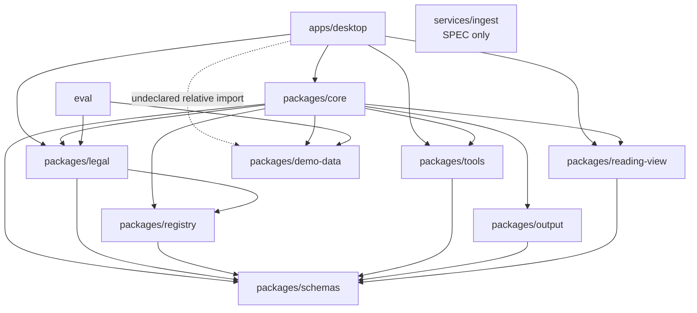

# SOL-ARCH-AUDIT：全量架构审计

> 日期：2026-07-13
>
> 角色：sol（独立审计）
>
> 处置边界：**只记录，不修复**
>
> 基线：clean detached worktree `/Users/lesprivilege/Projects/Courtwork-sol-arch-audit`，被审计代码 tip `1fa527f`
>
> 编号：原工单写 `docs/72`，但 LEGAL 记录已占 72；`docs/55-Debug工单册.md:825` 已拍板本报告改为 73。

## 0. 审计口径与基线

### 0.1 分支收口

审计 worktree 从当时 `main@7f98c30` 建立，合并 `codex/luna-ui-001@e3dd9be`，随后又合并审计期间前进到 `a47bb7b` 的 `main`。最终祖先检查：

```text
$ git rev-parse --short HEAD
1fa527f

$ for b in codex/luna-ui-001 codex/ux-ui-polish main; do ...; done
codex/luna-ui-001  e3dd9be  ancestor=yes
codex/ux-ui-polish 185c3b6  ancestor=yes
main                a47bb7b  ancestor=yes
```

`codex/ux-ui-polish@185c3b6` 本已在 `main` 祖先链上。共享主工作树中他会话未提交的 `CLAUDE.md`/docs/lockfile/`packages/pm-schemas` WIP 不属于任一分支 tip，也不能进入 clean detached 数字语境，故本报告不审计这些未提交内容。

### 0.2 方法

- 地图：`CLAUDE.md`、`docs/20–58`、各层 `SPEC.md`。
- 领土：逐个 `package.json`/Cargo manifest，生产源码 `import` 实抓，各包根导出，门禁源码与测试实跑。
- 边口径：实线为生产源码实际 import；测试/dev-only 边单列；纯 `type` import 仍是源码耦合，但不计运行时调用。
- 结论标记：🟢 对齐；🟡 部分对齐/有【漂移】；🔴 违规或【未落地】的现行承诺；⚪【仅文档】/明确后置，不当作当期 bug。

### 0.3 机器基线

```text
$ node --version && pnpm --version
v25.9.0
9.15.0

$ pnpm install --frozen-lockfile
Scope: all 11 workspace projects
Lockfile is up to date, resolution step is skipped
Done

$ pnpm -r build
packages/schemas build: Done
packages/demo-data build: Done
packages/registry build: Done
packages/reading-view build: Done
packages/tools build: Done
packages/output build: Done
packages/legal build: Done
eval build: Done
packages/core build: Done
apps/desktop build: Done

$ pnpm lint
Process exited with code 0

$ pnpm test
Test Files  99 passed (99)
Tests       823 passed (823)

$ COURTWORK_E2E_PORT=1473 pnpm --filter @courtwork/desktop test:e2e
动效属性门禁通过：仅 transform / opacity / background-color / border-color
法理之线审计通过：右栏白名单 + 五色封闭集 + icon 品牌单色
G6 主题审计通过：tokens.json 对齐 + 边色封闭 + 结构化矛盾 marker
SVG 图标门禁通过：20 个具名 SVG（18 概念）+ Lucide 静态按需导入
Preview host/import boundaries: OK
Elevation shadow boundary: OK
RP-2.6 token/demo/preview contracts: OK
RP-2.7 subtraction/language boundaries: OK
ThinkingStream three-state/char boundaries: OK
RP-2.8 turn-card/dock/composer boundaries: OK
RP-2.9 lazy-probe/home/titlebar/message-ledger boundaries: OK
RP-2.9.1 chrome/flat-controls/dock/rail boundaries: OK
RP-2.10 三卡一纸/线影凡例/卡片清算 boundaries: OK
RP-2.11 chat|work/chrome/collapse/chip boundaries: OK
中性色单源律审计通过:tokens 中性组 25 值冷调同源;src 95 文件全部色值 ∈ tokens 声明集;废除族零回流
Playwright 假绿防护通过：191 条用例（下限 185）
Running 191 tests using 4 workers
191 passed (1.6m)
```

Playwright 使用 `apps/desktop/playwright.config.ts:3-19` 的环境变量端口，`:1473` 独立自起服务，`reuseExistingServer:false`，未连共享 `:1420`。

净重装后若**先**直跑部分跨包测试，4 个 suite 因 workspace `exports` 只指向尚未存在的 `dist` 而在 collection 阶段失败；先 `pnpm -r build` 后同一命令 5 files/32 tests 全绿。这不是产品行为失败，但是“测试不能独立从 clean install 起跑”的门禁易碎性，记为漂移项 D-07。

---

## 一、架构树实况图

### 1.1 实际 workspace 依赖图

箭头方向是“消费方 → 被依赖方”。虚线是未声明且绕过包边界的物理路径 import。



`schemas` 无 workspace 内依赖（`zod` 是外部库）；`demo-data` 无 runtime 依赖。`tools`/`reading-view` 对 `demo-data` 只有 devDependency 与测试消费，符合 docs/21 测试例外。

### 1.2 逐包/应用/服务实况

| 单元 | 实际职责（一句话） | 主要模块 | 关键根导出 | 实际 workspace 边 |
|---|---|---|---|---|
| `packages/schemas` | 领域无关的 wire/基座契约 | anchor、artifact id/descriptor/projection、confirmation、citation、package identity、revision event、ingest status、revision/file-ops plan | `SourceAnchor*`、`ArtifactDescriptor*`、`RevisionEvent*`、`RevisionInstructionSet*`、`FileOpsPlan*` | 无 |
| `packages/registry` | 垂类包 ABI、准入与五类运行注册表 | `package-manifest`、`admission`、`package-registries` | `VerticalPackageManifest`、`admitPackages`、`buildPackageRegistries` | `schemas` |
| `packages/tools` | 确定性工具契约与宿主执行器 | tool envelope/cache、party/cite、web fetch/search、case path/system open、file ops | 根导出工具；另有 `./contract`、`./case-path`、`./system-open`、`./file-ops-*` 子路径 | `schemas` |
| `packages/output` | 对 docx OOXML 定位、修订、批注与回写 | zip、locate、apply instructions、comments、fonts | `applyRevisionInstructionSet`、`InstructionOutcome`、`LocateResult` | `schemas` |
| `packages/reading-view` | docx/md/txt/文本层 PDF 统一转阅读视图并产 anchor | dispatcher、docx/pdf/md/text converter、zip/XML 安全、CaseFile 薄投影 | `convertToReadingView`、`ReadingView*`、`toCaseFileEntryProjection`、`DEFAULT_LIMITS` | `schemas` |
| `packages/demo-data` | 虚构样板案语料与薄访问器 | party/citation corpus、data/artifacts/dossier、fixture generators | `findPartyRecord`、`findStatuteCitation`等 | 无 runtime 边 |
| `packages/legal` | 法律垂类的 schema、descriptor/场景/渲染声明、词表与法律编译器 | 5 类业务 schema、`manifest`、RiskList→RevisionInstructionSet、demo drafts | `LEGAL_PACKAGE`、法律 schema/types、`compileConfirmedRiskListToRevisionInstructions`、demo 草稿 | `schemas`、`registry` |
| `packages/core` | provider 无关的无头执行器，同时承载 assembly/composition/acceptance | provider、evidence、events/session/revision、tool registry、scenario executor、six-segment assembly、citation resolver、demo/real runners | 根导出 provider/evidence/events/executor/assembly，**也根导出 demo assembly 与 demo runner**；provider/generic-chat 子路径 | 机器层：`schemas/registry/tools`；绑定/验收层：再加 `output/demo-data/legal/reading-view` |
| `apps/desktop` | React + Tauri 产品壳：案件/对话/工作面、provider 凭证、文件/阅读宿主 | App/chrome/case/chat/composer/modules/workbench/protocol/provider/settings/system + Rust shell | 应用，无对外 package export | `core/legal/reading-view/tools`；物理直连 `demo-data` |
| `eval` | promptfoo/规则回归与数据集生成 | schema-valid/risk-list/revision/citation rules、dataset scripts | 无公开导出 | `legal/demo-data`；manifest 额外声明但未实抓 `schemas` |
| `services/ingest` | 地图上的 Python OCR/分类/实体对齐服务 | 只有 `SPEC.md` | 无 | 无；W3 spike 状态仍“未开工” |

### 1.3 与 `CLAUDE.md` 逐边对照

| 实际边/缺边 | 地图口径 | 结论 |
|---|---|---|
| `registry → schemas` | `CLAUDE.md:13` 明记 | 🟢 |
| `tools → schemas` | `CLAUDE.md:15` 允许，但“MVP 两工具当前无需”已被 file-ops 实现过时 | 🟡 地图文案漂移 |
| `output → schemas` | `CLAUDE.md:16` 明记 | 🟢 |
| `reading-view → schemas` | `CLAUDE.md:17` 明记 | 🟢 |
| `demo-data → ∅` | `CLAUDE.md:18` 明记 | 🟢 |
| `legal → schemas` | 新垂类拆包后的合理根边 | 🟢 |
| `legal → registry` | `CLAUDE.md` 图没有 `legal` 节点/边，代码因 manifest 类型实际需要 | 🟡 **多边（地图少画）** |
| `core → schemas/registry/tools/output/demo-data/legal/reading-view` | `CLAUDE.md:14` 全部显式列出，后四者限 composition/acceptance | 🟢 就 core 包内边而言对齐 |
| `desktop → core/reading-view/tools` | `CLAUDE.md:21` 明记 core 与阅读汇流；tools 为壳宿主实际需要 | 🟢/🟡 |
| `desktop → legal` | 地图未列；且壳内不只是 type，还写死 `legal.*`→工作面路由 | 🔴 **多边 + 包 ABI 绕行** |
| `desktop ⇢ demo-data` | docs/21/`CLAUDE.md:26` 说全仓运行时唯一导入点是 `core/src/composition/demo-assembly.ts` | 🔴 **未声明多边**，见 `App.tsx:83`、`demo/recordings.ts:2` |
| `eval → legal/demo-data` | eval 本就是垂类回归/数据消费方，docs/21 显式豁免 | 🟢 |
| `desktop → schemas`、`eval → schemas` 只声明未实抓 | package manifest 有边，生产 import 为空 | 🟡 **声明边多余/领土少边** |
| `ingest → schemas/legal` | `CLAUDE.md:19` 与 `services/ingest/SPEC.md:7` 说产 schemas JSON | ⚪ 代码全缺；且法律 schema 已迁 `legal`，SPEC 仍指向 `schemas/json-schema` |

未发现 workspace 图环。但 `CLAUDE.md:24` 的“依赖只能向上指向 schemas，禁止横向”按字面与同文 `CLAUDE.md:14` 允许的 core→tools/output/legal/reading-view，以及 PACKAGE-ABI 必需的 legal→registry 冲突。这不能靠审计会话自行重解为新契约，已列入 `[A-01 需架构拍板]`。

---

## 二、解耦六验

### ① 依赖只向上、零横向：🔴 全仓不成立

**机器证据**：`package.json` 与生产 import 交叉得到上述实图；全仓 import 实抓存在 `legal→registry`、`desktop→legal`、`desktop⇢demo-data`。

```text
$ rg -n "from ['\"]@courtwork/|from ['\"]../../../packages/" \
    packages/*/src apps/desktop/src eval/src --glob '!**/*.test.ts'
packages/legal/src/manifest.ts:1: ... from '@courtwork/registry'
apps/desktop/src/App.tsx:2: ... from '@courtwork/legal'
apps/desktop/src/App.tsx:83: ... '../../../packages/demo-data/...md?raw'
apps/desktop/src/demo/recordings.ts:2: ... '../../../../packages/demo-data/...json'
```

core 机器层未发现反向包 import，且没有 workspace cycle；但“全仓零横向”不能放行。

### ② core 域盲：🟡 行为层基本成立，“语义零命中”不成立

排除 `*.test.ts`、`acceptance/`、`composition/` 后：

```text
$ rg -n -i --glob '!**/*.test.ts' --glob '!**/acceptance/**' \
    --glob '!**/composition/**' '(卷宗|合同|风险|\blegal\b)' packages/core/src
packages/core/src/provider/pricing-table.ts:17: ...过期风险...
packages/core/src/citation/resolver.ts:246: ...（legal.RiskList=/risks）...
```

- `pricing-table.ts:17` 是普通运营风险语义，判为灰名单假阳性。
- `citation/resolver.ts:246` 是机器层真实法律类型字面泄漏（虽然只在注释，不影响行为）。
- 现有守卫 `package-boundary.test.ts:14-16` 只抓完整 package specifier 与带引号的 `'legal.`，因而没抓住注释里的 `legal.RiskList`。这是守卫盲区，不是本次修复项。

### ③ 装配点唯一：🔴 不成立

🟢 预期点存在：`packages/core/src/composition/demo-assembly.ts:4-13` 统一绑定 demo-data、legal、registry、reading-view、tools；`core` 的其他机器层由门禁保持域盲。

🔴 但生产壳另有绑定点：

- `apps/desktop/src/App.tsx:83` 直读 demo 合同原文。
- `apps/desktop/src/demo/recordings.ts:2-6` 直读五个 demo artifact JSON。
- `apps/desktop/src/App.tsx:107-114` 写死 `legal.Timeline/PartyGraph/ReviewMatrix/RiskList` 到工作面的路由。
- `apps/desktop/src/modules/module-stack.ts:33-36`、`workbench/generic-structure.ts:9-11` 又有一组 legal type id 绑定。

这些路径既未通过 `@courtwork/demo-data` manifest 声明，也没有从 `LEGAL_PACKAGE`/renderer registry 派生；换垂类不是“只换装配”。

### ④ 管线归底座：🟡 主生产链成立，夹具/安全边界有漂移

**解析器归属**：

- 统一分发：`packages/reading-view/src/convert.ts:42-65`。
- PDF 文本层与页级 anchor：`packages/reading-view/src/pdf/pdf-to-reading-view.ts:3-49`。
- docx 安全预检后解压：`packages/reading-view/src/docx/docx-reader.ts:32-50`。
- docx 修订写回：`packages/output/src/apply-revision-instruction-set.ts:18-37`。
- 引用坐标由通用 resolver 从 quote + reading view 铸造：`packages/core/src/citation/resolver.ts`。

```text
$ rg -n "pdfjs-dist|unzipSync|DOMParser" packages/*/src apps/desktop/src eval/src \
    --glob '!**/*.test.ts' --glob '!**/test-fixtures/**'
# 真正 PDF 解析仅 reading-view；docx 读仅 reading-view；docx 写仅 output。
```

未发现 legal/desktop/eval 自造生产 PDF/docx parser。`demo-data/scripts` 手写 OOXML/PDF 是 fixture 生成器，不是消费方解析器。

但严格“锚只能底座铸造”仍有两类例外：`packages/legal/src/demo/s3-risk-list-response.ts:25`开始的旧式 demo 全量回应直接嵌 SourceAnchor，`eval/scripts/build-s3-dataset.ts:176` 铸造 placeholder range。它们不在新的 quote→resolver 生产主链，但会让评测/回放继续训练旧形状。

另有安全归属漂移：`output/src/docx-zip.ts:5-6` 对外来 docx 直接 `unzipSync`，`output/src/apply-instructions.ts:1` 直接 DOM parse，没有 reading-view 同级的 zip-bomb/macro/DOCTYPE/ENTITY 防线。这是 docs/27 已拍板的安全漂移，见 D-04。

### ⑤ 词表/文案归宿：🔴 契约层通过，壳层不通过

🟢 descriptor 自携词表：`packages/legal/src/manifest.ts:63-180`。例如 `legal.RiskList` 的 `level`/`dispositionStatus` 映射与 descriptor 同位（`:115-143`）。

🟢 准入机递归抽取 enum 并验完整性：`packages/registry/src/admission.ts:63-79,102-115`；定向 5 files/32 tests 实跑通过。

🔴 壳层又建了域内真值：

- `App.tsx:92-99` 写死工作面标签，`:107-114` 写死 legal artifact 归宿。
- `App.tsx:903-990`、`workbench/Panels.tsx` 包含成批法律工作面文案与字段假设。
- `LEGAL_PACKAGE.renderers` 已在 `packages/legal/src/manifest.ts:314-320` 声明，registry 也能以 `uiTemplateId` 查找（`package-registries.ts:148`），但 desktop 没有消费这个 registry 来决定工作面。

因此“枚举映射随 descriptor”在包 ABI 层成立，“界面业务串零包外来源”全局不成立。

### ⑥ demo 双向隔离：🟢 两组守卫在位、可触红；🟡 扫描边界不覆盖 desktop

**in-harness**：`packages/core/src/no-demo-in-harness.test.ts:8-13` 声明双向目的，`:20-66` 扫素材指纹/固定 id 分支，`:96-100` 内置变异自证。

**in-real**：`packages/core/src/acceptance/run-s3-real.ts:55-93` 拦 scripted/demo provider、`demo-fixture` 事件、非真材料与非真锚点；`run-s3-real.test.ts:76-133` 逐类投毒。

```text
$ pnpm exec vitest run packages/core/src/package-boundary.test.ts \
    packages/core/src/no-demo-in-harness.test.ts \
    packages/core/src/acceptance/run-s3-real.test.ts \
    packages/registry/src/admission.test.ts \
    packages/registry/src/package-registries.test.ts
Test Files  5 passed (5)
Tests       32 passed (32)
```

本审计又在 clean worktree 临时向 `core/src/provider/types.ts` 注入 `sample-sale-contract-v1.docx`，in-harness 真实变红：

```text
FAIL packages/core/src/no-demo-in-harness.test.ts
provider/types.ts 含 demo 素材指纹 "sample-sale-contract"
Test Files  1 failed (1)
Tests       1 failed | 3 passed (4)
```

反向补丁撤除后原命令恢复 `1 file / 4 tests passed`，worktree 恢复 clean。因此“守卫在位且可触红”可放行。但两者只扫 `packages/core/src`，对 desktop 的 demo-data 物理直连无感；守住的是 harness 机器层，不等于全仓 demo 绑定唯一。

---

## 三、docs/20–58 文档—代码对账

本节覆盖该号段实际存在的 34 份 Markdown（包括两份 `docs/54-*`）。“仅文档”用于调研、历史验收、工单或明确后置的设计，不代表当期应有代码。

| 文档 | 抽查的 1–3 条关键裁决 | 领土位置/结论 |
|---|---|---|
| `20-信源分级与检索策略` | web search 是普通工具；A/B/C 传播与 C 级确认；`retrievalPolicy` 后置 | 🟡 `core/src/evidence/grade.ts:75`、`tools/src/web-fetch.ts:88`、`tools/src/web-search.ts:78` 已有分级/消毒骨架；全仓无 `retrievalPolicy`，与文档的 MVP 后分期一致。 |
| `21-演示数据包与样板案` | demo-data 独立；生产 src 只认注入；真/demo 同管线 | 🔴【漂移】`core/src/composition/demo-assembly.ts:4-13` 落了正路，但 `desktop/App.tsx:83`、`desktop/demo/recordings.ts:2-6` 建了第二生产绑定点。 |
| `22-范式泛化边界` | 通用机制沉底，垂类价值保留在数据/声明；先打穿法律 | 🟡【漂移】`schemas/registry/core` 与 `legal` 已拆（`schemas/src/index.ts:1-14`，原始落地 sha `a9549e1`）；desktop 仍读法律类型/路由，第二垂类基线不存在，尚不足以用实证证明可替换。 |
| `23-编辑面与单向编译` | 起草画布；手动编译为 Word；冻结后 docx 唯一权威 | 🔴【未落地】`workbench/Panels.tsx:256` 有按钮，`App.tsx:1543` 确认后只 `setDraftFrozen(true)`，没有调 output/产 docx；仪式外壳已落，“编译”未落。 |
| `24-场景注册表与 skill` | 固定声明式 pipeline；模型不自主选工具；外部 skill 必须有 schema+门禁 | 🟢 `legal/src/manifest.ts:198-307`、`registry/src/admission.ts:82-185`、`core/src/scenario-executor/executor.ts` 落地前两项；⚪【未落地】skill 双向转换/自装路径未做，文档明确不 UI 化/后置。 |
| `25-三层记忆与偏好` | 案件层=artifact/event/revision；用户偏好强制确认；左栏容器而非 session | 🟡【漂移】`core/src/events/event-log.ts:29-51`、`revision/revision-store.ts:36-49` 有 append-only 基座；用户偏好记忆【未落地】且按 Stage 后置；`App.tsx:197-198` 仍留 unfiled state，但 `:1132` 强制传空，是死实现。 |
| `26-数据维护即场景` | 维护任务也走声明/门禁；deep-research 后启动 | ⚪【仅文档】【未落地】无专用维护场景，符合“MVP 后”状态。 |
| `27-sandbox 与 fetch` | SSRF/重定向/大小限制/spotlight；docx/ingest 禁宏与 XXE；key 不进日志/遥测 | 🟡 `tools/src/web-fetch-ssrf.ts`、`web-fetch-spotlight.ts:18-29`、`reading-view/src/docx/docx-reader.ts:32-50`、Tauri keyring 已落；🔴 output 直接 unzip/XML parse，ingest 无实现，安全承诺不完整。 |
| `28-数据承诺分层` | 分层同意；行为数据 opt-in；遥测可随时关 | 🔴【漂移】`settings-store.ts:17-41,93-171`、`SettingsPage.tsx:484-555` 有 UI/持久化，但 `App.tsx:541,886,892` 不读 `telemetryEnabled` 就发 review telemetry。“Disable at any time”与领土不符。 |
| `29-企业私域库接入` | ACL 透传、`requesterContext`、检索时过滤；MCP 后置 | ⚪【未落地】按期后置；desktop settings 只有 reserved/disabled 占位（`SettingsPage.tsx:430-479`）；全仓无 `requesterContext`/enterprise adapter/MCP。 |
| `30-W9 设计 brief` | 零技术概念；壳只消费 core 协议 + demo 装配；业务逻辑不进壳 | 🔴【漂移】产品 UI 与 protocol 已成，但 `App.tsx:107-114`、`903-990` 与直连 demo-data 证明“一行业务逻辑不进壳”未守住。 |
| `31-设计语言调研分发` | 浅色优先；“法理之线”签名动作；独立 UI 硬门禁 | 🟢 `apps/desktop/scripts/assert-signature-line.mjs`、`src/styles.css`、`src/design/*`已代码化；desktop e2e script 串含签名线门禁（`package.json:11-27`）。 |
| `35-Gemini UX 提案` | Gemini 三栏/动效/风格提案 | ⚪【仅文档】已被后续 docs/49 与 RP 批次取代，不作现行契约验收。 |
| `36-schema 空间设计` | schema 驱动五层工作面；未知 schema 通用兜底；不暴露 wire 编码 | 🟡 `workbench/GenericStructurePanel.tsx`、`generic-structure.ts` 有兜底，`registry/admission.ts:63-79` 守 enum 词表；但既有五面映射仍写死在 desktop，未由 renderer registry 驱动。 |
| `40-S5 合同对比` | 批量 docx 比较场景与 diff 工作面 | ⚪【未落地】按期后置；`LEGAL_PACKAGE` 现有 S1/S2/S3/S4/S6，无 S5；无合同比较引擎。 |
| `41-MVP 缺口盘点` | reading-view、web fetch/search、真 provider 与 OCR 路由 | 🟡 reading-view 与 provider 子路径已落，fetch 有真 HTTP adapter；`tools/src/web-search.ts:72-94` 的真 search adapter 仍是注入式壳，ingest/OCR 无实现。 |
| `42-MVP 补强验收报告` | 历史行为验收与放行证据 | ⚪【仅文档】历史验收；现行领土以本报告的 clean run 为准，不沿用历史自述数字。 |
| `43-场景 UI 可视化` | 关系图首选 G6；时间线先紧凑列表；图表按需 | 🟢 `apps/desktop/package.json:35`、`workbench/GraphPanel.tsx`、`Panels.tsx:68` 对齐；未见为无消费场景预埋重型图表。 |
| `44-组件与图标库` | Lucide 优先；自制 SVG 走优化/生成/验证；不提前建 `packages/ui` | 🟢 `desktop/package.json:28-30,43`、`src/icons`、`scripts/verify-icons.mjs`对齐；无 `packages/ui`。 |
| `45-composer 输入区惯例` | 扁平 composer、附件/chip、发送优先；语音/摄像后置 | 🟢 `apps/desktop/src/composer/Composer.tsx`、`process-upload.ts`、`reading-view` 上传汇流已落；无语音/摄像伪功能。 |
| `46-控件全量清单` | 界面控件 census、状态/动词与后置项台账 | 🟡 大部分控件已能在 `desktop/src` 定位，但该文档是快照且已被 docs/52/RP 批次多次修订；不能当作单一当前 DOM 契约。 |
| `47-文件操作分级` | move/rename/copy/mkdir 封闭集；无 delete/overwrite；hash+可撤销 | 🟡 `schemas/src/file-ops-plan.ts`、`tools/src/file-ops-executor.ts`、`file-ops-redline.test.ts:20-32` 已落；desktop 现主要用 memory host（`system/file-ops-demo.ts`），真文件宿主/来源区仍不完整。 |
| `48-办公管理场景族预言` | 法律计算器零 LLM；PM/表格/飞书等为后续垂类；不影响当前 core | ⚪【仅文档】【未落地】按期后置；审计基线无 PM/计算器包；共享树未提交 `packages/pm-schemas` 不在本次数字语境。 |
| `49-通用底座与垂类路由` | base/vertical 包 ABI；renderer 按声明挂载；未知 schema 兜底；容器—包绑定 | 🔴 `registry`+`legal/manifest` 已落 ABI，`GenericStructurePanel` 已落兜底；但 desktop 写死 legal 映射，全仓无 `containerPackBinding`，“换包零改壳”尚不成立。 |
| `50-agent 与 workflow 演进阶梯` | 从固定 workflow 到更强自主性的阶段判据 | ⚪【仅文档】战略观察；当前领土明确停在声明式 pipeline，与 docs/24 一致。 |
| `51-push 前安全清扫` | 秘钥/样本/大文件/忽略规则的历史扫描 | ⚪【仅文档】历史报告；本审计未以其历史“清洁”结论代替当前代码审计；当前未在源码 import/凭证路径发现硬编码真 key。 |
| `52-UX 微调批次一` | UX/RP 问题与修正历史，demo 转正，base 优先 | ⚪【仅文档】工作日志；代码已经后续 RP 多批次演化；本审计将其当作变更索引，不当现行规格。 |
| `53-schema 握手协议` | 契约>声明>租户>会话优先级；修正即 RevisionEvent；渐进填充/通用包 ABI | 🟡 `core/src/assembly/assemble.ts:59-72` 六段组装（sha `7391cd9`）、`revision-store.ts:36-49`、registry/legal ABI 已落；字段级流式填充按文档仍是 future；desktop 词表/渲染绕声明是当前漂移。 |
| `54-career-kit 唤醒 prompt` | 本地 career-kit 会话操作指令 | ⚪【仅文档】非产品架构契约，无应用代码落点要求。 |
| `54-收束与对外材料计划` | career kit 分流；公开镜像白/黑名单；反 slop 叙事纪律 | ⚪【仅文档】发布流程；镜像脚本/发布流程不属于当前 runtime 解耦。 |
| `55-Debug 工单册` | Debug/RP/审计工单与收账纪律 | ⚪【仅文档】运营台账；本 SOL-ARCH-AUDIT 任命位于 `:807-825`；不将历史完工自述当实现证据。 |
| `56-法律计算器族` | 零 LLM 计算；法规参数库是壁垒；输出必须带依据/分项/溯源 | ⚪【仅文档】调研；现行 legal manifest 无计算器场景或参数库，未被误做成 LLM 节点。 |
| `57-schema 渲染形态全谱` | 7 族 18 原语提案；交互动词封闭集；渲染器不做领域计算 | ⚪/🟡【仅文档】调研未拍板、部分先行；`legal/manifest.ts:314-320` 只有当前 7 个 renderer descriptor，不是 18 原语 registry；壳也未通过 registry 挂载。 |
| `58-数据治理与存储拓扑` | 双平面/案件目录隔离；六段 harness；append-only 权威态；续行投影/容器一对多 | 🟡 `assembly/segments.ts:12,41-162`、`legal/manifest.ts:67-173`、event/revision JSONL 已落；全容器目录持久化、`containerPackBinding`、turn fork UI 仍缺，desktop 主状态仍是内存/demo。`services/ingest` 又与 legal 迁包后的 schema 归属脱节。 |

---

## 四、台账与结论

### 4.1 模块台账

| 模块 | 当前可证状态 | 形状判定 | 主风险 |
|---|---|---|---|
| schemas 基座契约 | 构建/全测绿，法律 schema 已迁出 | 🟢 | `CLAUDE.md` 仍称“领域 schema 一切的根”，语义过时 |
| registry/PACKAGE-ABI | 准入、五 registry、enum 词表门禁在位 | 🟢 | 下游 desktop 未真正消费 renderer/vocabulary 真值 |
| legal 垂类包 | schema/manifest/compiler/demo 完整 | 🟢/🟡 | demo 旧响应仍内铸 anchor；壳层重复法律映射 |
| core 机器层 | 执行、证据、六段组装、resolver 门禁全绿 | 🟡 | 一处 `legal.RiskList` 注释泄漏；边界守卫过窄 |
| core composition/acceptance | demo/real 全链与双向隔离守卫在位 | 🟢 | core 根导出与 runtime deps 包含 demo，产品打包边界需持续守 |
| tools | 确定性工具、fetch 安全、file ops 红线已落 | 🟢/🟡 | 真 web search/真 FS host 仍依赖装配 |
| reading-view | 四格式汇流、anchor、docx 安全落地 | 🟢 | OCR 路由只能返 `needs_ocr`，ingest 未接 |
| output | docx 修订引擎可用 | 🔴 安全形状 | 直接 unzip/XML parse，与 docs/27 承诺不等强 |
| demo-data | 自洽样板案、零 runtime 依赖 | 🟢 | desktop 物理路径直连让“自解耦”在消费端失效 |
| desktop TS/React 壳 | UI/e2e/阅读/provider 已成品 | 🔴 架构形状 | 绕过 ABI，demo/legal 重绑，假编译，遥测开关未接发送端 |
| desktop Rust 壳 | keyring/provider probe/opener 在位 | 🟢/🟡 | 这不等于已完成案件目录持久化或全文件宿主 |
| eval | 法律规则/数据集可构建 | 🟡 | 旧 placeholder anchor 会固化过时形状；声明依赖有噪声 |
| ingest | 仅 SPEC，W3 spike 未开工 | ⚪/🔴 契约漂移 | SPEC 仍指向已从 schemas 迁出的法律 JSON Schema |

### 4.2 三色清单

#### 🔴 违规/现行承诺不成立

| ID | 问题 | 机器/代码证据 | 影响 |
|---|---|---|---|
| V-01 | desktop 绕过唯一 demo 装配点 | `App.tsx:83`，`demo/recordings.ts:2-6` | 真/demo 替换需改壳，生产 bundle 与样板数据绑死 |
| V-02 | desktop 绕过垂类 renderer/vocabulary registry | `App.tsx:92-114`，`modules/module-stack.ts:33-36` | 替换垂类不是换包，壳成为第二业务真值源 |
| V-03 | docs/27 的 docx 输入安全没有等强覆盖 output | `output/docx-zip.ts:5-6`，`output/apply-instructions.ts:1` | 不可信 docx 进修订管线时缺 zip-bomb/macro/XXE 前置拒绝 |
| V-04 | “编译为 Word”只冻结 UI，未产文件 | `App.tsx:1543` | 用户可被告知已编译，但领土只改 bool |
| V-05 | 遥测开关没有门控发送点 | `SettingsPage.tsx:537-554` vs `App.tsx:541,886,892` | 界面的可关闭承诺没有运行时效力 |
| V-06 | ingest 的权威 schema 路径已失效 | `services/ingest/SPEC.md:7,32` vs `packages/schemas/src/index.ts:1-14`、`packages/legal/json-schema/*` | W3/W8 按现 SPEC 开工会找错契约源 |

#### 🟡 漂移/守卫缺口

| ID | 问题 | 证据/说明 |
|---|---|---|
| D-01 | `CLAUDE.md` 图没画 legal→registry，仍把 schemas 称为“领域 schema” | `CLAUDE.md:12-24`，`legal/package.json:18-21` |
| D-02 | core 域盲守卫漏掉无引号领域字面与壳层跨包路径 | `citation/resolver.ts:246`，`package-boundary.test.ts:14-16,35-68` |
| D-03 | legal demo/eval 仍铸 placeholder/full anchor | `legal/src/demo/s3-risk-list-response.ts:25+`，`eval/scripts/build-s3-dataset.ts:176` |
| D-04 | desktop/eval 声明 `schemas` 却无生产 import | `apps/desktop/package.json:39`，`eval/package.json:13`；import 实抓为空 |
| D-05 | core 根导出 demo assembly/runner，产品面与演示面的可打包边界不清 | `core/src/index.ts:18-19`，`core/package.json:44` |
| D-06 | desktop 保留不可达 unfiled session state | `App.tsx:197-198,672,1132` |
| D-07 | clean install 后跨包定向测试需先 build `dist` | 本报告 0.3 的首轮 collection 失败/构建后 32/32 |

#### ⚪ 未落地（明确后置与无实现层）

- `services/ingest` W3/W8 全层：OCR、文书分类、实体对齐、队列/API。
- docs/29 企业私域库、ACL/`requesterContext`/MCP adapter。
- docs/26 数据维护场景、docs/40 S5 合同比较、docs/56 计算器族。
- docs/25 用户偏好记忆、docs/58 turn fork/完整 case directory persistence/`containerPackBinding`。
- docs/57 的 18 渲染原语只是调研立案，未拍板/未实现。

### 4.3 `[需架构拍板]`

| ID | 需拍板问题 | 为什么审计会话不能自行定义 |
|---|---|---|
| A-01 | 将“依赖只能向上指向 schemas，禁止横向”改写为一张**允许边白名单**，还是将现有 core/legal 边收回到更严格的层级？ | `CLAUDE.md:14` 明记的例外与 `:24` 字面律冲突，属于工程宪法语义。 |
| A-02 | ingest 产出的 `CaseFile/Timeline/PartyGraph` 应直接依赖 `@courtwork/legal` JSON Schema，还是把其中性契约重新下沉 schemas？ | 这会改 schema 归属、Python↔TS 边与 W8 验收标准，不是实现修补。 |
| A-03 | desktop 的法律工作面是否被定义为允许的“终端绑定层”；若是，需在 docs/21/49/53 明记例外；若否，应改由 renderer/vocabulary registry 驱动 | 现有文档说壳零业务逻辑/换垂类只换包，代码却反向。这是终端与包 ABI 的契约边界。 |
| A-04 | `emitReviewTelemetry` 是仅本地的审阅质量事件，还是受“Usage telemetry”开关控制的遥测？ | 命名/UI 承诺与当前调用不一致；若改口径会影响 docs/28 的数据类型语义与用户同意范围。 |

### 4.4 最终结论

**一问的直接答案：架构解耦不能按“全仓已属实”放行。**

更精确地说：

1. **底座的核心机制大体属实**：法律 schema/manifest 已从 core 迁出，core 的 provider/executor/assembly/resolver 主体能以通用契约运行；PACKAGE-ABI、enum 词表准入、阅读/输出管线和 demo 双向守卫都有代码与可触红测试。
2. **产品终端尚未按这套解耦机制收口**：desktop 仍直连 demo-data，直接识别 legal type id/类型/文案，没有让 renderer/vocabulary registry 成为唯一真值。这是当前最大的**歧途风险**：往下增加工作面时，开发者会很自然地继续改 `App.tsx`/壳映射，包 ABI 则逐渐退化为“有文档、有测试，但不掌控产品路由”的影子架构。
3. **安全与信任承诺有三个高优先风险点**：output 的不可信 docx 防线低于 reading-view；“编译为 Word”实际不编译；遥测开关不控发送。这三项不只是内部漂移，会直接伤及用户所见承诺。
4. **ingest 是结构性空白**：未开工本身是已知分期，但 legal 迁包后 SPEC 仍指向不存在的 schemas JSON Schema，若不先拍板 A-02，W3/W8 会从错误契约起步。

因此，本审计的放行口径是：**行为门禁绿，但架构形状不放行为“全量解耦已完成”。** 可以宣称“通用 core/PACKAGE-ABI 骨架已落地”，不应宣称“垂类可通过换包零改壳替换”，直到 V-01/V-02 的契约归属由架构会话拍板并有后续独立验收。
