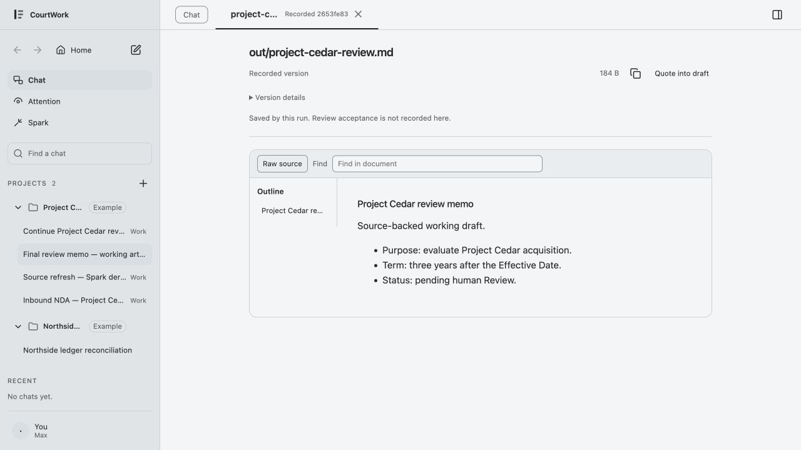
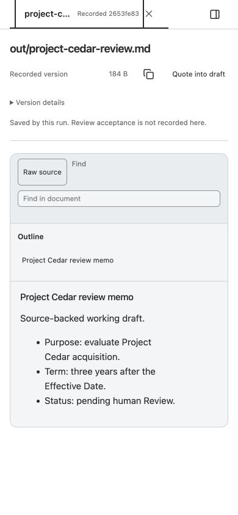
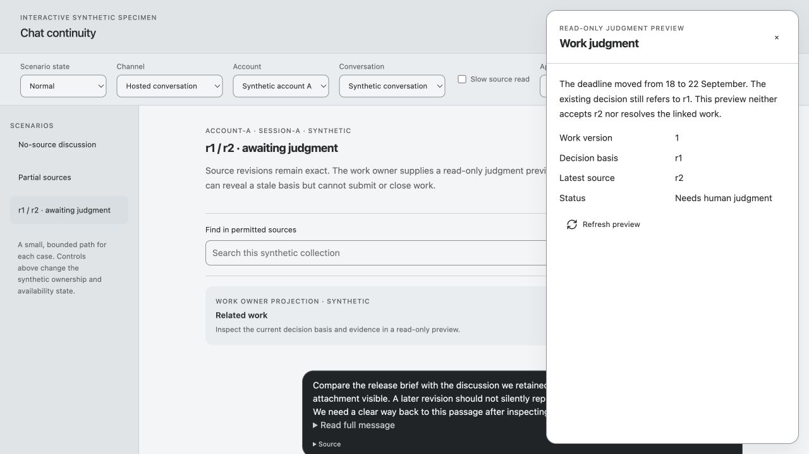
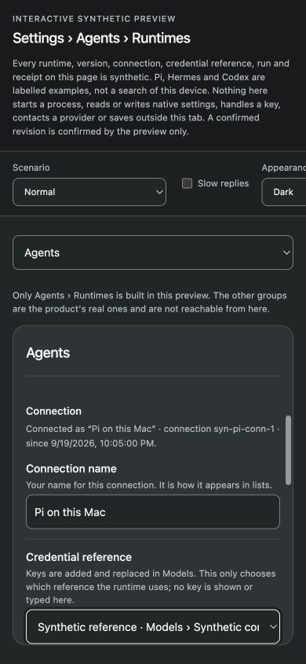
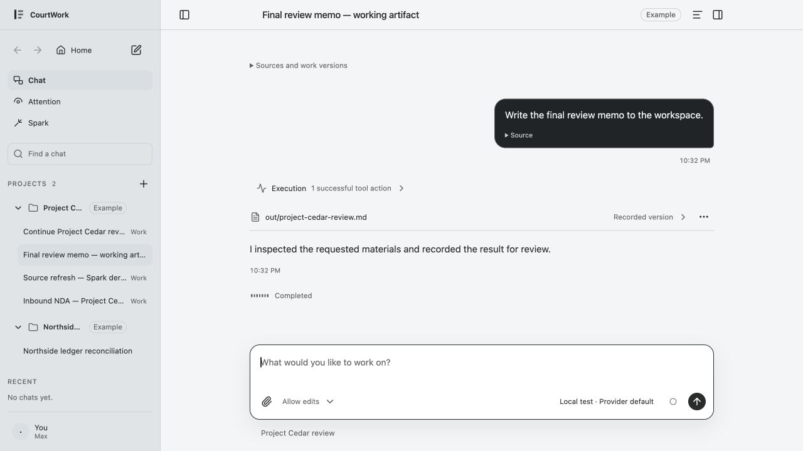
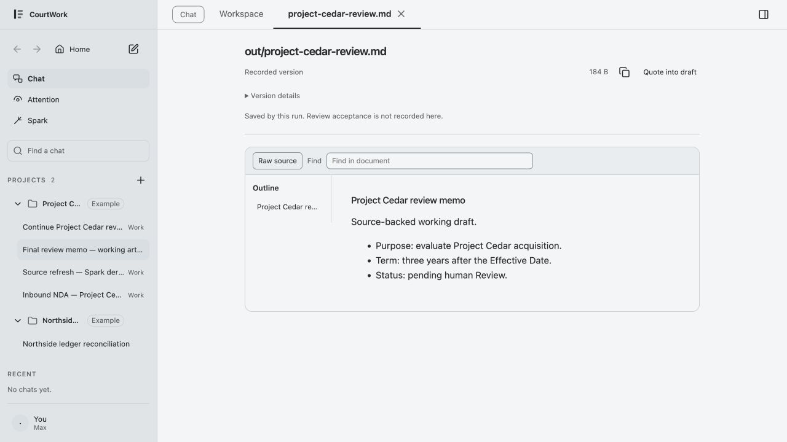
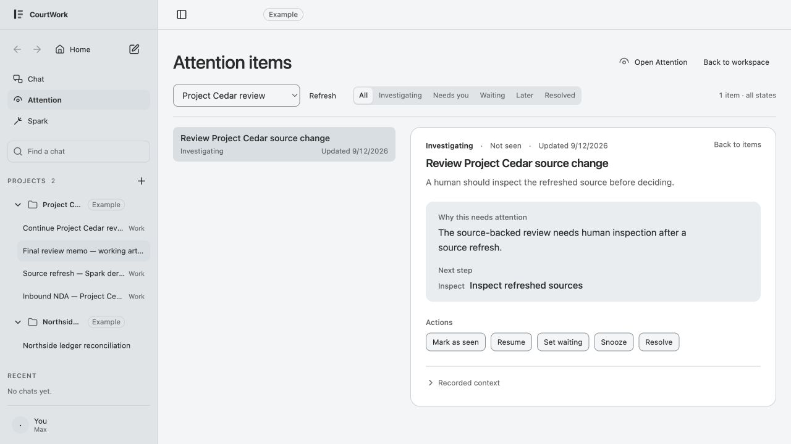

# GUI Grammar Convergence — first read-only packet

Status: audit complete; no product implementation, acceptance or write lease. Parent **Arch**, task `01a0ba1a-b9f7-7311-a52b-b9c27ef33bc1`, retains final Design, exception, migration and integration decisions.

The evidence supports one small next migration: reduce redundant **Runtime Settings block spacing**, preserving field anatomy and state information. The Preview stack also has measurable inherited chrome and narrow-target exceptions, but remains with the reserved 06d/reader owners. No global control, typography or density replacement is justified by this sample.

## Baselines and evidence ownership

- Main inspected: `ef73d276bf892a73a818ca5abf94f10c1a106c1d`. Audit checkout is detached and initially clean. Product sources were served from committed Git archives with fresh synthetic data.
- At stop, parent main had advanced to `3a9de98f304561d74f6751dbe46ba8bf54cb71cf`, changing only `engineering/current.md` and the task-start handoff. Product bytes are unchanged from the pinned audit baseline; the audit did not switch checkouts.
- Separate 06d candidate: `9860c6ce4c6084dc2385f41ad500d40c06fa050f`. It was clean at inspection but reserved by its author. No unpublished working-copy bytes were used or accepted.
- Core tree was dirty at `3022b5c`; its earlier authentication-blocked current entry was not used to infer idleness. No Core source/state was changed. The original main and author worktrees were only inventoried.
- [Baseline receipt](baseline.json), [scope and ownership](scope.md), [source map](luna/source-map.md), [static inventory](sol/inventory-main.json), [inventory script](sol/inventory.mjs), [preview processes](sol/preview-processes.json), [reproduction](sol/reproduce-previews.sh).
- Luna performed bounded source reading; Sol built inventory and served existing fixtures; Astra independently operated and inspected the IAB. Author test claims are not promoted to independent acceptance. No product suite was run for this read-only artifact change.

## Method and actual conditions

Eight captures below are current-run screenshots, saved exactly as returned by IAB and visually inspected from disk. The browser returns JPEG bytes; filenames use `.jpg`. Measurements come from read-only DOM `getBoundingClientRect`, computed styles, media queries and root tokens, not screenshot pixels. [Measurement helper](measure-cua-reference.js) records the executed method. Hidden or collapsed descendants can still have nonzero rectangles; only visibly inspected controls support target findings. Box measurements do not prove clickable overlap/spacing exceptions or accessibility compliance.

| Evidence | Source/surface | CSS viewport | DPR | Input / text / appearance |
|---|---|---|---|---|
| 01 | Main production Runtime Management view inside its synthetic Settings harness | 1280×900 | 1 | fine, hover, no coarse; scale 1; light |
| 02 | 06d full product, recorded file | 1280×720 | 2 | fine, hover, no coarse; scale 1; light |
| 03 | Same 06d object, narrow full product | 390×844 | 1 | fine, hover, no coarse; scale 1; light |
| 04 | Main Chat continuity specimen, fixture-owned judgment overlay | 1280×720 | 2 | fine, hover, no coarse; scale 1; light |
| 05 | Main Runtime Management detail, scrolled to fields | 390×844 | 1 | fine, hover, no coarse; scale 1; dark |
| 06 | Main full product, completed artifact Chat | 1280×720 | 2 | fine, hover, no coarse; scale 1; light |
| 07 | Main full product, same recorded file as 02 | 1280×720 | 2 | fine, hover, no coarse; scale 1; light |
| 08 | Main full product, Attention item detail | 1280×720 | 2 | fine, hover, no coarse; scale 1; light |

`visualViewport.scale` was 1 in all measured cells. Native browser zoom was neither set nor independently read; scale 1 and DPR are not proof of 100% native zoom. Explicit viewport override changed DPR to 1 in those cells; no DPR experiment was performed. A resize attempted on an older Settings tab left its viewport unchanged and was not counted as narrow evidence; 05 uses a newly created, measured narrow tab. Temporary tabs were closed and the viewport override reset.

## Findings mapped to existing grammar

### F1 — inherited Preview stack, not a new 06d height regression

At matching 1280×720 conditions and identical 184-byte recorded content, main and 06d have the same document stack measurements. Main still has the Workspace lens; candidate has version-bearing object tabs. In the candidate the long tab title is visibly truncated while the document title and source identity remain available.

| Layer, CSS px | Main 07 | Candidate 02 | Candidate narrow 03 |
|---|---:|---:|---:|
| Surface/header band height | 48 | 48 | 48 |
| Document identity block top | 72 | 72 | 68 |
| Reader toolbar top | 239.90 | 239.90 | 251.90 |
| Reader toolbar height | 45 | 45 | 114.75 |
| Reader article top | 284.90 | 284.90 | 461.65 |
| First substantive heading top | 316.90 | 316.90 | 477.65 |
| Reading font / leading | 15 / 24 | 15 / 24 | 15 / 24 |

The metadata title is 18px, while the reader h1 is 15px with 18px leading. The 740px reader box contains an outline column, leaving 534px inner body width on desktop. Narrow layout stacks the outline above the article and wraps Find onto another line. File-document top margin 20 + top padding 20 + border, identity/provenance spacing, the reader border and toolbar together explain the cumulative weight; shrinking body type would target the wrong role.

**Owner/rule:** 06d surface composition and Markdown reader; UX-01/02/07/09, tab-view grammar, visual-spatial chrome versus reading roles, Output Review provenance boundary. Exact source anchors are in Luna's map and the computed JSONs. **Disposition proposed:** return evidence to 06d/reader owner; do not open a competing migration. Preserve recorded identity, version disclosure, the explicit lack of Review acceptance, quote/copy semantics and reading restoration. No universal chrome percentage is proposed.

### F2 — narrow/coarse fallback is not inherited by every target

At 390×844 with a **fine** pointer, root `--control` is 44px. Raw source is 44px tall, but the visible candidate tab close remains 24×24 with an 18×18 glyph, and Find remains 27.25px tall. Desktop close is also 24×24; ordinary Copy/Hide controls are 28×28 with 18px glyphs. The gap is selector/consumer mapping, not absent base tokens. Reader Find styles use font/padding without the standard input height mapping; tab close locally pins 24px.

**Owner/rule:** 06d close target and existing reader input; icon/control grammar and visual-spatial input fallback. **Disposition proposed:** return for scoped narrow/coarse verification. Actual coarse/hybrid interaction is unexecuted. A 24px target is not by itself an AA failure: [WCAG 2.2](https://www.w3.org/TR/WCAG22/#target-size-minimum) distinguishes AA minimum 24 with exceptions from AAA enhanced 44. CW's 44 narrow/coarse behavior is a local convention. No complete target-spacing or WCAG evaluation is claimed.

### F3 — Runtime Settings composition has a smaller shared cause

Desktop detail uses one 820px settings plane with 778px inner content. Its fields remain 14px, inputs/selects are 28px tall, and labels/help/controls retain their PropertyRow axes. However, `--settings-group-gap:40px` plus block top padding 8px and title top margin 12px puts the next title **60px below the previous block boundary**, in addition to the preceding 20px bottom padding. The ownership block border is at y659.20 and Connection heading at y719.20. This pushes the first field input to y778.93 in the specimen.

At 390px, labels/controls reflow into one column and controls become 44px. Keyboard Tab from Connection name scrolls Credential reference into view with a visible focus ring. The harness's own scenario controls overflow horizontally; they are fixture chrome, not a production Settings defect. The specimen's page-top disclaimer and global navigation also limit any whole-app vertical-budget inference.

**Owner/rule:** Runtime Management 06c consumer, shared `settingsRow`/`createPreferenceGovernance`, UI composition continuous Settings plane, UX-07/09. **Disposition proposed:** adopt the narrow candidate below. Keep configured-by, saved revision, credential-reference ownership, next-admission versus bound-Run facts and disabled-action reasons; do not compact by removing them.

### F4 — actual Chat and Attention retain distinguishable roles

Main Chat presents a message bubble, one aggregate execution row, one recorded file row, readable response, Completed status and composer. The artifact row is a reading entry, not acceptance. Keyboard document-close returns to that row; composer Tab reaches Chat files and Shift+Tab returns to Message. In main Attention, status/identity, Why/Next step, actions and Recorded context are visually separated. Investigating and Not seen remain distinct; merely opening the item did not mark it seen. No action was submitted.

**Owner/rule:** Chat projection/actions and Attention typed human actions, UX-02/04/08/09/10, SH-1. **Disposition proposed:** retain in this packet; no appearance migration selected. Pending/unknown/conflict/error action states require additional fixtures before changing action-region density.

The separate Chat judgment specimen was inspected for shared-primitives/continuity only. Its decision card and overlay are fixture-owned; [exact boundary](sol/chat-specimen-boundary.json). Its successful Escape return does not prove production Core decision behavior. Actual main Chat and Attention captures were added to avoid that substitution.

## One finite migration candidate — M1

**Runtime-detail block rhythm only.** Owner: 06c Runtime Management/Settings consumer; integrator: parent Arch. Current anchors: `app/web/runtime-management-view.mjs` `createRuntimeManagementView`, `identityBlock`, `ownershipBlock`, `connectionBlock`, `admissionBlock`, `disconnectBlock`, `renderRuntime` (lines 81, 424–727, 730–765); `app/web/styles.css` Settings block rhythm at 5335–5355, token at 373.

Propose a runtime-detail-only composition scope that reuses the existing spacing tokens; compare `--settings-group-gap` mapped locally from 40px to `--space-4` (16px) as a **test hypothesis**, leaving block padding, type, controls and every state-bearing string unchanged. This would reduce the observed boundary-to-next-title gap from 60 to 36px, pending exact rendering. It is not a new canonical value or accepted after measurement. Do not change the global Settings group gap or use fixture IDs as product selectors. A scoped mount/class may require a small view markup change; controller, adapter and state contracts remain untouched.

**Dependency and non-overlap:** no work now. Parent must record a usable finite lease after 06d releases shared `styles.css`, or serialize an explicitly nonoverlapping hunk through the existing owner. Preview/reader selectors, `app.mjs`, profile optional-note/focus work and Core are excluded. No concurrent stylesheet writer is authorized by this recommendation.

**Nearest precedent:** existing continuous Settings plane and flat interior with `settingsRow` label/help/control layout, not a new settings framework. **Before/after evidence to obtain:** same Pi detail and exact viewport, content width, heading/border distances, first input and Reconnect positions, overall scroll extent; 1280/1440 and 390, light/dark, normal/large text, real coarse/hybrid where available. **Counterexamples:** long name/help, unknown reply with retained draft, stale/fresh read-back, unsupported/disabled action reason, field validation focus, keyboard scroll, last/empty blocks, search exposing multiple Settings groups, independent 200% text/reflow/text-spacing checks. Reuse affected Runtime controller/view tests and actual synthetic GUI states; no full suite solely for spacing. Acceptance remains separate from implementation.

Attention and Chat action-family suggestions from initial source exploration are **deferred**, not additional migration candidates. There is no demonstrated shared cause in those families in this first sample.

## Capture notes and screenshots

1. **Settings desktop — usable; excessive inter-block spacing.** Production view in synthetic wrapper. [CSS data](01-settings-desktop.json).

2. **06d desktop reader — usable; inherited cumulative chrome.** Stable recorded identity, visible provenance; title truncated in tab. [CSS data](02-preview-desktop.json).

3. **06d narrow reader — readable; local target exceptions remain.** One-column outline/Find stack consumes more vertical space; no width-only touch claim. [CSS data](03-preview-narrow.json), [keyboard](03-preview-keyboard.txt).

4. **Synthetic judgment reference — coherent; limited authority.** Exact r1/r2 and read-only status visible. Escape returns to opener. Fixture-owned judgment panel; not a product finding. [CSS data](04-chat-judgment.json), [keyboard](04-chat-keyboard.txt).

5. **Settings narrow dark — usable fields and visible focus.** Native select visually truncates its long value; options are accessible via the select. Fixture toolbar overflow is excluded from product claims. [CSS data](05-settings-narrow-dark.json).

6. **Main Chat — clear task/result/composer separation in this completed state.** A tooltip-obstructed capture was rejected and replaced with this unobstructed keyboard-focused state. [CSS data](06-main-chat.json), [keyboard](06-main-chat-keyboard.txt).

7. **Main reader — same inherited vertical measurements as candidate.** This is the direct same-data/same-viewport baseline for 02. [CSS data](07-main-reader.json).

8. **Main Attention detail — coherent status, decision information and actions.** No action submitted; no uncertain-result acceptance inferred. [CSS data](08-main-attention.json), [AX](08-main-attention-ax.txt).

## Limits, validation and stop

Unexecuted: native page zoom, 200% text resize, 320px reflow, user text-spacing override, small/large text preferences, physical coarse/hybrid pointer, screen reader, forced colors, reduced-motion/transparency and native shell toolbar geometry. No new loading/long/error/unknown matrix, multi-object/late-response Preview suite, real provider or Core action submission. 1440px was not sampled. These are future checks for any leased migration, not passed cells. APG behavior references do not replace WCAG full-page/process evaluation.

Static inventory includes motion and 13 manually checked source anchors; inferred selector/media scopes are explicitly heuristic and unverified. It is not a full CSS cascade or computed-style validator; raw SHA + file + line remains authoritative. Parent corrections take precedence over the older external index's loose desktop44/resize wording. All pixel claims above point to computed evidence. Scope validation and source/evidence hashes are in [validation](validation.json); process shutdown in [cleanup](sol/cleanup.json).

Only this task's audit directory was written. No source migration, shared Design/current update, commit, push, merge, deployment, user-data operation or writer cleanup. The first phase stops here; parent disposition and a finite lease are required for any later product writing.
