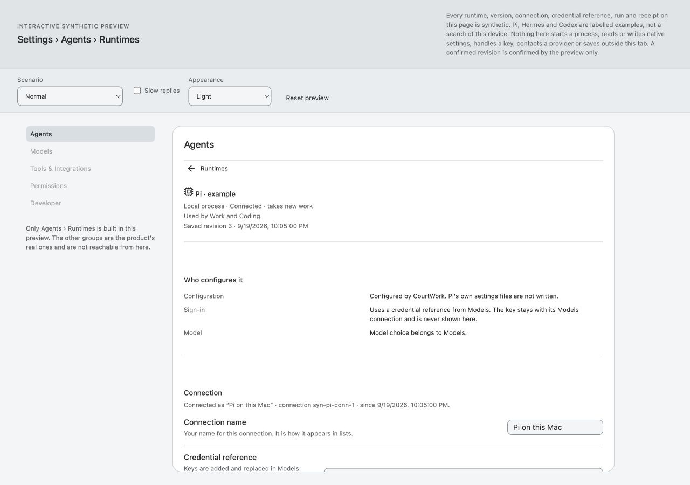
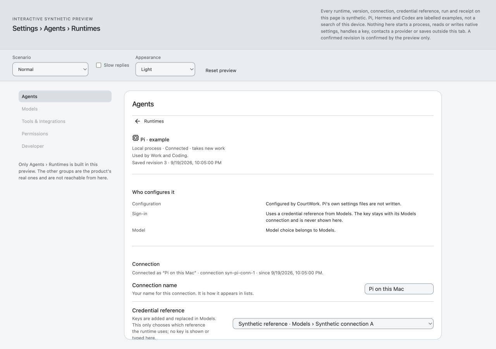

# M1 candidate — Runtime detail block rhythm

Status: implementation candidate delivered; product write lease released. **Parent Arch retains final Design value selection, acceptance and merge.** Child Astra recommends the 16px mapping on the sampled evidence; it is not a new global rule.

## Exact source and scope

Integrated base: `ec772e162aac5decf61c3a5e46f881e5d5145171`. The original 32-file audit was backed up, byte-compared with main and preserved in commit `a785e38`; merge `aa765ede3d008c80cc9e4e6dcd50704cfa95db61` has the same tree as that integrated base. Branch: `codex/m1-runtime-rhythm-20260922`. At stop parent main was `e1170cfb2131a13668300ed5c56cc1a0152cff9e`; the leased product/test files and shared Settings styles were unchanged from the integrated base.

**Product candidate: `b8cd54f4d2e3d142ed367d49e08297170394495d`.** It changes only `app/web/runtime-management-view.mjs` and adds one scope regression in `app/tests/runtime-management.test.mjs`. The plain detail div scopes `--settings-group-gap: var(--space-4)`; it adds no class, visible text, landmark, border or padding. Existing detail nodes, strings, controls and state transitions remain. The list/error-before-detail path receives no override. No shared CSS, controller, adapter, Profile, Preview, app.mjs or canonical-rule file changed.

[Lease](../../disposition-20260922.md), [checkout preservation](astra/checkout.json), [Sol change record](sol/change-record.md), [source hashes](sol/source-record.json), [Luna independent review](luna/review.md).

## Rendered result

All four matched Pi revision-3 pairs show **60→36 CSS px** from a block boundary to the next title. The first input and Reconnect move up 48px; the full scroll height falls by 120px. This follows five inter-block gaps reduced by 24px. Last-block margin remains zero; field dimensions, type, inner padding and content measure match baseline.

| Same data / CSS viewport | Text scale / appearance | First input y, before→after | Reconnect y, before→after | Scroll height, before→after | Input height / inner width |
|---|---|---:|---:|---:|---:|
| 1280×900 | 1 / light | 778.93→730.93 | 958.85→910.85 | 1353→1233 | 28 / 778 |
| 1440×900 | 1.143 / dark | 826.95→778.95 | 1043.73→995.73 | 1500→1380 | 28 / 778 |
| 390×844 | 1 / light | 1117.21→1069.21 | 1357.02→1309.02 | 1771→1651 | 44 / 324 |
| 390×844 | 1.143 / dark | 1254.41→1206.41 | 1509.60→1461.60 | 1948→1828 | 44 / 324 |

Positions are viewport-relative at the initial scroll position, including the **existing synthetic harness** header. Values below the viewport are scrollable content positions, not claims that the action is initially visible. The large preference resolves to 1.143, not 200%. Normal input font remains 14px; large remains 16.002px. All measured pairs use a fine pointer, no coarse/any-coarse match, DPR1 and visualViewport.scale1 under explicit IAB viewport override. Native page zoom was not independently set/read; scale1 does not prove native100%.

The 16px version retains clear separators and distinct headings in light/dark and normal/large. There was no observed crowding that justified testing 24px as a second candidate. No information was removed to move controls upwards. [Machine comparison](astra/comparison.json) and [read-only measurement method](astra/measure-reference.js) retain the underlying data.

**Before, 1280 normal/light:**

**Candidate, same conditions:**

## Behavioral and isolation checks

| Case / production controller and view with synthetic adapter | Observed result / evidence |
|---|---|
| List → detail → Back | Focus returns to Manage: Pi. Detail scope disappears; root/mount/list stay40. [List measurement](astra/list-isolation.json). |
| Long submitted label; reply lost; newer unsent draft | Unknown message distinguishes submitted label, last confirmed revision3 and newer unsent draft. Reconnect stays locked. Check status recovers revision4 and retains the newer draft; the bound Run still reads revision3. [Unknown](astra/09-unknown-draft.txt), [reconciled](astra/10-reconciled-draft.txt), [screenshot](astra/09-unknown-draft.jpg). |
| Large/dark narrow keyboard scrolling | Tab from Connection name reaches Credential reference, scrolls it into view and shows focus. [Measurement](astra/11-large-narrow-keyboard.json), [screenshot](astra/11-large-narrow-keyboard.jpg). |
| Stale→fresh read-back at390 large/dark | Receipt4 plus stale reading3 keeps changes locked. Tab reaches Read again with visible focus; fresh reading4 unlocks Reconnect. Bound Run remains revision3. [Locked](astra/12-stale-locked.txt), [keyboard](astra/12-stale-keyboard.jpg), [fresh](astra/13-fresh-unlocked.txt). |
| Refused Hermes connect with long draft | Refusal retains the connection name and revision6, restores focus to Connect, and shows no applied connection. [Observation](astra/14-refused-focus.txt), [measurement](astra/14-refused-focus.json), [screenshot](astra/14-refused-focus.jpg). |
| Changed elsewhere / Reload | Conflicting request4 versus current5 stays locked; keyboard Tab→Reload runtime→Return obtains revision5 and focuses the reload notice. [Conflict](astra/15-conflict.txt), [Reload](astra/16-reload-focus.txt). |
| Unsupported actions and disabled reason | Read-only host explanation remains near the affected actions; Reconnect/Disable/Disconnect stay disabled. Existing bound-Run disconnect reason is also retained in normal state. [Observation](astra/17-unsupported.txt). |
| Empty/list and last block | Empty list settles with no detail wrapper. Final technical block keeps zero bottom margin in all four pairs; absent history adds no empty box. [Empty](astra/18-empty-list.txt), [comparison](astra/comparison.json). |
| Unrelated Settings consumer | An evidence-only sibling page uses the **real settingsRow**, Runtime list and Runtime detail together. Baseline values are40/40/40; candidate40/40/16. Root and all mount containers remain40; only detail descendants inherit16. [Baseline](astra/21-baseline-isolation.json), [candidate](astra/20-candidate-isolation.json). This is an inheritance test, not a new product layout or full Settings acceptance. |
| Supported320 CSS-pixel probe | Connection input and focused credential selector remain reachable and within the Runtime content width. [Measurement](astra/19-candidate-320-reflow-probe.json), [screenshot](astra/19-candidate-320-reflow-probe.jpg). This bounded sample is not full WCAG reflow acceptance. |

All actions above affect tab-local synthetic state; no provider, credentials, native configuration or production API is involved. Long native input/select values may scroll or visually truncate inside their controls, as on baseline. The Settings harness's scenario toolbar scrolls horizontally on narrow widths; the isolation harness deliberately puts consumers in columns and is unsuitable for layout acceptance. Neither harness is presented as product geometry outside the tested content.

The text observation records explicitly separate notes transcribed from the fresh tool-displayed accessibility state from the subsequent raw saved AX response. AX diffing meant those subsequent responses often said no change; they are not represented as full AX dumps. Computed JSON and inspected screenshots provide complementary retained evidence.

Two locator attempts used labels that were not present after a state transition (Reconnect became Reconnect with changes; stale recovery was Read again, while Reload runtime belongs to conflict). Fresh AX inspection resolved each before the next action. These were test-navigation corrections, not product failures or silent retries.

## Independent checks and evidence boundaries

- Sol author: Runtime35/35, spacing lint, targeted interaction lint and diff check. Initial test failure was a tiny-dom tagName case assumption; the test normalized it without changing product bytes. [Author checks](sol/checks.md).
- Luna non-author at exact candidate commit: Runtime35/35, adjacent Settings navigation7/7, spacing/interaction lints and diff check. Structural review found no broken direct-child/last-child/search/focus selector relationship. [Review](luna/review.md).
- Astra independently operated the OpenAI in-app browser, measured matching CSS states, inspected saved screenshot bytes, and recommends16 based on the bounded comparisons. It does not claim final parent acceptance.
- Test results are recorded in the author/checker reports; raw test stdout was not retained. No extra test rerun was made solely to recreate logs.
- No full suite was repeated for the spacing-only change. No color/material/contrast change was introduced. Original audit hard-break bytes remain preserved; new evidence is checked separately.

Unexecuted: native page zoom, actual200% text resize, user text-spacing overrides, physical coarse/hybrid input, screen reader, forced colors, native shell and whole-app Settings navigation. IAB's exposed read-only page evaluation does not supply native accessibility/zoom controls; changing viewport or selecting the product's large preference does not substitute for those tests. The320 probe covers one reachable field composition, not every control/state or a complete conformance process. No paid-provider/capability/production Runtime-API acceptance is claimed.

## Reproduce and handoff

[Reproduction commands](sol/reproduce-previews.sh), [preview server](sol/serve-preview.mjs), [process ownership](sol/preview-processes.json), [cleanup](sol/cleanup.json), [packet validation](validation.json). The query wrapper only selects existing root text/theme attributes; no product CSS is injected. Appearance UI was explicitly synchronized to Dark for captures. Main archive bytes and candidate view hashes are recorded; candidate product bytes were frozen before the remaining visual/independent checks.

All owned browser tabs are closed and overrides reset; only this task's six preview processes are stopped. Owned temporary artifacts and worktree remain. No push, deployment or main merge. Sol product writes are released; child coordination stops with this single M1 candidate. Final16/24 choice, acceptance and integration remain with parent Arch; no next family is started.

## Additional matched captures

| Pair | Baseline | Candidate |
|---|---|---|
| 1440 large/dark | [Before](astra/03-base-1440-large-dark.jpg) | [After](astra/04-candidate-1440-large-dark.jpg) |
| 390 normal/light | [Before](astra/05-base-390-normal.jpg) | [After](astra/06-candidate-390-normal.jpg) |
| 390 large/dark | [Before](astra/07-base-390-large-dark.jpg) | [After](astra/08-candidate-390-large-dark.jpg) |
| Synthetic sibling isolation | [Before](astra/21-baseline-isolation.jpg) | [After](astra/20-candidate-isolation.jpg) |
