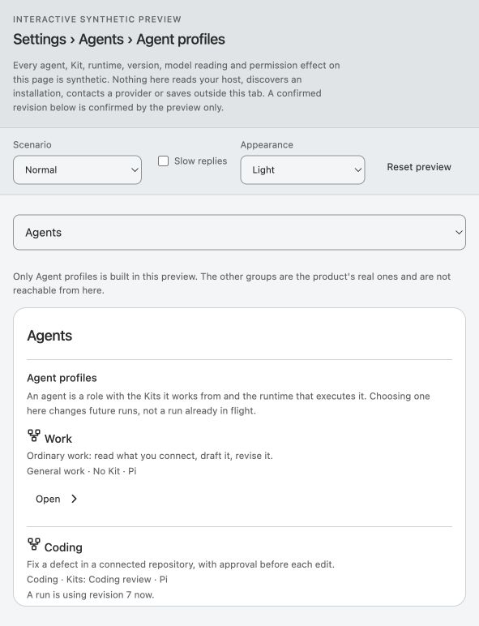
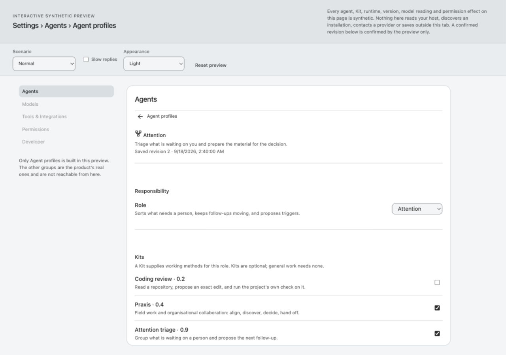
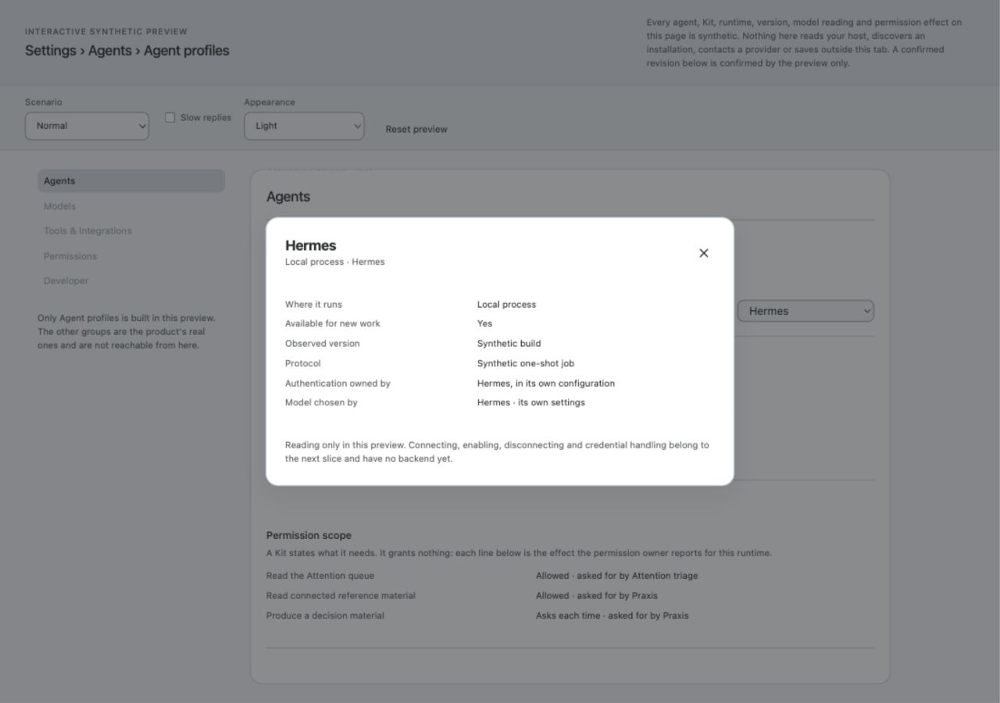
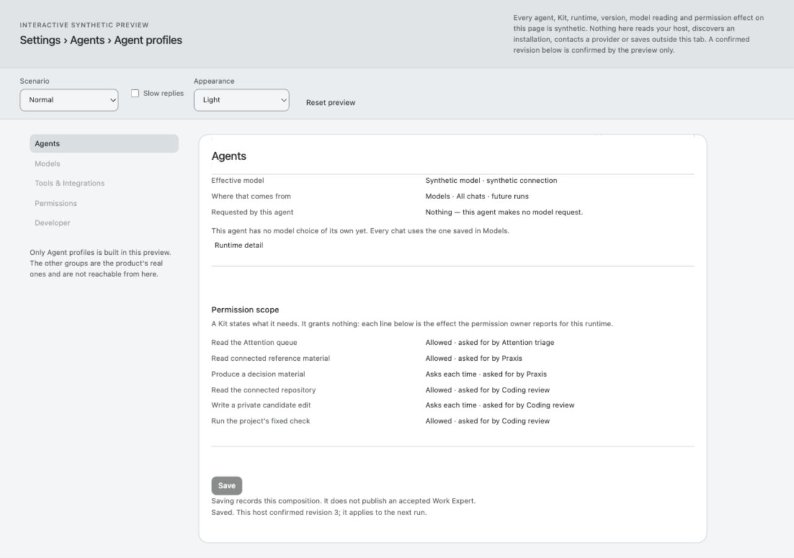
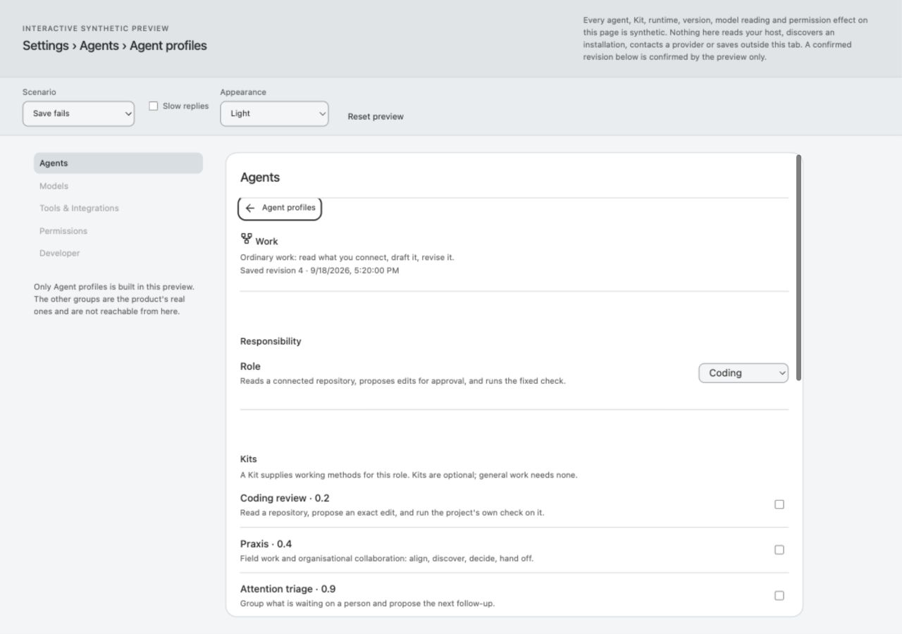
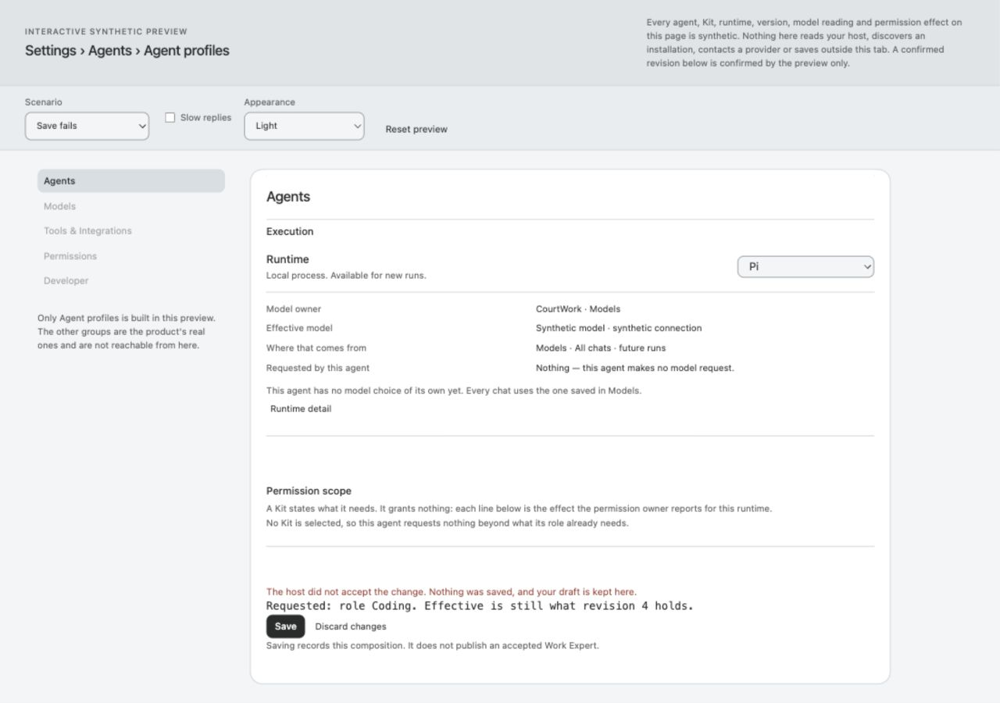
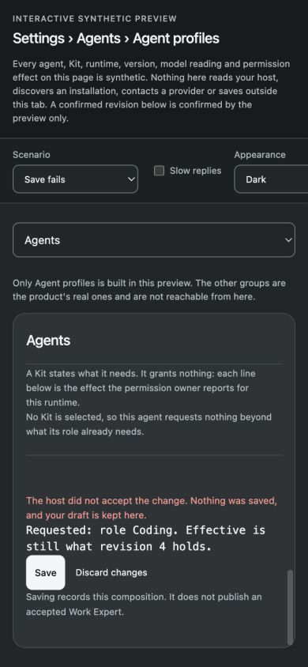
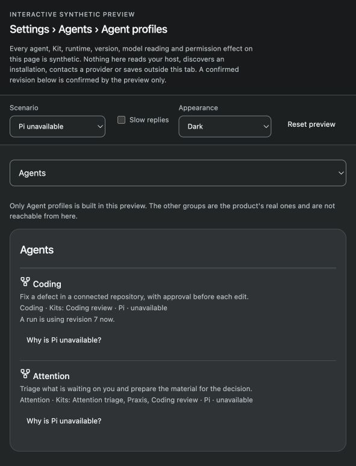
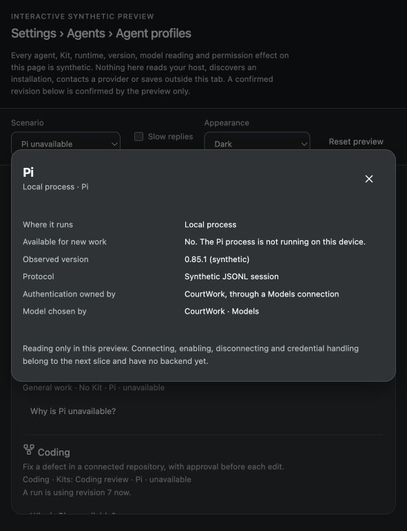

# Agent profiles 06a — independent review and bounded return

2026-09-20 · **Astra decision: retain the frontend direction; hold acceptance/integration for a bounded correction under Claude's original 06a ownership.** Runtime management and Role-first Composer do not start from this receipt.

## Candidate, source and evidence

Main at pickup: `d0bfeba0beb448557642a34b92fde758873ea7c6`. Candidate: `0f76407ac3f0fc7aa34585a003921e855c80820b`, based on `95ed9cfb068300d154dca9643bf754beebe1d295`, branch `claude-agents-frontend-20260920`. Author tree was clean. [Source hashes](source-sha256.json) pin all 14 changed files and verify the four served controller/view/fixture/wiring files on the author's loopback preview against that commit.

- [Author delivery](author-delivery.txt) and [author checks](author-checks.txt) are retained unchanged. The unidentified failed full run remains unidentified; a later green run cannot reconstruct its name.
- [Luna controller review](luna-controller.md): 16/16 scoped tests plus two gated-reply counterexamples. These are independent seam observations, not browser results.
- [Astra browser observations](browser/observations.json): OpenAI computer use through `cua_repl`, in-app browser, a separate fresh tab at port 8899. Only synthetic tab-local state was changed. No real provider, backend, native configuration or user's dogfood instance was used.
- [Luna full-suite/routing review](luna-checks.md): one independent run reports **1254/1254**, zero failures/cancellations/skips; [complete unfiltered output](independent-full-suite.log). The capture wrapper exited 1 after assigning to zsh's read-only `status` variable; the separate npm exit was not retained, so this receipt reports the test summary rather than claiming a captured exit 0. The author's unidentified earlier failure did not reproduce. Preview route/isolation probes pass within their recorded scope. No repeat full-suite loop is requested. The raw report truncates the displayed commit by one character; the exact pin is the 40-character SHA above and in the source manifest.

## Direction retained; contract not yet frozen

Adopt the use of the existing Settings composition, controls and native dialog; the explicit fixture adapter is correctly a consumer-development boundary. Keep Role, Kit, Runtime, Provider/Model, grants and current Run binding distinct. No new visual system or backend ledger is needed. Fixture-only construction remains authorized; real backend completion is not a condition for accepting a correct frontend journey.

Adjust the delivery's ownership claims. **Missing exposed implementation is not missing ownership.** Profile composition remains with Runtime Control; Role semantics with the existing product/Host admission contract; Kit admission/context with the existing Harness Extension / RD-009 owner; runtime registration/capability/lifecycle with Runtime Adapter / RD-001, and provider/model/authentication with their existing configuration owner. Astra adjudicates cross-layer seams. No new owner or registry follows from the preview.

Also qualify existing-versus-proposed revision facts: `app/runtime/control-contract.d.ts` exposes a configuration-wide snapshot `revision`, a numeric `activeRuns` count, and a scoped profile-selection mutation. It does **not** already expose this preview's per-profile revision, `{runId, revision}` binding or Role/Kit/Runtime save shape. Those are proposed consumer needs for the existing owners, not implemented API fields. Do not promise that backend integration can require only an adapter swap before those owners have agreed the projection. No schema or backend implementation is requested in this return.

## Bounded author corrections

| ID / disposition | Evidence and consequence | Required delta and evidence |
| --- | --- | --- |
| AP-R1 · adopt Luna F-01 | `agent-profiles.mjs:166–195,356–368`: navigating list/profile closes detail state without invalidating its request epoch. A gated late reply restores stale runtime detail after navigation. | Invalidate the detail request whenever its surface is abandoned; cover late success/error after list/profile navigation. This is a controller-seam counterexample, not a claim that a user clicked through an inert modal. |
| AP-R2 · adopt with adjustment, Luna F-02 | Save → controller `discardDraft()` → late save reply produces confirmed revision 5 with Praxis while draft has no Kits and `dirty:false`. The current view disables Discard during saving, so this is not a demonstrated ordinary-click data loss. | Make the controller enforce that disabled operation as a no-op, or correctly reconcile the confirmed saved state and retained draft. Merely ignoring a reply must not imply that an already-applied backend save was cancelled. Add the minimal race regression; do not introduce a queue. |
| AP-R3 · adopt browser finding | `agent-profiles-view.mjs:79–87,424–435,606–612`: Save replaces its focused button with a disabled button; focus falls to BODY on success and failure. In the actual failed-save journey, the next Tab goes to Back at the form's top instead of the recovery action. | Preserve a logical focus destination through saving and completion, including failed retry and successful receipt. Restore only when this action still owns focus; do not steal focus from subsequent navigation or another control. Verify actual keyboard behavior in the browser, with a targeted view regression if supported. |
| AP-R4 · adopt browser finding | Fixture adapter `nextAction` changes to runtime detail when Pi is unavailable, and `listRow` offers only that action. The dialog has only Close. Work can no longer be opened to choose another available runtime. | Retain a path to open/edit the affected profile even when its runtime is unavailable. Prefer the existing single primary profile action with the explanation inside it; no runtime-manager expansion is needed. Verify Pi unavailable → open Work → choose a supported available alternative → synthetic Save. |
| AP-R5 · adopt Luna F-03/F-04 | `capabilities.reason` is not rendered beside disabled Save; a missing grant for a selected supported runtime reads “choose a runtime.” Both hide the actual reason the person cannot proceed. | Display the adapter's unavailable-save reason and distinguish unreported permission from no selected runtime. Add the two missing fixture/view states; requests, support and grant remain separate. |
| AP-R6 · adjust docs/typed projection | “No owner today,” implemented per-profile revision/freeze implications, and “adapter replacement is all backend integration requires” exceed the existing facts. Delivery also says slice 11's stable precondition now holds merely because it was delivered. | Apply the ownership/revision ruling above and correct sequencing/coverage text. Keep proposed fields explicit and preserve raw author evidence. Do not create new architecture APIs or call incomplete dogfood readiness accepted. |

All corrections remain within the new 06a controller/view/fixture/tests and its delivery contract. Preserve the only existing-product change (static module allowlist) unless a demonstrated fix requires otherwise. Do not implement backend, runtime CRUD, credentials, hooks or Composer in this return. Keep source commits, targeted checks, browser evidence and author release explicit. After the return, Luna reviews only the changed seams; no accepted GUI/Core work is repeated.

## Browser journey and screenshots

Screenshots are original captures from this independent run. The form uses an internal scroller; each image shows the actual visible reading position, not a stitched complete page. [Structured observations](browser/observations.json), [failed-state DOM](browser/failure-dom.txt) and [unavailable-state DOM](browser/unavailable-dom.txt) separate behavior evidence from visual evidence.

1. **Entry and open — usable.** Agent rows state responsibility and composition; the synthetic identity remains visible. The profile opens with Role, Kits and execution grouped in the existing Settings layout.

   

   

2. **Runtime disclosure — passes bounded keyboard check.** Open Hermes detail → press Escape → dialog closes and focus returns to `runtime-detail`. This fills that specific author evidence gap through an OpenAI provider; it does not retroactively change the author's browser provenance.

   

3. **Change and Save — saved values confirmed; focus defect.** Attention gains Coding review and selects Pi; the synthetic owner confirms revision 3. The next screenshot shows the receipt. `document.activeElement` is BODY afterward, so confirmation alone is not complete keyboard recovery. Returning to the list focuses the originating row; list values refresh asynchronously.

   

4. **Failed Save — draft retained; focus defect.** Work changes Role to Coding; Save fails and the draft remains against revision 4. A subsequent Tab moves to Back at the top (first screenshot), requiring traversal to return to the retry action. The following screenshot captures the actual error and retained draft.

   

   

5. **Narrow/dark — form reflows in the checked state.** At 390×844, page widths are 390/390 and panel widths 324/324, with no horizontal form overflow. The preview's scenario toolbar has its own horizontal scroller; this is not evidence that every control fits without scrolling. Native 200% browser zoom and screen-reader operation remain unexecuted.

   

6. **Unavailable runtime — explanation present, profile recovery missing.** With Pi unavailable, the affected rows expose only “Why is Pi unavailable?” and the read-only modal exposes only Close. No route remains to change Work's runtime. Escape itself closes correctly and returns to `row:ap-work`.

   

   

The temporary viewport override was reset and the review tab closed; the author's preview server was left untouched. No new long-label stress case, full accessibility acceptance or G4 campaign was performed.

## Sequence and disposition

Retain the isolated frontend work; do not discard it solely for the sequencing deviation. Reject the claim that the precondition is satisfied by order 11's delivered status: `d0bfeba` explicitly holds readiness for correction. At this review, the dogfood author branch has advanced with corrective commits, but that alone is neither a final handoff nor acceptance. Its source/review remain under order 11.

Claude has released 06a and should apply only this finite return within its existing serial schedule. No next frontend journey starts until this journey is accepted and the stable order 11 handoff is independently accepted. The existing authorization still permits local integration after the appropriate checks; no extra permission round is introduced. The heartbeat stays paused. No task tree, preserved data, frozen Git dependency or user preparation was deleted, and no push/deploy occurred.

## Record validation

`node tools/check-doc-links.mjs` passes: 1,443 documents / 8,188 links; `git diff --check` passes. This integration decision changes documentation and evidence only.

## Evidence integrity

The [final SHA-256 manifest](sha256.json) covers retained evidence and this ruling, excluding itself. Source hashes are separate from evidence hashes. Raw author and Luna text remain unchanged; adjustments and review severity above are Astra's disposition.
