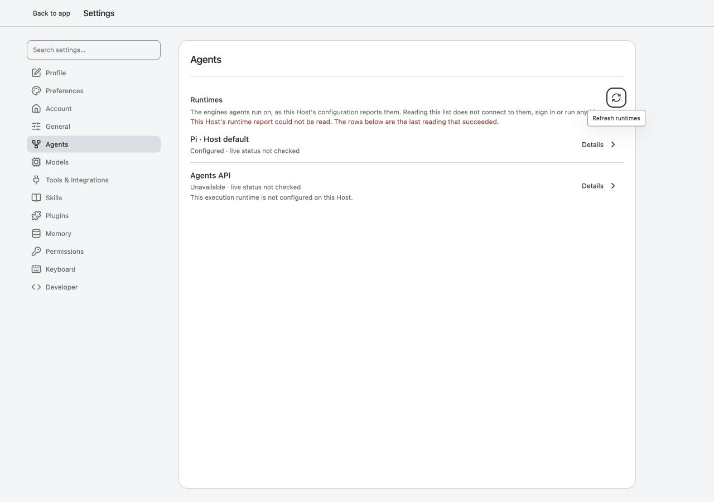
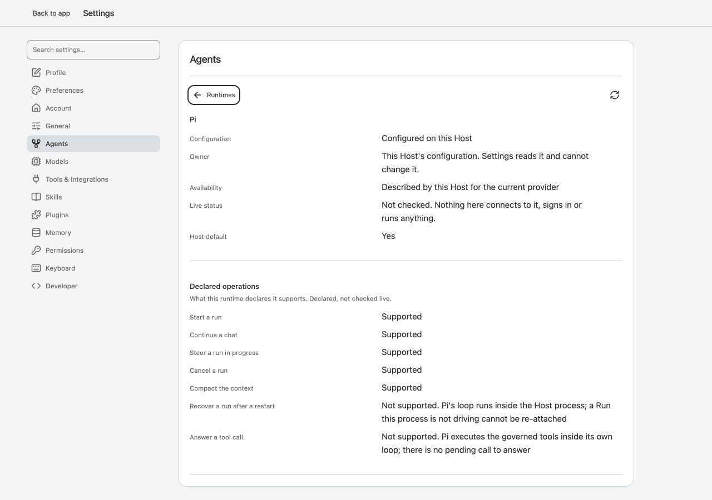
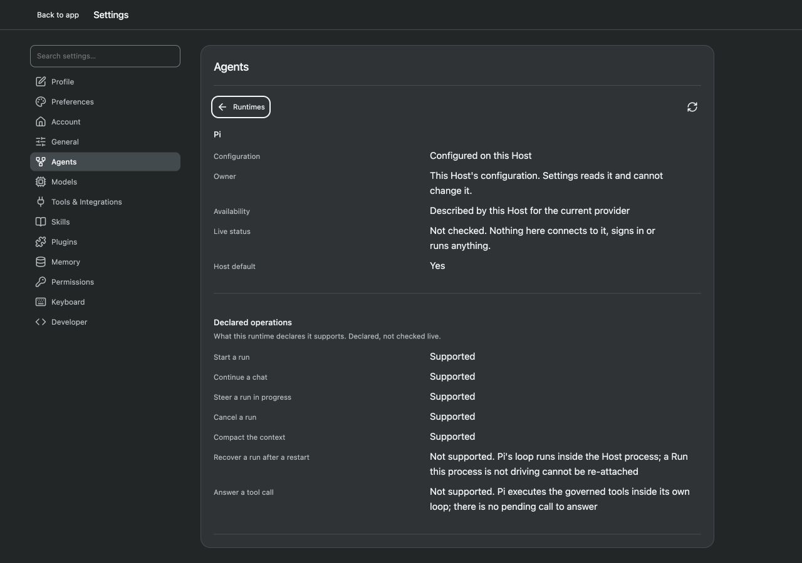
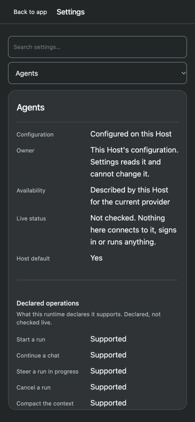
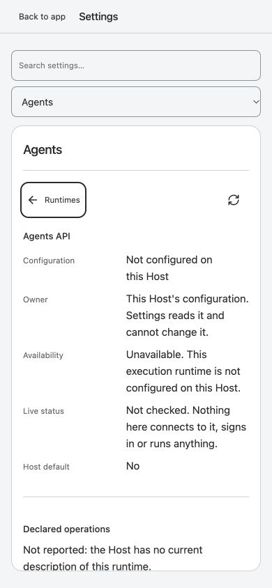
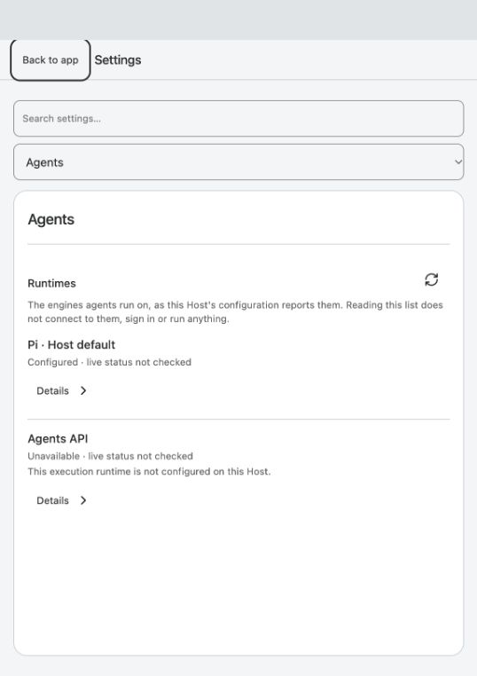
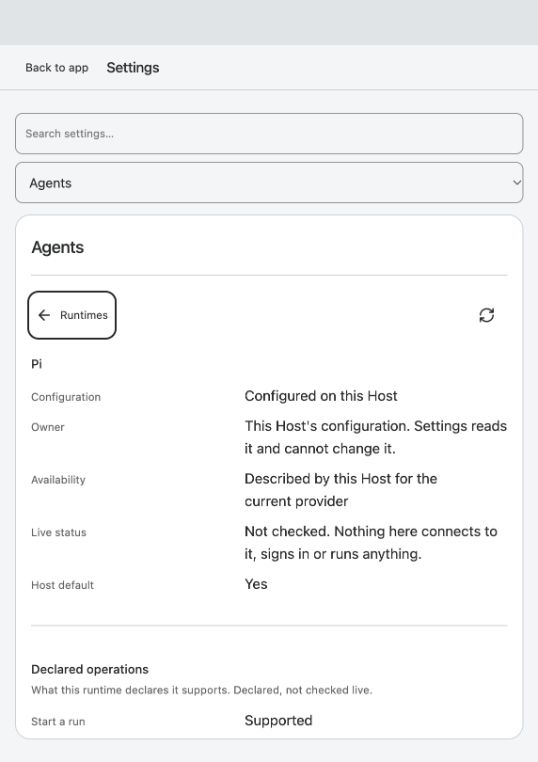

# Production06c I1 frontend — final independent acceptance

2026-09-27 · **Astra accepts RFS-R1/RFS-R2 and the bounded read-only production Settings journey.** Product correction `6acad62`, accepted author/evidence/merged head `d37320c`, prior reviewed `36f8357`. Main fast-forwards from `7b29ee7`, preserving all original author, review and correction commits. No product correction was substituted by the reviewer.

## Disposition

- **RFS-R1 — closed.** The supported-version item guard validates the fields the view consumes before a successful reading is stored. Malformed reports become `UNREADABLE`; missing/old reports retain `NOT_REPORTED`. The exact earlier parent `items:[null]` browser counterexample now shows the failed read, retains rows/focus, and the next Refresh issues one actual HTTP request and recovers without page errors. Unknown well-shaped IDs/operations/reason codes remain data.
- **RFS-R2 — closed.** The status/operation values and not-reported explanation use15px/24px reading typography. Labels and technical identifiers stay11.5px; controls remain28px at1280 and44px at390. The CSS is scoped to this reader, not global `.data-list`. Full compositions were independently inspected and accepted at1280 and390 in light/dark states.
- **RFS-D1/D2 — retained.** Agents group/object glyph and the two bounded independent Settings-open reads retain the [previous parent decisions](../runtime-settings-i1-review-20260927/README.md). No connection, mutation, live-check or profile relocation is added.

## Independent steps and evidence

| Step | Result | Evidence |
| --- | --- | --- |
| 1. Repeat the original malformed list response at1280 | Pass: visible unreadable error and last-good rows | [01 error](browser/01-malformed-error-1280.png) |
| 2. Refresh after that error | Pass: one new runtime-info request; no remaining alert, focus on Refresh, no page errors | [Recovery observation](browser/recovery.json) |
| 3. Open Pi detail at1280, light/dark | Pass: reading values15px; labels/technical11.5px; compact controls unchanged | [02 light](browser/02-detail-1280.png), [03 dark](browser/03-detail-1280-dark.png), [geometry](browser/geometry.json) |
| 4. Narrow390 detail and unavailable explanation | Pass: readable values/reasons, wrapping, no horizontal overflow,44px controls, return focus retained | [04 dark Pi](browser/04-detail-390-dark.png), [05 light unavailable](browser/05-unavailable-390-light.png) |
| 5. Confirm no-Session Host state after review | Pass: exact RuntimeStore digest unchanged,0 Sessions/0 Runs/0 events | [Before/after](after-browser.json) |
| 6. Load accepted code on the idle user Host | Pass:10 existing Session records unchanged across restart; actual Settings → Agents list displays real Host inventory | [Restart observation](user-after.json), [06 user Host list](browser/06-user-host-list.png), [07 live detail](browser/07-user-host-detail.png); values also measured15px/24px |

Screenshots were saved and reopened before acceptance. Transitional captures during media/viewport switching were rejected and recaptured after stable DOM/geometry checks.390 remains a narrow fine-pointer viewport, not touch-device proof; dark mode uses `prefers-color-scheme` emulation. Fetch interception and emulation were cleared, viewport override reset and the disposable review Host stopped. The user-requested8787 Host remains running on accepted source and the browser is left at Agents.

Luna's [non-author delta review](luna-review.md) and [raw80/80 output](luna-tests.stdout.txt) cover controller/view, Settings navigation/preferences/plugins, backend inventory and icons. No full suite or paid provider was run by the reviewer. Author124/124, full1738 at the original delivery and original smoke remain separately attributed, not relabeled as new independent checks. Unchanged initial valid-data keyboard/network-failure/Escape behavior reuses the previous fixed-source parent evidence; the current delta repeats the actual formerly failing malformed-read path.

## Limits

Native200% zoom, text-spacing override, forced colours, screen reader, browser-configured managed executor and long unknown adapter-id browser layout remain unexecuted. They are not inferred from viewport or unit coverage. This acceptance is the read-only Host inventory consumer, not live executor connectivity, runtime mutations, full product accessibility or G1–G5 release closure. All rows still report live not_checked. No push or deployment occurred.

## Screenshots

