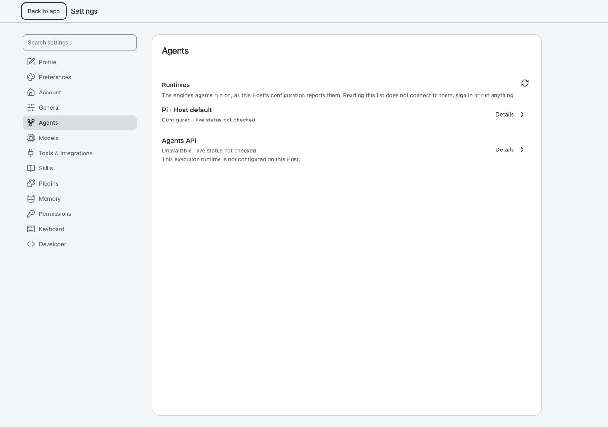
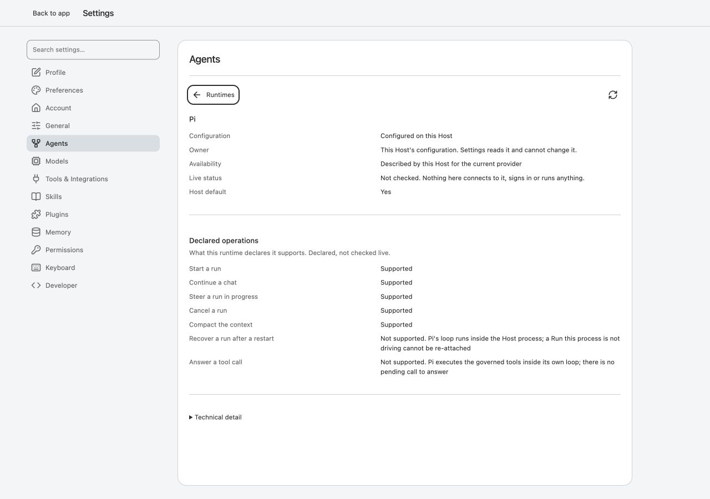
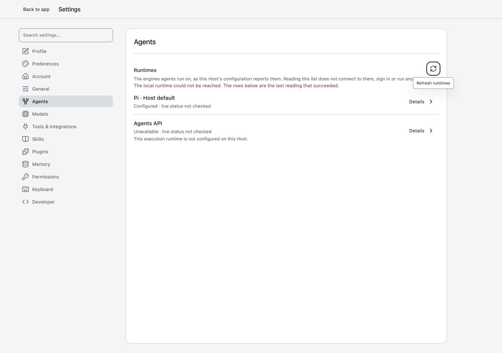
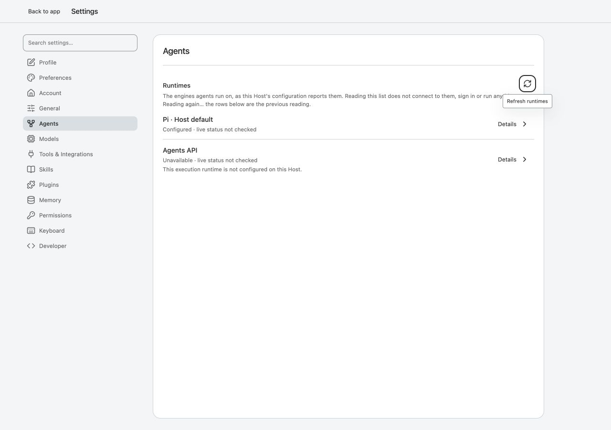
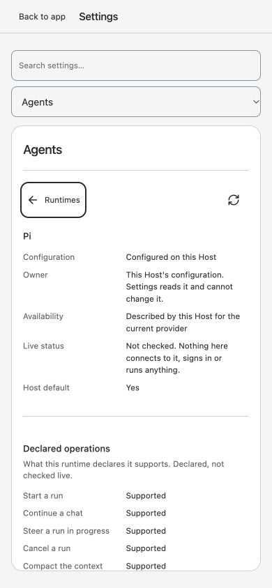
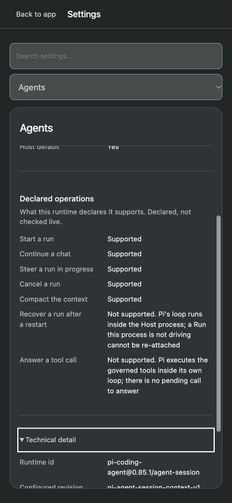
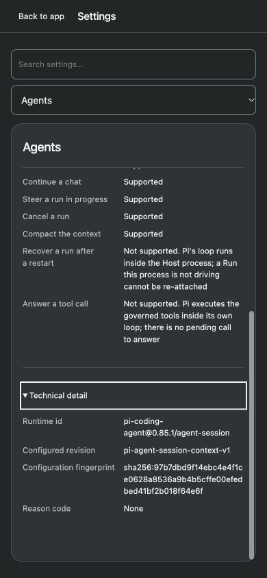
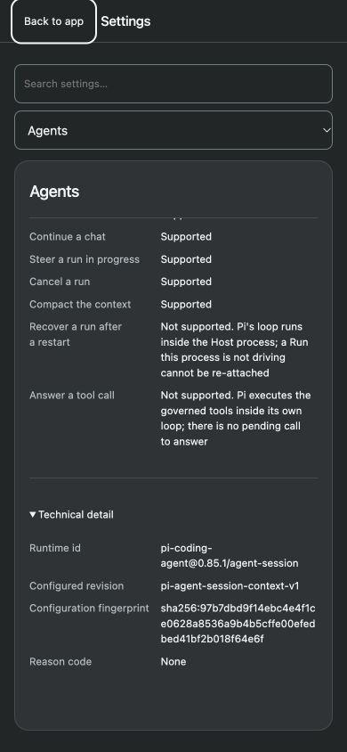

# Production06c I1 frontend — parent review and finite return

2026-09-27 · **Hold integration; return RFS-R1 and RFS-R2 to the original Claude owner.** The valid-data list/detail design is retained. Parent Astra owns the three requested decisions and integration; Luna independently reviews code/tests. No product code is edited or merged by this review.

Fixed source: product `a6e07f8`, author/evidence `36f8357`, original branch `claude/runtime-settings-i1-20260927`, base/main `12799ff`. [User-provided author handoff](author-handoff.txt) is retained byte-for-byte with [source identity](source.json). Author1738/1738 and earlier screenshots stay author evidence; independent evidence below was captured in this review.

## Parent decisions

| Input / ID | Disposition | Reason and implementation boundary |
| --- | --- | --- |
| New Agents group and `agent.profile` glyph — RFS-D1 | **Adopt** | The existing local-runtime IA already assigns Agents/Profiles/Runtimes to this owner. General → Agents → Models is coherent. The existing object glyph is sufficient; no new icon or profile migration is needed. This does not expose runtime mutations. |
| Two runtime-info reads on Settings open — RFS-D2 | **Adjust; allow in this slice** | Actual browser capture confirms two authenticated GETs without sessionId. They are read-only and the two consumers have independent state. This is acceptable here, but independent failure state does not logically require separate network requests. Do not introduce a shared fetch/cache refactor merely to remove one bounded GET. |
| Detail values at11.5px — RFS-R2 | **Adjust; correction required** | The supplied pre-edit record calls these facts a reading readout. Current1280 and390 captures show the main values and multi-line availability/recovery explanations at11.5px/17.25px, inherited from metadata `.data-list`. An implemented primitive does not override the recorded surface role. Map the primary status/operation values and explanatory reasons to the existing reading token (`--text-reading`, default15px) within this detail only; labels and technical identifiers may retain their separately recorded metadata/mono roles. Preserve compact28px/fine and44px/narrow controls. Do not enlarge global `.data-list`, add universal padding or shrink content to avoid scrolling. |
| Malformed response accepted into ready state — RFS-R1 | **Adopt; correction required** | A version1 response with `items:[null]` reaches the view, throws on `adapterId`, leaves “Reading again…” visible and poisons the retained inventory. Subsequent Refresh throws before issuing HTTP; only full reload recovers. Validate the view-consumed top-level/item/capability shapes before committing a reading. Treat invalid input as the existing failed read, retaining the last good reading. Unknown but well-shaped adapter IDs and operation names must remain supported. |

RFS-R1 is a client error-recovery defect demonstrated by deliberate malformed-response injection, not a claim that the actual Host currently emits invalid rows. RFS-R2 is a project role/legibility decision, not a screenshot-only WCAG failure claim.

## Independent behavior and visual steps

| Step | Health | Current-run evidence |
| --- | --- | --- |
| 1. Open `#settings/agents` at1280×900 before any Session | **Pass** | Pi configured/default and managed unavailable are truthful; both say live not_checked. [01 list](browser/01-list-1280.png). |
| 2. Pi Details → Back using keyboard | **Behavior pass; reading scale held** | Details focuses Back; Back returns focus to the Pi row. Main detail values compute11.5px/17.25px. [02 detail](browser/02-detail-1280.png). |
| 3. Fail one inventory GET, then Refresh | **Pass** | Last good rows remain, failure text is local, Refresh focus remains; a successful retry clears the error. [03 failure](browser/03-failed-read-1280.png). |
| 4. Return a version1 malformed inventory, then Refresh | **Fail — RFS-R1** | `items:[null]` produces uncaught TypeError. Another Refresh produces a second error and **zero** runtime-info requests. [04 stuck view](browser/04-malformed-stuck-1280.png), [DOM](browser/04-malformed-stuck.ax.txt), [payload/errors/request count](browser/malformed-recovery.json). |
| 5.390×844 detail, light/dark, Technical detail | **Layout pass; reading scale held** | Fine pointer remains true; narrow fallback targets measure44px. Document width390; detail width/scrollWidth324; fingerprint wraps and is vertically reachable. [05 light](browser/05-detail-390-light.png), [06 dark](browser/06-detail-390-dark.png), [07 technical](browser/07-technical-390-dark.png), [geometry](browser/geometry-390.json). |
| 6. Escape, then re-enter Agents | **Pass** | Settings closes and returning retains the Pi detail and open disclosure. [08 returned detail](browser/08-return-detail-390-dark.png). |

All images were saved and reopened before use. Dark mode uses emulated `prefers-color-scheme`;390 is a narrow fine-pointer viewport, not touch-device validation. All captures use the actual candidate app and a disposable Host through OpenAI CUA, not the author's HeadlessChrome script. Temporary fetch interception is cleared before recovery/navigation; no interception or style override remains after cleanup. The user's8787 service is untouched.

[Endpoint observation](browser/settings-open-reads.json) records two authenticated GETs with no query; tokens are not recorded. [Host state after the journey](parent-host-state.json) has zero Sessions/Runs/events. This is not an independently retained before/after whole-store byte comparison. Home after Escape can display its example projection; the authenticated Host counts remain zero.

## Code and tests

Luna passes **61/61** selected non-browser tests, exit0: [review](luna-review.md), [raw output](luna-tests.stdout.txt). Epoch handling, ordinary refresh/back, unknown well-shaped IDs, Settings navigation/preferences/plugins and backend inventory pass. [Independent malformed probe](luna-malformed-probe.stdout.txt) finds the same RFS-R1 input boundary. Parent reproduces the stronger no-retry-request case in the real browser. No full suite or additional provider call was run by the reviewer.

## Exact original-author return

Keep the original branch/tree and write ownership. Correct only:

1. **RFS-R1:** reject malformed supported-version inventories before they replace the last good reading. Cover null/empty item objects, missing/null availability, invalid field/operation value types actually consumed by the view, empty/missing initial inventory, and valid recovery after the error. Assert no render throw/unhandled refresh rejection; last good rows/detail, focus and navigation remain; the next Refresh really reaches the reader. Keep unknown adapter/operation names as data and keep old-version refusal. Do not add another registry, infer capabilities, or repair malformed facts into success.
2. **RFS-R2:** apply the scoped reading/metadata mapping above. Record computed typography and full composition at1280 and390, both themes, including long reasons and technical disclosure. Keep wrapping, scrolling, text scaling, focus and pointer targets. No global compactness migration or unrelated CB-D1 work.

Re-run the failing-before/passing-after controller/view case and the corresponding real-browser malformed-read → failed-read → successful-refresh path. Reuse unchanged source evidence explicitly; do not repeat the full suite solely because it was previously large/green. Parent will independently recheck the delta before deciding integration.

Native200% browser zoom, text-spacing overrides, forced colours, screen reader, browser-configured managed fixture and long unknown runtime identifier remain unexecuted here. They are limits, not claimed passes. This review adds1280 and malformed-read evidence but does not close broader accessibility or managed-runtime capability gates. The author request for Parent decisions is resolved without a new approval gate or a substitute writer.

## Screenshots

