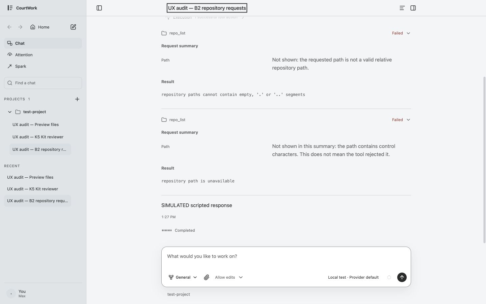
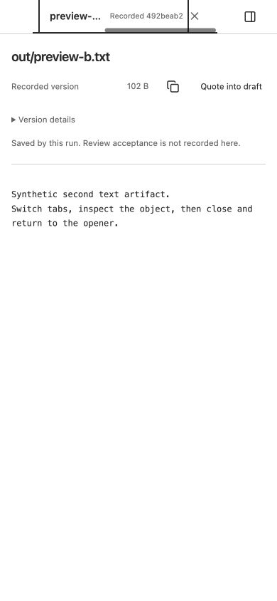

# New-surface UX continuity audit and bounded acceptance

2026-09-28 · Parent Astra/OpenAI in-app browser; original Claude implementation; Sonnet source/precedent recall; Luna fixed-source review; Sol isolated fake-provider fixture support. Audit source78a1b43; B2 reading candidate656d8a1/619a20f; Preview candidate0695b90/e318c7a. Findings stay in [original UX owner](../../ux-polish-release-20260924.md) and [original06d owner](../../06d-surface-continuity-20260921.md).

## Scope and capture method

User goal: new sub-surfaces should retain CW's existing task, reading, state and control grammar. Inspect production Agents inventory, the selected imported Kit editor, B2 request disclosure, and ordinary Chat artifact Preview. Use real Host/Core/Pi paths with synthetic data and Local test provider, independent random ports and data roots. No personal key/config/user Host or external model call. Captures at1440×900 and390×844 use normal text scale and fine pointer; narrow viewport is not a touch-device or native zoom test. Screenshots were saved then reopened/inspected; transitional K5 capture was replaced by a stable capture of the same state, not counted as a defect.

Sol prepared fixture source78a1b43 on port63302, then renewed after stopping only the owned process: source619a20f on64317 and finalsourcee318c7a on64733. All three used fresh synthetic state with the same B2 contents, selected Kit source and exact two Preview artifact hashes. Before/current metadata and repeatable seed scripts remain in the disposable task's local scratch area; no private storage was copied into Git. Parent reset its temporary viewport and closed its browser tab after verification. Final fixture cleanup is recorded below when confirmed.

## Observed steps and findings

| Step | Actual observation / evidence | Disposition |
| --- | --- | --- |
| 1. Settings → Agents list → Pi detail | [List1440](01-agents-list-1440.png), [detail1440](02-runtime-detail-1440.png), [detail390](03-runtime-detail-390.png); primary values15px/24px, labels11.5px; configured/unsupported/not-checked stay separate | Retain existing I1 reading precedent; no new defect inferred |
| 2. Chat → B2 failed tool disclosure | [Before1440](04-b2-1440-before.png), [before390](05-b2-390-before.png), [measurements](b2-before-metrics.json): primary path/omission explanations inherit11.5px/17.25px metadata role | Adopt UX-B2-READ: scope only summary values to current15px/24px reading role; preserve labels/actions/Result |
| 3. Agent → Edit selected Kit source → Preview | [Editor1440](06-k5-editor-1440.png), [stable preview1440](07-k5-preview-1440.png), [editor390](08-k5-preview-390.png), [candidate390](09-k5-candidate-390.png), [metrics](k5-metrics.json). Editor14px/21px; compiled candidate uses existing reading role; hashes/technical preview remain metadata as the accepted K5 distinction | Retain current semantic/editor split, do not globally enlarge every metadata list |
| 4. Invalid JSON draft → Preview refusal → restore original text | [Error390](10-k5-invalid-preview-390.png). Draft stays editable, refusal is local, Save explicitly revalidates (not a false preview/save equivalence); restoring exact saved text disables Save and permits a new preview. No Save or provider call was executed | Bounded recovery observation; no new CAS/unknown or full save matrix claim |
| 5. Chat recorded file → Preview → Back to Chat → second file | [Desktop](11-preview-file-1440.png). Back returns focus to the exact opener, both tabs keep full accessible identities and retained hashes | Preserve06d semantics |
| 6. Two tabs,390px, ArrowRight from first to second | [Before](13-preview-second-390.png), [geometry](preview-tabs-390-metrics.json): selected/focused tab x292–496 outside strip x16–306; scrollLeft0 although scrollWidth524/client290. Body switches correctly but tab identity is mostly hidden | Adopt existing06d active-tab visibility return, not a backend/state change |

## Fixed-candidate evidence

**B2 reading correction accepted:** [After1440](14-b2-1440-after.png), [after390](15-b2-390-after.png), [fixed measurements](b2-after-metrics.json). Values/omission explanations15px/24px, labels11.5px and existing wrapping/actions unchanged; no document horizontal overflow at1440/390. A further actual fake-provider UI Run requested a300-character path and preserved the256-code-point prefix plus explicit truncation; [long-path390](16-b2-long-path-390.png) stays readable by vertical scrolling. Parent independently ran request-summary/run-rows16/16, exit0 on the isolated combined tree: [raw log](parent-tests.log). Luna reviewed fixed656d8a1/619a20f and found no scope/behavior change outside the summary class. Author24checks/lints remain in the sibling author packet.

**Preview visibility correction accepted:** [After390](17-preview-second-390-after.png), [fixed geometry](preview-tabs-390-after-metrics.json), [desktop after](18-preview-1440-after.png). Repeating the original ArrowRight case moves only the strip to scrollLeft234: active select x58–262 and its wrapper/close x46–306 now fit within x16–306. Document and reader scroll remain0 in this fixture. Closing the inactive first tab preserves the selected second tab and reveals/focuses it; Delete on the last tab hides Preview and restores focus to the exact `out/preview-b.txt` opener. Desktop content/anatomy remain intact.

Luna independently ran preview-tabs15/15 and reviewed fixed0695b90/e318c7a. Its initial helper-only inactive-close/owed-reveal concern is **rejected as a product blocker**: the helper omitted actual app.mjs close/show focus, which activates the new focusin reveal. Parent traced that consumer and repeated real inactive/last close in the browser; no broader automatic structural scrolling is added that could override deliberate strip scrolling. Standalone helper coverage could be refined later if its consumer changes; it is not a new roadmap item. Unchanged-poll/manual strip scroll is covered by the focused tests/source review, not a claimed prolonged browser load test.

## Governance and evidence limits

Astra adopts the two bounded fixes; initial source-only “no difference from previously accepted source” is adjusted to mean no source-detected defect, not proof of cross-surface role consistency. Existing tokens/anatomy/state authority remain. UX-02/03/07/08/09 and the existing reading/chrome roles explain the scope; no new controls, actions, design system, global data-list rewrite or backend capability.

[External recall](../hermes-protocol-preflight-20260927/external-recall-20260928.md) records current W3C resize/reflow/status references separately from local choices.15px is CW's adopted reading token, not a WCAG minimum. This audit does not certify WCAG compliance. Native200% zoom, forced colors, screen reader, coarse/touch devices, dark theme, full unknown-save/network-failure matrix, direct Attention composition and arbitrary long-tab matrices were not newly exercised. Prior accepted evidence retains its own identities. No new full product suite, provider run, native Hermes execution, push or deployment was required or performed.

**Cleanup confirmed.** Sol stopped final owned process64555; port64733 has no listener. Its handler removed only its disposable data/root/dependency link and retained seed scripts and before/candidate metadata in scratch. No user Host or author process was stopped. Parent compared all `app/` bytes with the fixed final author sourcee318c7a before main integration; the combined product is identical.
