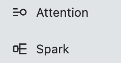

# Spark / Attention · 产品形象方向修订

2026-09-11 · Astra按用户截图与明确反馈修订。源码基线34baa408dc509faf6544f791181664bcde95f631。本页作为同一Claude Design ONE-SHOT的最新增量，覆盖旧稿对这两枚产品glyph的拓扑造型要求。

## 1. 当前导航截图：造型待重设计

用户指出选型奇怪、不引人注目，呈现工程语义而非氛围；Spark本身已是抽象概念，图标不应需要读文档才能建立感觉。截图中Attention的短横加圆容易让人联想到筛选或调节，Spark的矩形加分支容易被看作结构工具。这是造型联想判断，未经用户识别实验；可见文字标签仍提供明确名称。截图只支持这一局部评价，不证明完整页面、交互、对比度或辅助技术结果。

## 最新裁定

现有两枚glyph是临时产品造型。已接收的来源、生成器、semantic mapping和实际调用继续有效；19项结构测试不能作为造型接受。Chat与Settings通用图标不因本次反馈一并退回。

取消Spark必须画source→fan-out、Attention必须画streams→ring的外形要求。这些关系可继续用于工程说明，产品标识允许采用能被直接感受到的形象。语义key、产品名称、权限、Review状态和owner不随外形改变。

Spark的感受目标是轻快、灵动、迸发、将要发生的小变化。可以探索有方向感的火花、萌发或轻盈跃动的轮廓；避免直接把网络分支缩小，也避免只用通用AI四角星结束设计。Attention的感受目标是专注、感知、清醒、在场。可以探索有包容感的聚焦、开放环抱或凝视形象；避免筛选滑杆、警报、审判徽章与过强监控感。这些是探索范围，不是已选择图样。

两枚应有各自记忆点，也能与Chat和既有导航共处。先看整体轮廓、重心、负空间与性格，再解释含义；不要求用文案为陌生结构辩护。黑白和小尺寸先成立，不用红色、发光、渐变或动画弥补轮廓。静态identity可提出更有形象性的开放或实心构成；这不授权按状态任意切换fill/line或更换全套通用图标族。

## 下一份设计返件

沿现有单writer继续，提供三组真正不同的成对轮廓方向，并列展示16/18/20/24实际尺寸、明暗及真实导航上下文；同时放Chat与若干通用图标判断相容性。初看一栏只展示图样与产品名，说明另列，避免先讲工程故事再评价外形。作者推荐一组并说明取舍，按既有授权完成候选接入，不新增逐阶段批准门；视觉接受由后续非作者复核与用户反馈记录。

继承原ONE-SHOT的可编辑源、生成器parity、manifest、真实消费和最终媒体回执。旧截图/原SVG保留来源，不改历史证据。RETURN须明确两枚旧造型被替换的范围，不能只报测试通过。

## 连续性与本轮验证

最近实现先例是[Stage1产品图标](../../../design/product-icons-2026-09-11/README.md)及app/web/ui-controls.mjs的icon消费；受影响grammar为产品identity轮廓，通用Lucide家族、命中区、可见标签和状态语义保持。参照[前端合同](../../../design/agent-interface-2026-09-10/frontend-contract.md)。本轮只修订设计要求并保存原截图，未生成新造型、改App或部署；文档链接及截图hash核对，不重跑无关App测试。
