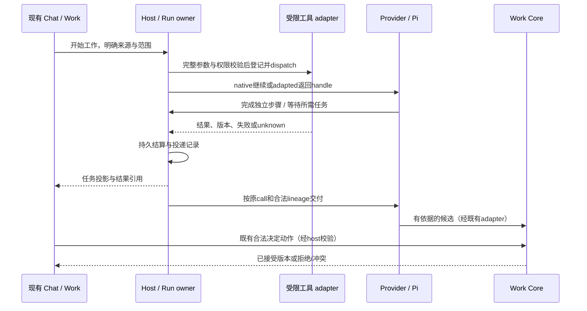

# 前后端合流 Design：异步执行、版本和工作效力

状态：语义设计草案。以下DTO/状态名是待冻结需求，不是已经上线的路由或schema。复用 [架构](../../architecture.md) 的M01…14与 [Work Surface边界](../../design/work-surface-boundaries.md)；不是视觉改版、不添加新一级导航。

## 一条因果链，三个独立事实

工具执行结束、结果已递交provider和成果已接受是不同事实。provider确认接收最多说明协议交付，不证明模型理解或实际引用；“模型已消费”只有可观察的后续行为支持时才展示，不能把HTTP成功当成认知证明。每个投影从其owner读事实，不在UI/插件注册表复制决定状态。

## 身份与投递合同

| 语义字段组 | owner与要求 |
|---|---|
| distribution / contribution / instance | Registry/Activation记录来源版本、能力契约与激活scope；包名不能替代这些身份 |
| job / invocation | Host铸造可信身份；模型handle仅别名，检查整个适用lineage内唯一性；不作权限令牌 |
| origin | 固定Session、Run、request、branch/lineage与provider call_id；后继授权与provider response pointer由host维护 |
| versions | 工具contract/实现、activation generation、input source revision；结果引用不能跨代替换 |
| execution | queued/running与实际settlement分列；cancel requested不是terminal。unknown表达证据不足，不伪造failed/succeeded |
| delivery | pending、attempted/unknown、provider acknowledged、不可投递及receipt；状态粒度由adapter能证实的事实决定 |
| work | source/finding/candidate/decision仅按Core现有schema；不增加job.accepted作为平行权威 |

同一lineage的续请求由host排队/CAS管理latest response引用，避免用户新回合与两个callback竞争分叉。回执仍携原始call_id；晚到结果不可投向全局最近Session。分支复制是否允许继承pending任务必须由AM-B冻结，默认不隐式继承；删除目标保留可查询处置，不自动复活。任务handle即便已完成也不得被重用冒领旧结果。

当前Pi Responses路径为store:false且host没有持久provider continuation；原生路径是否采用服务器状态或显式回放必须在AM-B作单独兼容裁定，不能直接把latest response pointer加进现有store并假定可用。

原生wait仅等待选择的任务，原call的结果在wait状态之前送入续请求；普通adapted get/wait返回自己的协议结果，不能拼造原生call链。投递去重与外部执行幂等各有账，不声称同一回事。只保存恢复必要的关键转换，UI高频进度可为非持久采样；重连要能由snapshot+cursor补齐事实。

## 前端贡献与状态设计

一项view contribution声明view identity、支持的payload/schema版本、host API范围、所需能力、typed commands与基础fallback。host决定受信renderer准入与静态路径；不执行模型生成脚本。模块缺席/损坏时数据获取仍由宿主历史路径完成，高级renderer仅影响呈现和可用动作。

| 用户位置 / 状态 | 应显示的事实 | 动作与一致性 |
|---|---|---|
| Chat / Run activity：两个任务执行 | 各任务的来源版本、实际阶段、可独立继续的工作与等待原因 | Stop遵循既有取消；点击后显示请求中，等待后端结算 |
| 一个任务完成，另一个仍运行 | 已完成结果引用及剩余依赖；不画全工作完成 | 查看已取得来源；继续不依赖剩余结果的步骤 |
| 已结算但交付未知 | “结果已保存，交付状态待核对”及更新时间 | 有后端查询/恢复动作才显示；不提供盲重试按钮 |
| 资料或配置代际已变 | 旧版本标识、适用性未知/已失效原因 | 重算/新候选由合法host动作请求；不覆盖历史 |
| producer/renderer缺席或不兼容 | host基础阅读、来源、决定与不可用原因 | 不依赖缺席代码读取历史；只暴露仍受支持的动作 |
| Work Review | 候选依据、验证、变化、当前revision | 既有accept/revise/reject语义；冲突刷新后重审，不乐观写入accepted |
| Settings / Developer能力详情 | 来源与兼容方式、证据范围、保存/激活差异、版本 | 本包不新造注册表UI；按当前Runtime/Connections合同落位 |

无可定义分母则显示阶段/计数，不用虚构百分比。键盘焦点不因后台结果到达被抢走；重要结算使用适度通知，进度批量更新；长结果有界加载、原文定位与加载失败可恢复。读屏、重连、窄屏与长中文文案进入真实UI验收，表格不是已完成的可访问性证据。UI样式变化不触发模型配置重编译。

## 前后端共同冻结与合流门

先用同一fixture记录origin、generation、source revision、序列cursor、execution/delivery、result refs及host允许动作；动作请求携目标身份和期望revision/generation，真实actor从host取得。后端契约测试覆盖版本冲突、权限撤回和unknown；前端消费投影，不推测可用性。

共用八个场景：乱序完成、重复事件、cancel竞争、断线重连、已删除目标、来源变化、renderer缺席、stale决定。后端先证明事实与动作后果，前端再证明显示、焦点和错误恢复；最后用组合main验证服务→投影→UI→动作→持久状态闭环。fixture、真实provider、专业成果三种证据分别报告。

前端仍沿FE-03/04等现有单writer队列，AM-E开工从Astra冻结后的实际main；不占用当前Models/Connections写权。新增路由/静态资源须由现有host owner精确准入。未知provider兼容或缺少动作时先显示真实限制，不能先画可用按钮后补能力。
