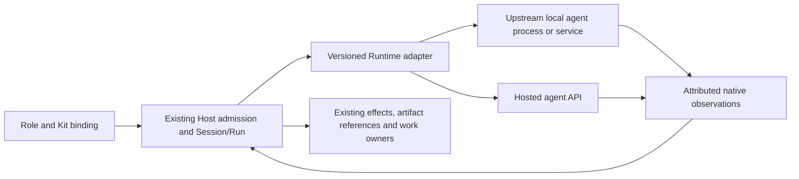

# Local Agent Runtimes — integration and Settings ruling

2026-09-20 · Architecture/integration: Astra; bounded local and upstream exploration: Luna. **Status: architecture and implementation guidance; no product implementation or capability promotion.** This consumes [RD-001](../RD-001-runtime-adapter.md), [RD-005](../RD-005-multi-agent-selection.md), the [Orchestra direction](orchestra-direction-20260919.md), and the user's subsequent Settings/CC Switch questions. The observed CW source is `main@72c91a2f070cc8e134f1d09cebc7de735ff89415` with uncommitted direction documents.

## Decision

Use upstream-maintained executors through versioned adapters. CW owns admission, binding, effects, source/result references, recovery and work decisions; it does not fork every agent's loop, mirror every settings screen, or become a package manager by default. CW's reference Pi composition still reuses its pinned upstream packages.

Two integration depths are sufficient initially:

- **Bounded consultation/job:** explicit input packet → one native invocation → bounded structured result. Best for a first read-only external consultant. It need not promise interactive approvals, steer or durable resume.
- **Managed session:** a native bidirectional interface with documented identity, events, input/approval replies and interruption. Use when the real consumer needs continuation or governed actions. Unsupported operations remain unavailable rather than being simulated through terminal text.

These are adapter capabilities, not two new product layers. Local process, local service and hosted API are transports/deployments behind the existing Runtime boundary. ACP can be one transport; adopting it does not replace CW's permission or result contract. MCP describes tool connectivity and cannot substitute for the entire agent lifecycle.

## What CW already has, and the actual gap

`app/server/service.mjs` still opens/creates Pi `SessionManager` and calls `createSessionRun` directly in `#executeRun`. `app/runtime/pi-session-runtime.mjs` supplies Host tools and events through the in-process Pi SDK. Extract only the lifecycle dependency exercised by the next consumer; do not move all service responsibilities into a new framework.

`app/harness/subagents.mjs` already persists Spark attempts before dispatch, checks exact source revisions, rechecks grants, runs children serially after the parent releases the lane, and stores result hashes and consumption. Preserve those responsibilities. `child-execution.mjs` is conformance-only: its in-memory abort race is not sufficient evidence that an external process or remote action stopped. It must not be installed as a production external scheduler without reconciliation and durable identity.

The current Agents API contract already separates CW identity, native locators, observations and Host settlement. Reuse that division while leaving agent-specific wire fields with each adapter. `check-runner.mjs` supplies a local precedent for `shell:false`, explicit environment, bounded output and process-group termination, but its isolated recipe environment is not directly suitable for every authenticated agent and is not a sandbox.

The [Hermes consultation](evidence/hermes-praxis-20260920/README.md) proved one actual profile-backed invocation and result return. It also exposed stale-input reasoning and output-limit problems. It did not exercise tools, enforced permissions, resume, cancel or a CW-managed child. Its `--toolsets none` workaround is version-specific, not the permanent adapter contract.

## Minimum implementation boundary

| Responsibility | Required behavior and owner |
|---|---|
| Admission / launch binding | Host records adapter/protocol and executable identity/version, native profile reference, explicit cwd, approved environment/auth reference, role/Kit revisions, grants and budget. A model cannot supply an arbitrary executable or shell command. Installed, authenticated, protocol-compatible and admitted are separate facts. |
| Transport | Adapter uses structured stdin/JSONL/RPC or a documented SDK/service interface. Keep diagnostics separate; limit bytes, frame size and time; handle split frames, malformed messages and backpressure. Never parse colored TUI output as a durable API. |
| Identity / recovery | Persist CW attempt and dispatch intent before launching; attach native identity when observed. A lost acknowledgement or missing terminal event is reconciled or remains unknown. Never blindly restart a possibly effectful job. Continuation uses the exact native ID, not `latest`, and revalidates the original scope. |
| Tools / permissions | Prefer Host-owned callbacks when available. Native tools require a verified native policy mapping and evidence of what the runtime actually enforces. A prompt, cwd, worktree or tool-name filter alone is not filesystem isolation. If the required grant cannot be enforced, reject that mode or retain the lower-capability consult. |
| Cancel / detach | Close new effect admission, request native interruption, drain observations, then reconcile terminal/effect evidence. Terminate only a CW-owned process group when appropriate. Never kill the user's shared Hermes gateway or Codex daemon to close one CW task. Detaching a connection is not cancellation. |
| Result / consumption | Host checks task/attempt identity, source revisions, schema/size, terminal envelope and artifact hashes before storing the receipt. Exit 0 or fluent prose does not prove work acceptance. Model findings retain attribution and uncertainty; existing owners decide their effect. |

For a native parent invoking another local agent, provide one typed, bounded delegation tool backed by the same Host admission and result path when a real consumer exists. The parent supplies an approved agent binding, scoped brief and source refs; the Host owns launch options and permitted operations. A native Codex/Claude child remains native-owned, while a child launched by CW has CW attempt identity. Do not duplicate the native scheduler or recursively enable delegation by default.

## Codex parent with local Pi workers

The user permits local Pi to be exposed as a subordinate worker to Codex. This has two separately attributed paths:

1. **Direct Codex delegation:** Codex can invoke a verified local CLI through its existing process tools with a bounded work order, isolated working directory and explicit executable/argv. This requires no new CW product Runtime registration. Codex owns orchestration and review; the native CLI owns execution and any native session. Results are attributed as external-worker outputs, not native Codex subagent events or CW-managed child receipts.
2. **CW-managed delegation:** a future typed tool selects an approved Pi binding and uses the Host attempt, grants, budget, cancellation and result path described above. This remains RD-005 work after the agreed integration sequence. A CLI installed on the machine is a prerequisite, not proof of this path.

A useful work order fixes the task ID, input/source revision, allowed directories and operations, deliverable path/schema, deadline/output limit, and return evidence. The parent checks the diff, source freshness and relevant validation before accepting the result. Start with one worker per task and bounded output; no recursive delegation or concurrent edits to the same files by default. Use an isolated worktree for coding and preserve other writers. A workspace boundary does not establish a sandbox; toolful Pi execution requires an admitted enforcement or explicit trusted-process scope. Request-only tool restrictions cannot be presented as enforced grants.

Pi's observed `--print --mode json` is a candidate one-shot worker surface; RPC is available when the parent needs interactive session control. The global Pi version must be recorded separately from CW's locked SDK. The [installed-interface inventory](explore/local-cli-inventory-20260920.md) retains exact historical executable observations; those observations do not select a downstream launcher for future work or establish inference, tool enforcement, cancellation or recovery.

**Astra disposition, updated by the user's naming ruling:** use **Pi** consistently in architecture, product copy, configuration choices and future worker assignments, and continue adopting the upstream Pi implementation. Preserve existing underlying IDs and native session/configuration references; this is no ID, package, directory or data migration. Earlier downstream-launcher observations remain historical evidence, not a separate product Runtime or recommended execution path. Before an actual dispatch, verify that the selected executable is the intended upstream Pi revision; a matching base version or display label alone is insufficient. Do not alter the user's installation, global Codex configuration or active Claude scope. This pass changes documentation only.

## Settings: Agents owns configuration intent; Developer owns diagnostics

The target user-facing hierarchy is **Settings → Agents → Agent profiles / Runtimes**. “Runtime” is a second-level execution object: an installed binary/service or hosted executor connection. Agent profiles express Role + Kit composition and select a Runtime binding. This is a planned evolution, not today's navigation.

Today `SETTINGS_GROUPS` in `app/web/settings-view.mjs` has Models, Tools & Integrations, Skills, Plugins, Memory, Permissions and Developer; the technical Runtime surface lives under Developer. Keep that implemented surface until a real runtime-management consumer and Host facts exist. Do not add empty placeholder groups or restore a generic top-level Runtime panel.

| Settings object | User question / ownership |
|---|---|
| **Agents → Agent profiles** (target) | What work does this agent do, with which Kits and default Runtime? Per-instance binding and revisions; active Run snapshots stay frozen. |
| **Agents → Runtimes** (target) | Which executors are connected and allowed to receive new work? Path/endpoint, upstream version, profile reference, compatibility, capabilities, health and connection lifecycle. |
| **Models** (existing) | Which provider connection/model/effort can this executor use? Preserve the existing provider/config owner. A runtime-owned model configuration may be read-only or delegated to its native settings; do not pretend every runtime consumes CW's model API connection. |
| **Tools & Integrations / Skills / Plugins** (existing) | Which external tools, on-demand procedures and trusted executable extensions are available? A Runtime connection is not automatically a Plugin, and a Kit is not just a Skill. Kit composition belongs to the agent definition until a concrete catalog consumer requires more. |
| **Permissions / Memory** (existing) | What is granted, and what context may persist? Kit requests cannot grant capabilities; native memory does not become CW's shared memory. |
| **Developer** (existing) | Protocol traces, compatibility details and recovery diagnostics for the same objects. Do not maintain a second editable configuration truth. |

Nearest implemented precedents: Settings model connections and precise return-to-composer navigation; MCP's separate Save/Connect/discovery/exposure/permission steps; trusted Plugin Inspect/Register/Load; configuration CAS and active-Run freeze. Reuse their semantics and controllers, not their resource kinds. UX-02/03/05/06/08 and the [frontend contract](../../design/agent-interface-2026-09-10/frontend-contract.md) govern the eventual UI; no new visual system is defined here.

## Comprehension, presentation and document ownership

**Product explanation:** choose an agent for the job; its Kit supplies the working methods; its Runtime executes the task using the configured model and permitted tools; inspect the result and continue. A specialized Expert is an agent prepared with professional Kits, not another mandatory configuration layer. Kits are optional for general work. A user should not need to learn the five engineering layers before sending a task.

The target first-use path is short: select an agent by its role, connect the relevant materials, confirm the effective execution/model and permission scope where necessary, then send. Start from available supported defaults rather than requiring users to configure every axis. A brief introduction may explain the product's purpose and these relationships; details belong beside the decision that needs them.

| Surface | Default presentation | Details when needed |
|---|---|---|
| Composer | Role/agent choice, current model and task/material scope | Agent configuration; supported execution/model options; changes' actual scope |
| Agents → Agent profiles | Responsibility, selected Kits and execution choice | Profile revisions and per-instance settings; defaults must not imply new grants |
| Agents → Runtimes | Pi or another executor's name, local/hosted location, availability and next useful action | Installation/endpoint/version, capability compatibility and native settings ownership |
| Models | Provider connection, supported models and effort | Connection/auth ownership, protocol and effective configuration; link to native settings if CW does not manage it |
| Work / Run | Current state, result, required user action | Source/version, tool/effect evidence and recovery details for the selected work |
| Developer | Technical diagnostics requested by the user | Protocol, native IDs and reconciliation traces for the same authoritative objects |

Keep Role, Runtime and Model names consistent across Composer, Settings, README and Pages. Use **Pi** as the public name while preserving exact native identity in technical evidence. Availability and current workload are separate facts. Configuration controls state their actual scope and when they take effect; until per-agent binding exists, retain today's global future-run model scope. Do not hide permission consequences or failure reasons behind an advanced disclosure.

**Architecture and documentation governance:** existing service/domain contracts own facts, the architecture canon owns boundaries, current owns delivery status, and the Developer control-plane record owns the Settings follow-up. README and Pages explain the product and point to those records; source explorations preserve evidence. Changes update the affected authoritative record and its entry points together. Do not create a second glossary, configuration ledger or acceptance status in a page-specific document. Multica is a reference for coherent architecture, documentation and presentation relationships; it does not supply CW's authority or require its Issue-centric navigation.

**Future comprehension check:** with only a brief product introduction, an experienced agent user should be able to (1) choose a suitable agent and explain what a Kit changes; (2) locate its executor and model configuration, including who owns each; (3) tell what a configuration change affects and when; (4) act on a disconnected executor or permission request; and (5) find a run's result, distinguish it from work acceptance and continue safely. Record observed misunderstandings and fix the corresponding naming, grouping or action. This is a task-based UI review under UX-02/03/05/07/08 and existing Settings precedents, not a claim of completed usability testing or a new mandatory onboarding flow. It belongs to the future management consumer and does not expand Claude's active G1–G4 scope.

## What runtime “plug/unplug” means

**Connect:** select/discover an existing installation or endpoint; inspect its version and protocol without a model call; save the connection separately from enabling it for future work. An authenticated capability probe or paid model test is an explicit, separately bounded action. Discovery must not import private profile history or copy credentials.

**Disable:** stop admitting new runs through that binding. Active work retains its recorded owner and version until it settles or is explicitly stopped. **Disconnect/remove registration:** detach only CW-owned transport/resources once active bindings are resolved; retain historical run/result/native references. This does not uninstall the upstream runtime or delete its user data.

**Upgrade:** upstream installer or package manager remains the default owner. CW may display the observed version and offer a scoped native-settings/update entry, but must not silently update or rewrite native configuration. Re-probe a changed executable/protocol before new admission. Runtime replacement applies to future runs; transferring ongoing work requires an explicit handoff and available recovery evidence, not a hot-swap button.

An adapter package may eventually be distributed as a trusted CW extension. The package, the upstream Runtime installation, and its live connection still have different lifecycle and trust boundaries.

## Bounded validation and ordering

After the [authorized fresh-node merge/cleanup sequence](../../execution/claude-frontend-harness-2026-09-16/orchestra-start-node-20260919.md), finish the missing RD-006/DF-04/RD-009 dogfood evidence. Local CLI feasibility work does not replace the existing P03/DRT-03 Agents API first-runtime delivery plan or automatically make any CLI a supported product runtime.

The local sample starts with deterministic transport fixtures: partial/malformed/oversized events, duplicate terminal, exit without result, native-ID mismatch, timeout, denied tool, lost acknowledgement, late output, reconfiguration and shared-daemon detach. Then use version-pinned no-inference protocol handshakes where available. Only an explicitly authorized bounded live trial tests native execution; keep fixture, protocol and live-operation coverage separate.

The first useful live comparison should hold the source packet and result contract fixed across two executors, then verify exact-session continuation and cancellation only where supported. No universal CLI shell wrapper, auto-routing, broad agent marketplace or simultaneous five-adapter rewrite is required.

## Source exploration and adoption

The [installed-interface inventory](explore/local-cli-inventory-20260920.md), [upstream precedent review](explore/local-cli-precedents-20260920.md) and [CC Switch recall](explore/cc-switch-consumption-20260920.md) have different evidence scopes. Installed help describes this machine; pinned upstream source describes that revision; current web documentation may describe another release. None alone proves CW interoperability. Hermes's upstream documentation pin differs from the installed revision used for the consultation; do not merge their capabilities into one tested configuration.

All five requested CLI families were found. The material version differences are global Pi `0.84.1` versus CW's locked `0.85.1`, and installed OpenCode `1.18.11` versus the earlier source pin `1.18.31` and newer V2 documentation. Use the actual admitted executable's version and protocol; do not substitute a global CLI for CW's pinned dependency. Metadata checks made no model calls. Hermes help additionally states that one-shot mode normally loads tools/context and bypasses approval prompts: the earlier consultation's empty tool selection and zero tool events must not become a general safe-mode claim.

| Candidate | Integration surface to evaluate | Astra disposition |
|---|---|---|
| Pi | JSONL RPC for managed sessions; JSON output for bounded jobs | **Adopt** request/event separation and explicit session operations as the nearest reference. **Adjust** the upstream subprocess-child example: it uses no-session mode and cannot supply CW durable recovery. Trusted extensions do not constitute portable Kits or isolation. |
| Hermes | The already exercised one-shot CLI for consultations; documented ACP/gateway for richer sessions | **Adopt** the consultation as a feasibility receipt. **Defer** a managed adapter until installed-version handshake, approvals, cancellation and recovery are tested. Preserve its native profile/memory ownership. |
| Codex | `exec --json` for jobs; App Server for interactive sessions | **Adopt** structured native identities/events and version-generated protocol schemas. **Defer** support until installed-version conformance. App Server's documented experimental status matters; no generic production-stability claim or removed MCP-server path is used. |
| Claude Code | Headless structured CLI or Agent SDK integration | **Adjust** to the actual supported process, permission and session contracts. SDK callbacks must not be assumed to intercept every native action. Authentication/access rights and recovery need their own evidence. |
| OpenCode | Local server/client API; embedded SDK only for a verified matching release | **Defer** the deployment choice until installed-version compatibility is known. A current server/SDK page does not establish support in a differently pinned release. |
| DeepSeek Harness / ACP | Named provider registry, capability preflight, durable session versus live activation | **Adopt** those separation patterns. **Reject** treating alpha source or an ACP handshake as proof of CW permission, persistence or recovery. |

Astra also fetched the official [Codex non-interactive guide](https://developers.openai.com/codex/noninteractive) and [App Server reference](https://developers.openai.com/codex/app-server) on 2026-09-20. The first documents structured job events and exact-session continuation; the second documents initialization, thread/turn identity, approval requests and interruption over a bidirectional protocol. Current documentation is source evidence, not an installed-version test. Both are local Codex integration candidates, distinct from the separately owned hosted Agents API lane.

### CC Switch: consume the Provider control plane, retain CW ownership

The [bounded recall](explore/cc-switch-consumption-20260920.md) reads the pinned v3.20.3 Add/Switch Provider manuals. Astra **adopts** explicit application/profile scope, visible native-file projection and reload/restart disclosure. **Adjust** universal-profile synchronization and backup patterns into the existing CW Provider owner's version/CAS and explicit target scope: importing a configuration must not silently rewrite unrelated native applications, copy credentials, or alter admitted Runs. The inspected manuals leave in-flight and resumed-session rebinding undefined; CW retains future-run binding and active-Run freeze.

**Reject** making CC Switch a required runtime gateway, child scheduler or recovery/cancellation authority on this evidence. **Defer** a live connector and native-file writeback until a concrete consumer and scoped ownership contract exist. The inspected two pages do not establish the absence of such capabilities anywhere in upstream; they simply do not prove them. Model discovery, protocol conversion, configuration activation, runtime connection and work acceptance remain different facts.

Consequently CC Switch informs **Settings → Models** and its provider configuration controls. Runtime plug/unplug belongs to the target **Settings → Agents → Runtimes**, with technical observations under **Developer**. These decisions are consumed by RD-001, RD-005 and the existing Developer control-plane record; no new implementation queue is created.

## Review and verification

Astra reviewed the reports against their source scopes and corrected an overbroad Claude SDK interpretation through a bounded Luna follow-up: a library API in the caller process does not prove an embedded runtime loop; the inspected Python SDK uses a Claude Code subprocess. Current OpenCode V2 documentation is also kept separate from the installed V1 CLI. No runtime was upgraded or substituted.

For this documentation-only change, `node tools/check-doc-links.mjs` passed (1,412 documents, 8,035 links) and `git diff --check` passed. Main remains at the observed `72c91a2` baseline; the product app paths and index were not changed by this work. No provider trial, runtime implementation, merge, worktree removal, push or deployment was performed. The earlier Hermes consultation remains a separately scoped receipt.

Luna then completed a non-author, read-only consistency review of this ruling, the three evidence reports, and the RD/Developer/current/Pages registrations. Settings ownership, installed-versus-source version distinctions, implementation ordering and direct-Codex versus CW-managed delegation were consistent; no blocking documentation findings were reported. Astra adopts this document-consistency result only. It does not independently accept any runtime, model capability or product implementation.

## Multica follow-up

The [2026-09-20 Multica ruling](multica-consumption-20260920.md) adds a fixed-source local-orchestra reference. It refines machine/daemon/adapter terminology and version-dependent retry/context-injection cases without changing this Settings hierarchy, Host authority or implementation order. Its custom license and unattended defaults are explicit limits on reuse.

## Naming-review disposition

Luna's bounded read-only review identified four active downstream-worker recommendations in this ruling, RD-005, current and the Multica consumption record. Astra adopts their replacement with Pi and retains the historical inventory/source records unchanged. The review confirms that existing Settings owners suffice; no new object layer is required. Internal document links follow the revised headings; native runtime/provider/session IDs and product files were not changed.

Luna subsequently reviewed the revised bilingual development sections, Pi worker/comprehension contract and RD-005 link. No blocking document inconsistencies or current-capability overclaims were found. Astra adopts this bounded document result; it is not product or usability acceptance.
