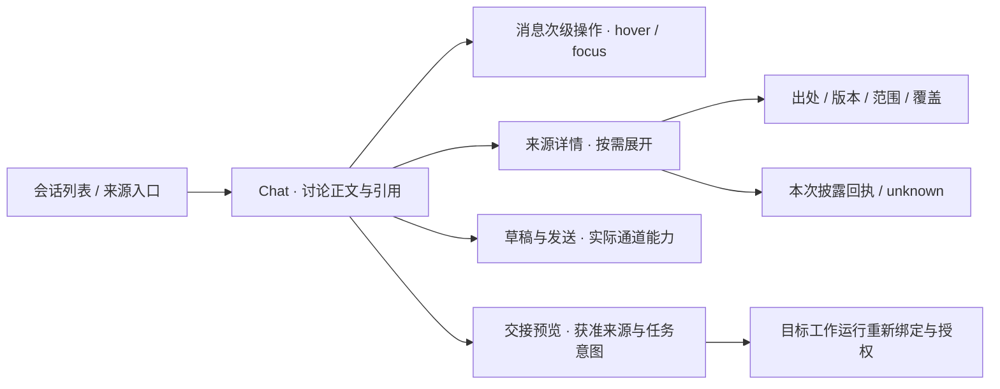

# Chat前端先行 · 页面责任与反推合同

2026-09-12；Astra裁决。依据[最后一轮来源](final-turn/README.md)、[薄能力层](thin-capabilities.md)与[前端连续性规范](../../design/agent-interface-2026-09-10/frontend-contract.md)。本页是低保真结构与施工顺序，不是已实现页面或新后端API。

## 复用裁定

Chat与Attention共享对话呈现、Markdown、composer、消息actions、现有模型选择和实际权限控件；页面controller、会话身份、数据集合与工作义务分别保留。不能把普通Chat接到global Attention端点来实现免project；原生Provider入口不伪装成CW可观察的Run。既有项目Chat仍按原合同运行。

## 第一张结构图

阅读正文占主列。来源详情在用户展开引用时出现；不把hash、grant ID、导入批次常驻成一排chip。空状态可以开始讨论；没有资料不显示假计数。失败与部分导入保留可解释反馈。窄屏来源详情沿既有overlay返回路径，不挤压正文。所有示例数据必须标明合成，未接线能力只在独立specimen中演示。

## 由界面反推owner需求

| 用户所见 / 动作 | 必要事实与责任 | 必测反例 |
|---|---|---|
| 阅读保留片段 | RG来源安全域、版本、表示、准确范围、coverage | 缺附件、部分解析、重复导入、跨账号相同native ID |
| 搜索再展开 | Broker组合获准reader；有界query、精确版本与range | 中文短词、搜索后撤权、旧cursor、隐藏对象计数泄漏 |
| 来源详情 | 原owner出处、转换版本、截断、实际披露回执 | selected不写成used；unknown不写off |
| 集合整理 | 组织关系owner；与retention/grant分别建模 | 移出集合不删原件、不自动撤权 |
| 原生入口 | 经验证的channel与导航/账号边界 | 无嵌入支持退外部浏览器，不假装取得历史 |
| 交接工作 | 获准来源版本与任务候选；目标Runtime重新准入 | 预览不执行；过期授权不沿用 |
| Attention待判断 | 现工作义务/版本/决定owner | Spark成功不自动关闭；新版本不自动推翻决定 |

先做三个合成场景：无来源讨论、部分保留资料与引用展开、来源r1/r2变化后待判断。每个场景同时包含正常/缺失/拒绝，不只画happy path。绘制后Astra冻结实际owner映射；Luna实现纯投影及接线成熟片，涉及身份、跨Provider披露、恢复和正式效力由Astra实现/裁定。

## 消息次级操作统一规则

适用于项目Chat、Attention/全局Attention及复用同组件的其他Chat space。鼠标设备在消息hover或内部focus时呈现复制、编辑与更多；键盘按钮保留Tab顺序，聚焦即显现。触屏/coarse pointer保留入口。预留动作行几何空间，避免正文跳动。打开菜单、确认面、busy或结果/错误反馈时保持可见。

停止运行、待审批、错误恢复等需立即处理的控制不进入此隐藏规则；文件成果动作不按聊天消息盲目隐藏。截图里的朗读/赞踩/重试等仍由现adapter决定可用性，本轮不扩权。共享CSS修补不另造动作组件或状态store。

## 实施顺序与验收

1. 本单先登记来源并统一已实现消息actions的显隐；不等待在途后端。
2. 利用[本地召回](final-turn/recall.md)建立上述三个页面specimen，复用现有tokens和controls；不启动容器大重写。
3. 依据页面状态冻结缺少的reader/DTO与权限合同，由现RG/LG/BE owner串行接收；已有事实直接消费。
4. 固定合成纵切接线后再测试实际获准来源与真实通道。容器试验单独判定兼容性。
5. 数据变化闭环进入Spark/Attention/Expert工作责任验证，不能由视觉完成代签。

前端先行指先检验信息层级、动作与缺失状态，再反推最低数据合同；不从漂亮页面倒造后端事实。本文未把候选结构图标为已接受视觉baseline。
