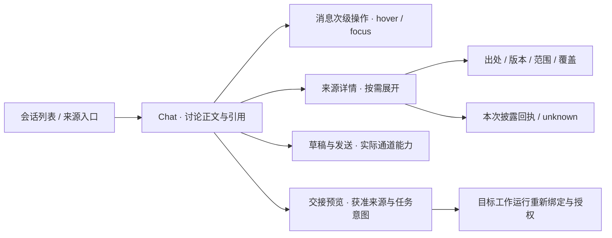

# Chat前端先行 · 页面责任与反推合同

2026-09-12；Astra裁决。依据[最后一轮来源](final-turn/README.md)、[薄能力层](thin-capabilities.md)与[前端连续性规范](../../design/agent-interface-2026-09-10/frontend-contract.md)。本页是低保真结构与施工顺序，不是已实现页面或新后端API。用户后续审阅的五处接线边界已补入，主体与实施顺序保留；[修订与验证](final-turn/review-followup.md)区分合同采用和实际修补。

## 复用裁定

Chat与Attention共享对话呈现、Markdown、composer、消息actions、现有模型选择和实际权限控件；页面controller、会话身份、数据集合与工作义务分别保留。不能把普通Chat接到global Attention端点来实现免project；原生Provider入口不伪装成CW可观察的Run。既有项目Chat仍按原合同运行。

共享组件不继承另一页面的控制权。CW托管对话、原生Provider入口和保留资料投影分别消费自己的通道能力。模型选择、发送、停止、编辑及权限控件只在当前通道有真实实现与回执时出现；原生入口与只读投影不合成CW Run状态。复用的是控件及交互规则，具体显隐、修改范围与回执归当前通道。

| 表面 | Composer与控制的最低责任 |
|---|---|
| CW托管对话 | 接现有Session、真实模型catalog、发送、取消与权限合同 |
| 原生Provider入口 | 仅在已验证通道内操作；没有CW控制接口时返回原生页面，不叠加假模型选择器或Stop |
| 保留资料投影 | 阅读、检索、引用与获准整理；继续讨论先明确目标通道，不把归档伪装为可发送的原生会话 |

## 第一张结构图

阅读正文占主列。来源详情在用户展开引用时出现；不把hash、grant ID、导入批次常驻成一排chip。没有资料不阻止在已可用的讨论通道开始对话；没有资料不显示假计数。没有来源、没有项目、没有连接、只有只读记录分别呈现。发送条件不满足时保留草稿并给出下一步入口，不自动借用最近项目、账号或Attention身份。失败与部分导入保留可解释反馈。窄屏来源详情沿既有overlay返回路径，不挤压正文。所有示例数据必须标明合成，未接线能力只在独立specimen中演示。

## 由界面反推owner需求

| 用户所见 / 动作 | 必要事实与责任 | 必测反例 |
|---|---|---|
| 阅读保留片段 | RG来源安全域、版本、表示、准确范围、coverage | 缺附件、部分解析、重复导入、跨账号相同native ID |
| 搜索再展开 | Broker组合获准reader；有界query、精确版本与range | 中文短词、搜索后撤权、旧cursor、隐藏对象计数泄漏 |
| 来源详情 | 原owner出处、转换版本、截断、实际披露回执 | selected不写成used；unknown不写off |
| 集合整理 | 组织关系owner；与retention/grant分别建模 | 移出集合不删原件、不自动撤权 |
| 原生入口 | 经验证的channel与导航/账号边界 | 无嵌入支持退外部浏览器，不假装取得历史 |
| 交接工作 | 获准来源版本与任务候选；目标Runtime重新准入 | 预览不执行；过期授权不沿用 |
| Attention待判断 | 现工作义务/版本/决定owner | Spark成功不自动关闭；新版本不自动推翻决定 |

绘制前标明每类事实、动作的既有owner与尚未解决的责任缺口；绘制后根据实际页面状态，由Astra冻结最小字段、查询、动作与错误映射。没有owner的能力可以在独立specimen展示候选，不得据此接入生产。先回答对象/版本、可读/缺失、动作来源、失败保留与返回位置；优先消费原合同，不为页面另造同义身份或状态。接受权、关闭权、披露权不能留到绘制后才分配。

Luna实现纯投影及接线成熟片，涉及身份、跨Provider披露、恢复和正式效力由Astra实现/裁定。保留三个合成specimen，每个只走一条主路径与两个关键反例：

| 场景 | 正常路径 | 缺失状态 | 拒绝或失效状态 |
|---|---|---|---|
| 无来源讨论 | 已配置通道中输入、发送，返回时保留未发送草稿 | 无连接或通道不可用 | 当前身份不能发送，不自动换账号/项目 |
| 部分资料与引用展开 | 命中→精确片段→详情→原引用位置 | 附件缺失或部分解析 | 搜索后撤权，展开拒绝且不泄露缓存正文 |
| r1/r2后待判断 | 来源变化与相关工作投影→判断预览 | 差异或核查证据不足 | 决定所依据版本过期，刷新而不自动提交 |

第三场景是Chat内的来源变化与工作关联投影，不在Chat controller复制Attention inbox。事项的生成与解决仍归原工作owner。

## 返回连续性

关闭来源详情、菜单或交接预览沿瞬时界面自身的关闭/焦点路径；切换会话、来源或页面是访问位置变化，沿[既有Shell控制面](../../design/shell-control-plane-2026-09-12/README.md)恢复阅读状态，不新建导航系统。

来源详情关闭后返回原引用位置与合理焦点，保留正文滚动锚点、消息展开状态和未发送草稿。会话、来源或账号切换后，旧请求晚到不得覆盖当前详情；历史引用固定r1/r2明确版本，不能改取当前版本。关闭详情不取消Run、不撤权、不清除待判断事项。

宽窄屏不强制同一种模态行为。窄屏若采用modal，需管理内部焦点和背景不可交互；关闭时优先返回触发引用，触发对象已消失则选择合理阅读位置，不能只加aria-modal。未来specimen须验证上述返回、晚到与旧版本反例；本次消息CSS检查不代签这些尚未实现的来源详情能力。

## 消息次级操作统一规则

适用于项目Chat、Attention/全局Attention及复用同组件的其他Chat space的已实现用户/assistant消息。显隐目标限定为消息次级动作组，不按footer类名批量隐藏。时间、消息状态、来源入口与即时失败反馈保留原呈现；现DOM混放时允许无状态分组或复用已有action row，不新增动作组件或store。

显隐统一不改变动作含义：已发送消息沿现“作为新消息编辑”（Edit as new message）将不可变记录带回composer准备新消息，不原地改历史。导入或保留片段只消费当前支持的复制、引用到草稿等动作，不暗示可修改上游原文。复制正文、选区、带出处引用的对象由原动作合同分别决定，不因组件复用而合并。

默认采用可发现的保守呈现，仅适合hover的输入环境收起。消息hover或内部focus时呈现动作；键盘保留现按钮Tab顺序，聚焦立即显现且焦点清晰，不引入toolbar键盘体系。透明动作不能接收指针误触；触屏和混合输入保留可触达入口。预留动作行空间，正文不跳动。菜单、确认面及异步反馈消费已有展开/busy/status状态，不能仅依赖消息hover/focus-within；菜单在消息外部时也需保留触发上下文，关闭按既有规则返回焦点。

本片验收需明确覆盖调用点，检查时间不隐藏、隐藏按钮指针命中关闭、Tab即时显示、打开菜单后移开指针/焦点、Escape返回、busy/成功/失败、粗指针及混合输入。来源返回与身份切换属于下一片specimen验收，不以CSS通过代签。

停止运行、待审批、错误恢复等需立即处理的控制不进入此隐藏规则；文件成果动作不按聊天消息盲目隐藏。截图里的朗读/赞踩/重试等仍由现adapter决定可用性，本轮不扩权。共享CSS修补不另造动作组件或状态store。

## 实施顺序与验收

1. 第一片只统一已实现消息actions显隐，明确用户/assistant及共享调用点；不隐藏时间，保留Edit-as-new、菜单/busy/反馈/焦点。不改会话身份、后端端点或模型能力，不等待在途后端。
2. 利用[本地召回](final-turn/recall.md)建立上述三个独立、可操作specimen，复用现有tokens和controls；绘制前记录owner与缺口，验证正文优先、按需来源、缺失/拒绝和返回连续性。
3. 绘制后冻结最小字段/reader/DTO、动作与错误映射，已有事实直接消费，责任缺口沿现RG/LG/BE owner串行补齐；读取、预览、交接草稿与实际启动工作分别验收。
4. 固定合成纵切接线后再测试实际获准来源与真实通道。容器试验单独判定兼容性。
5. 数据变化闭环进入Spark/Attention/Expert工作责任验证，不能由视觉完成代签。

前端先行指先检验信息层级、动作与缺失状态，再反推最低数据合同；不从漂亮页面倒造后端事实。本文未把候选结构图标为已接受视觉baseline。
