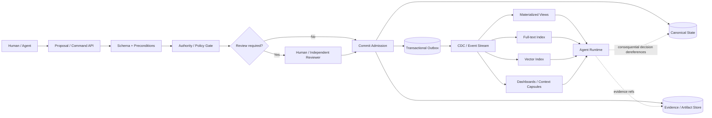
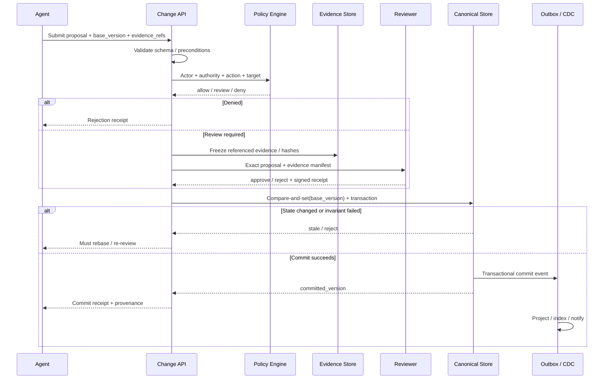
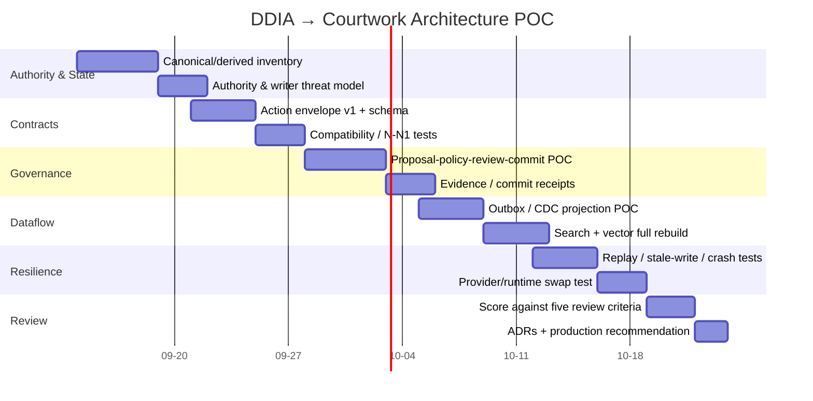

# 将 DDIA 第二版引入 Agent / Courtwork 的软件工程架构审查：从数据系统原则到可治理执行

> **范围说明。** 本文把 “Courtwork” 作为你给定的架构语境：一种把 agent 输出视为**提案而非天然事实**、把状态变更放入可审查/可授权/可追溯流程的工程体系，而不把 Courtwork 当作 DDIA 或公开文献中的既定术语。这里的 “SE” 指面向长期维护的软件工程架构与 agent harness/runtime 体系。

## 执行摘要

Martin Kleppmann 与 Chris Riccomini 的《Designing Data-Intensive Applications, 2nd Edition》（DDIA 2e，2026）并不是一本 agent architecture 教科书；它更适合为 Agent/Courtwork 提供**状态、数据流、演化、正确性与可运维性这一半的理论骨架**。第二版第 1–5 章新增或强化了 system of record / derived data、event sourcing/CQRS、vector embeddings、durable workflows、event-driven architecture 等主题，第 6 章正式纳入 sync engines/local-first，第 12–13 章则把 CDC、日志、不可变性、派生数据、数据流组合、端到端正确性与 “trust, but verify” 收束成一套非常适合治理型 agent 系统的系统观。DDIA 自己强调的也不是寻找“最佳架构”，而是理解不同方案的 trade-off 与长期不变的底层原则。citeturn18view0turn18view1

**本报告的核心结论是：DDIA 应成为 Courtwork 的 “state/governance substrate review”，而不是 agent cognition review。**

最值得吸收的架构原则可以归纳为：

> **Canonical authority/state → governed transformations → derived views → agent consumption**
>
> 以及：
>
> **稳定的是语义 contract 与 provenance；短命、可替换的是 model、runtime、index、UI 与 provider implementation。**

这不是 DDIA 中一句原文，而是把第 1、2、5、12、13 章投射到 agent 系统后的架构综合。DDIA 第 1 章明确区分 systems of record 与 derived data，第 2 章把 maintainability 拆到 operability、simplicity、evolvability，第 5 章处理 encoding/evolution、服务间 dataflow、durable workflows 和 event-driven architecture，而第 12–13 章处理 CDC、不可变状态、派生数据、数据流组合以及端到端正确性。citeturn18view0turn18view1

对 Courtwork，最重要的具体改变不是“所有东西改成 event sourcing”，而是**重新划清什么是真相、什么只是投影、谁有权提交变化**：

1. **Agent 不应默认拥有 authoritative write 权。** Agent 可以生成 `proposal`、patch、command envelope 或 tool intent；确定性治理层负责检查 schema、authority、preconditions、policy、并发版本和证据，必要时经人类或独立 reviewer 批准，再做 commit。ToolGate 的研究原型已经把这一思想形式化为 tool precondition 决定“能否调用”，postcondition 决定“结果能否提交到可信状态”；AgentSpec 则把 runtime policy enforcement 放到模型之外。citeturn19view3turn18view5

2. **Canonical state 与 derived state 必须显式区分。** Git commit、批准后的 specification、业务数据库记录、不可变 evidence artifact 可以是 canonical；vector index、全文索引、summary、RAG chunk、agent memory projection、dashboard、task read model 通常应视为派生物。只要业务允许，派生物应能从 canonical data + versioned transformation 重建。DDIA 第 4、12、13 章正好覆盖 materialized views、vector embeddings、CDC、derived state 与数据流组合。citeturn18view0turn18view1

3. **Event log 很有价值，但不应成为宗教。** 高审计价值、生命周期状态机明显、需要重演/取证的 Courtwork workflow 很适合 append-only events；普通 CRUD 域则通常更适合 authoritative DB + transactional outbox/CDC + projections。2026 年的 ESAA 预印本非常直接地把 agent 设计成 intention emitter，以 append-only log、deterministic orchestrator 和 materialized view 管理软件工程状态；它说明这种映射是可实现的，但仍属于新近、有限验证的研究，不应当作成熟工业共识。citeturn15search0

4. **Evidence provenance 应绑定“可观察事实”，而不是要求保存模型私有推理。** 需要持久化的是输入版本、authority、tool invocation、外部证据、diff、测试结果、policy decision、review receipt、commit ID/hash、effect observation 等。2026 年 provenance 研究强调，agent 的可信性不能只看最终答案，还需要把 evidence、tool output、memory/observation、actions 与最终产物之间的关系保留下来；PCAA 更进一步提出 runtime-neutral action certificate，把授权、approval semantics 和执行后 proof 与动作绑定。citeturn20view7turn15search1

5. **Local-first 对 Courtwork 有很强吸引力，但不能简单等价为 decentralized authority。** Kleppmann 等人的 local-first 工作把本地副本而非远端服务器看作用户数据的 primary copy，并明确讨论过“tentative proposal → review → selectively apply”以及 Git pull request 这种协作方式；但论文同时明确指出，银行、电商等服务非常适合集中式系统。Kleppmann 在 2026 访谈中也强调，去中心化 access control 很难，例如撤销权限与并发编辑会产生复杂冲突。citeturn18view2turn19view0turn18view3

6. **DDIA 的边界同样重要。** 它不能告诉你怎样安排 subagent、怎样做 prompt/context scheduling、如何让模型正确分配 attention、如何设计最有效的 Agent-Computer Interface，也不能代替 tool-routing、planning 或 model evaluation。SWE-agent 的研究显示，Agent-Computer Interface 本身会显著影响 coding-agent 行为；OpenHands SDK、LangGraph 等则把 agent orchestration、sandbox、checkpoint、session/runtime lifecycle 作为独立问题处理。citeturn17view7turn20view5turn20view1

因此，**推荐的默认 Courtwork 架构不是“event-source all the things”，而是：**

> **versioned Command API / proposal envelope**  
> → **policy + authority + evidence gate**  
> → **review/approval where risk requires**  
> → **transactional canonical commit**  
> → **outbox / CDC / event stream**  
> → **rebuildable materialized views / search / vector indexes**  
> → **agent runtimes consume projections but dereference authoritative evidence for consequential decisions**

这套设计既保留 DDIA 的长期数据系统纪律，又不会把 LLM runtime 的短期技术形态固化成核心状态模型。

## DDIA 章节相关性与适用边界

DDIA 2e 官方目录显示，第 1–5 章已明显覆盖今日 agent/data-system 交叉区域：第 1 章有 Systems of Record and Derived Data、Cloud versus Self-Hosting；第 2 章完整覆盖 Maintainability / Operability / Simplicity / Evolvability；第 3 章加入 Event Sourcing and CQRS；第 4 章覆盖 Materialized Views、Full-Text Search 和 Vector Embeddings；第 5 章在 Encoding and Evolution 之后覆盖 REST/RPC、Durable Execution and Workflows、Event-Driven Architectures。第 6 章则加入 Sync Engines and Local-First Software。citeturn18view0

后半部与 Courtwork 最直接的两个章节是第 12 和第 13 章：第 12 章从 log-based brokers 走到 databases and streams、CDC、state/streams/immutability；第 13 章则讨论 deriving data、unbundling databases、composing storage technologies、designing applications around dataflow、observing derived state、end-to-end correctness、constraints、timeliness/integrity 和 trust-but-verify。citeturn18view1

| DDIA 2e 章节 | Courtwork 相关度 | 最重要的审查问题 | 不应过度推导之处 |
|---|---:|---|---|
| **第 1 章 Trade-Offs in Data Systems Architecture** | ★★★★★ | 哪个 store 是 authoritative？哪些是 derived？cloud/provider 是否变成了不可退出的状态所有者？ | “System of record” 不意味着一定需要单个物理数据库。 |
| **第 2 章 Nonfunctional Requirements** | ★★★★★ | 系统能否被运维、理解、替换、升级和恢复？ | 不应把 maintainability 简化为代码整洁度。 |
| **第 3 章 Data Models / Event Sourcing / CQRS** | ★★★★☆ | domain state 适合 relational/document/graph，还是事件事实？read/write model 是否值得分离？ | Event sourcing 不是默认优于 CRUD。 |
| **第 4 章 Storage and Retrieval** | ★★★★☆ | search/vector/materialized view 是 authoritative 还是 index？能否 rebuild？ | 向量 embedding 是 retrieval 机制，不是 provenance 或 truth mechanism。 |
| **第 5 章 Encoding and Evolution** | ★★★★★ | agent/tool/provider/schema 如何跨版本共存？运行中的 workflow 如何升级？ | JSON Schema 本身不等于兼容性策略。 |
| **第 6 章 Replication 中 local-first 新内容** | ★★★★☆（选择性） | 本地 workspace 能否成为用户掌控的 primary copy？如何同步、冲突合并、授权？ | 不适合自动推导为完全 P2P/去中心化治理。 |
| **第 12 章 Stream Processing** | ★★★★★ | canonical change 如何可靠地产生 projections？CDC/outbox 如何避免双写？ | CDC 是传播机制，不是 authorization mechanism。 |
| **第 13 章 Philosophy of Streaming Systems** | ★★★★★ | derived state 如何被观察、校验和重建？约束最终在哪里执行？ | “数据流化”不是把每个业务功能都 Kafka 化。 |
| **第 14 章 Doing the Right Thing** | ★★★☆☆（补充） | accountability、privacy、data power 的治理后果是什么？ | 它是伦理/责任补充，不代替 access-control engineering。 |

DDIA 第二版真正“AI 时代化”的地方并不是增加了一章“LLM Agents”，而是把**vector embeddings、durable execution、event-driven architecture、local-first sync** 等已经成为 AI 系统基础设施的问题纳入主线。O’Reilly 对第二版的官方介绍仍把重点定义为可靠、可扩展、可维护的数据系统及其 consistency、fault tolerance、complexity 等 trade-off，而不是 agent cognition。citeturn18view0turn22search5

Kleppmann 自己的近期研究轨迹进一步解释了为什么这些概念适用于 AI 时代：他的官方页面显示其当前研究集中于 local-first collaboration 与 distributed-systems security，并参与 Automerge；2025 年底他还提出一个明确的 AI 工程判断——随着 LLM 生成代码越来越多，formal verification 的经济性可能发生变化，因为确定性的 proof checker 可以拒绝无效证明，而关键瓶颈会转向“specification 是否正确”。citeturn17view2turn21view0

这对 Courtwork 有一个重要启示：

> **不要试图让“更聪明的模型”承担全部正确性责任。尽可能把可机械验证的 invariant，从 probabilistic cognition 下沉到 deterministic admission / verification layer。**

这正是 DDIA 式 correctness engineering 与 agent governance 研究相交的地方。ToolGate 把 tool invocation 与 state commit 分成两个可验证阶段，而 AgentSpec 把安全约束从 agent prompt 外置到 runtime enforcement。citeturn19view3turn18view5

## 概念映射与目标架构

### 核心映射表

| DDIA 概念 | SE / Courtwork 转译 | 具体实现例 |
|---|---|---|
| **Maintainability → Operability / Simplicity / Evolvability** | 架构不仅要“agent 今天能完成任务”，还要能诊断、恢复、替换 provider、演化 contract | OpenTelemetry/structured events；replay tooling；provider adapter contract；versioned schemas；自动 migration tests |
| **Encoding & Evolution** | tool call、action envelope、artifact、event、policy input/output 都是长期协议，不是内部小细节 | `action/v2` schema；N/N-1 decoder；unknown-field preservation；contract tests；event upcaster |
| **System of Record vs Derived Data** | approved source / committed state / evidence 是 truth；summary、RAG、vector index、dashboard、agent memory 是 projection | Git + DB + artifact CAS 为 canonical；Postgres read model、OpenSearch、vector DB 为可重建 projection |
| **Event Sourcing / CQRS** | 把重要状态迁移表示成 admitted fact，把 query-facing 状态投影出来 | `proposal.created → reviewed → committed` event stream；task dashboard 是 projection |
| **Materialized Views** | 为 agent 和 UI 构建 task-specific read models，而不污染 source of truth | “当前有效 policy”“当前 task state”“agent context capsule”由 projector 生成 |
| **CDC / Log-based integration** | authoritative commit 后可靠传播到 search/index/analytics/context systems | transaction + outbox；Debezium/Kafka 类 CDC；projection worker |
| **State / Streams / Immutability** | 已发生的 governed fact 不被“悄悄改写”；修正通过新事实表达 | supersede/revoke/correct events，而不是 edit history |
| **Local-first / Sync Engine** | workspace、spec、code、notes 可以优先本地拥有，云端负责协作/同步 | Git；Automerge/CRDT；local artifact cache + signed sync |
| **Trust, but Verify** | agent output 是 untrusted proposal；commit receipt 和 evidence 才是可验证结果 | policy decision + test result + artifact hash + reviewer receipt + committed version |
| **Control / Data / Compute separation** | **本文的综合推导，而非 DDIA 原生术语**：治理 authority 与 canonical data 不与某个 LLM/runtime/provider 绑死 | OPA/policy service = control；DB/Git/artifact CAS = data；Claude/Codex/local model/index workers = compute |

这些映射的理论基础主要来自 DDIA 第 1–5、12–13 章，而“control/data/compute 三分法”是把 system-of-record/derived-data、dataflow、unbundling/composition 和 agent runtime 治理进一步组合得到的工程抽象。citeturn18view0turn18view1

### 推荐的状态拓扑



这张图有两个关键约束。

第一，**vector store 不应该因为“agent 经常读它”就变成 source of truth。** DDIA 第 4 章把 vector embeddings 与其它 index/storage 问题放在一起，第 13 章又把 derived state 与原始数据系统组合联系起来；工程上更稳妥的解释是：embedding/index 应持有 `source_id + source_version/hash + projection_version`，从而可以发现 stale vectors 并完整 rebuild。citeturn18view0turn18view1

第二，**agent memory 也应分类，而不是统称 memory**：

| Memory 类型 | 推荐地位 |
|---|---|
| 用户明确确认的 preference / policy | 可成为 canonical，但必须有 authority/version |
| task progress / approved decision | canonical workflow state 或其严格 projection |
| transcript summary | derived |
| semantic memory extracted by LLM | derived，必须有 source refs/confidence |
| vector embedding | index，derived |
| model hidden state / private reasoning | 不应成为业务 canonical record |
| tool result / test result | evidence artifact；是否成为 domain fact 由 admission 决定 |

LangGraph 官方文档本身也区分 thread-scoped checkpoint state 与跨 thread 的 application-defined store，这再次说明 “runtime memory” 与 “业务 source of truth” 是不同类别；其 checkpoint 能支持 HITL、time travel 和 fault tolerance，但这不意味着 checkpoint database 自动成为 Courtwork 的 authoritative domain store。citeturn20view1

## Agent 写入安全与治理

### 从“模型能写”改为“模型能提议”

对有外部后果的 Courtwork action，推荐的最小协议不是：

```text
agent → database.update(...)
```

而是：

```text
agent
  → propose(action envelope)
  → validate
  → authorize
  → review when required
  → compare current state with proposal base
  → commit atomically
  → issue receipt
```

2026 年 ToolGate 的直接贡献是把这一区别形式化：工具调用前检查 precondition，工具返回后再通过 postcondition 决定结果是否可以进入 trusted symbolic state。citeturn19view3

AgentSpec 的思路类似但层次更偏 runtime policy：约束可以基于 execution trajectory 和 proposed action，在执行过程中进行 enforcement，而不是期待 prompt 中的一段自然语言永远得到遵守。citeturn18view5

Kleppmann 与 Riccomini 在 2026 年围绕 DDIA 2e 的访谈中甚至直接用“API 决定 AI 可以按哪些按钮”的方式描述这一问题，并强调数据库可以成为人类和 AI 共享的共同状态，但 AI 可执行的动作应通过有意义、能保持一致性属性的 interface 暴露。citeturn22search3

因此，在 Courtwork 中，**API 的安全意义不是 HTTP 比 SQL 安全，而是 API 可以成为 invariant-enforcing admission boundary。**

一个合理的 `ActionProposal` 可以包含：

```json
{
  "schema_version": "courtwork.action/v2",
  "action_id": "uuid",
  "actor": {
    "principal": "agent:reviewer-17",
    "delegated_by": "user:123"
  },
  "intent": "update_requirement",
  "target": {
    "type": "requirement",
    "id": "REQ-42"
  },
  "base_version": "sha256:...",
  "proposed_change": {},
  "evidence_refs": [
    "artifact://..."
  ],
  "preconditions": [],
  "requested_externalities": [],
  "idempotency_key": "..."
}
```

其中 `base_version` 尤其重要：review 所批准的必须是**某一个精确版本上的某一个精确 change**，而不是“允许 agent 大概完成这件事”。Commit 时若 canonical state 已经变化，应 stale-reject 或重新 review，而不是默默把旧批准套到新状态。

### Proposal → Review → Commit 序列



Local-first 研究其实已经给出一个很好的社会技术类比：一个人先提出 tentative changes，由另一个人 review 并 selectively apply；论文明确用 Google Docs suggestion mode 和 GitHub pull request 来说明这种协作模型。citeturn19view0

### Evidence provenance 应记录什么

合理的 provenance chain 应至少能回答：

**谁**提出 → **凭什么 authority** → **看了哪些版本的证据** → **提出了什么精确变化** → **谁/什么 policy 批准** → **基于哪个 base state** → **执行了哪些 externally observable effects** → **验证结果是什么** → **最终 committed object/hash 是什么**。

PCAA 2026 把类似问题组织为 portable action envelope、approval/runtime receipts 与 replay-ready proof，并刻意让证书独立于某个 vendor 的 session record，从而降低 agent runtime 更换后治理记录失效的风险。citeturn15search1

最近的 provenance 综述也指出，仅记录 final response 不足以建立 agent trust；需要追踪 evidence、tool output、observations、actions 和最终产物之间的联系。citeturn20view7

这里需要一个重要的隐私/架构界线：

> **Provenance ≠ 把模型全部内部推理永久保存。**

对 Courtwork，更可持续的是保存**外部可验证 evidence 与 action trajectory**：input artifact IDs、tool calls、stdout/stderr 或结构化结果、API responses、diffs、test reports、policy decisions、approvals、hashes、timestamps、identity/authority，以及必要的模型输出 artifact。这样既能审计，也不会把治理正确性建立在不可验证的自然语言 reasoning transcript 上。

### Policy engine 与 write boundary

OPA 是一个成熟的实现参照：其官方设计就是把 policy decision-making 与 enforcement 解耦，应用以结构化输入查询 policy engine，再由应用自身执行结果。citeturn20view2

因此 Courtwork 可把控制面写成：

```text
Authentication
      ↓
Delegation / Authority
      ↓
Action Contract
      ↓
Policy Decision Point
      ↓
Risk Classification
      ↓
Optional Independent/Human Review
      ↓
Transaction / CAS / Idempotency
      ↓
Effect
      ↓
Receipt + Evidence
```

这里必须区分：

- **Authorization**：这个 actor 原则上有权做什么？
- **Admissibility**：在当前状态和上下文，这个具体动作现在是否允许？
- **Approval**：风险策略是否要求第二主体确认？
- **Commit correctness**：被批准的精确对象在 commit 时是否仍然成立？
- **Outcome verification**：执行后的世界是否与预期一致？

Matrix 2026 的研究结果对此有一个很有价值的提醒：**“最终结果正确”不等于“执行是 governed 的”**。其实验中 governed 和 direct workflows 有时能到达同样业务结果，但 governed 路径能保留 authority/evidence、拒绝 unsupported closure，并对后续变化做选择性 invalidation；同时它也发现过严的 completeness contract 会产生 over-blocking。这是支持治理层价值、同时警告 policy 设计不能机械过头的一项新近结果。citeturn15search2

## 兼容性、迁移与架构模式权衡

### Contract 应比 implementation 长寿

DDIA 第 5 章的中心价值对 agent system 来说并不是“应该用 Protobuf 还是 JSON”，而是承认：**旧写者、新写者、旧读者、新读者和正在运行的 workflow 会同时存在。** 官方目录把 schemas、database/service dataflow、REST/RPC、durable workflow 和 event-driven architecture 全部置于 Encoding and Evolution 这一章。citeturn18view0

Courtwork 因而应把以下内容都视为可演化协议：

`ActionEnvelope`、tool schema、event schema、artifact manifest、approval receipt、policy input/output、context capsule、provider adapter API、plugin API、projection schema。

推荐采用以下策略：

| 问题 | 推荐策略 |
|---|---|
| 新字段 | 默认 additive；旧 reader 忽略未知字段，新 writer 不依赖旧 reader 不认识的语义 |
| 字段改义 | 不原地改语义；增加新字段/version，再迁移 |
| 删除字段 | 先停止写 → 观察所有 reader → migration → 最后删除 |
| Event schema | immutable historical bytes；用 upcaster/projector version 或多版本 reader |
| Canonical DB | expand → dual-read/write（必要时）→ backfill → verify → contract |
| API/tool | 明确 capability/version negotiation；失败应 fail closed，而非 silent fallback |
| Long-running workflow | pin workflow/version，或提供显式 patch/version route |
| Derived index | 优先 full rebuild 而非复杂 in-place migration |
| Artifact | content-addressed + manifest/schema version |
| Provider/model | provider-specific payload 留在 adapter boundary，不泄漏到 canonical domain model |

Temporal 是长生命周期 workflow evolution 的一个很好的警示性实现案例：它通过 append-only Event History 支持 durable recovery，但官方文档同时明确存在 history size limit 和 workflow backwards-compatibility/versioning 问题。这说明“有 event history”不会自动消除 evolution 成本。citeturn20view0

因此，一个重要的架构审查问题应该是：

> **“六个月后的新 runtime，能否解释今天已经 committed 的状态？”**

而不是仅仅问：

> “今天这个版本能不能跑？”

### Event sourcing、CRUD+CDC 与 Git-like canonical state

| 模式 | 最适合 | 优势 | 主要代价 | Courtwork 建议 |
|---|---|---|---|---|
| **CRUD canonical DB + outbox/CDC** | 大多数业务状态 | 熟悉、查询直接、事务成熟；projections 可异步生成 | 完整历史需额外 audit/event | **默认首选** |
| **Full event sourcing** | 审计价值高、生命周期明确、重演价值高 | 完整状态演化、replay、时间点 reconstruction | schema evolution、删除/privacy、event volume、projection complexity | 选择性使用 |
| **Git/content-addressed artifacts** | code/spec/docs/patch | diff/review/branch/merge/provenance 天然强 | 非文本/高频事务弱；domain query 不方便 | SE/Courtwork 非常适合 |
| **Local-first CRDT state** | 用户 workspace、多设备协作、offline-first | ownership、offline、低延迟、同步 | authorization/revocation/concurrency 复杂 | 局部使用 |
| **Durable workflow history** | 长事务、审批、重试、等待外部事件 | recovery、timers、HITL、retry | runtime history ≠ domain truth；versioning 复杂 | 用于 orchestration，不独占 canonical state |
| **Materialized projections** | UI、agent context、search、analytics | 针对读取优化、可隔离模型需求 | stale state、重建成本 | 广泛使用，但必须标识 provenance |

DDIA 的基本方法本身支持这种“按 trade-off 选模式”的立场：其前言明确指出不存在适合所有场景的一种技术，重要的是理解不同系统选择背后的代价。citeturn18view1

**对大多数 Courtwork，我不建议 full event sourcing 作为第一默认值。** 更稳妥的基线通常是：

```text
Canonical DB / Git / Artifact Store
          │
      transaction
          │
          ├── authoritative state
          └── outbox event
                 │
                 ▼
             CDC / log
          ┌──────┼────────┬─────────┐
          ▼      ▼        ▼         ▼
       Search  Vector   Dashboard  Agent Context
```

只有当“为什么状态变成这样”与“能否从历史事实重建”本身就是核心业务需求时，才把某个 bounded context 提升为真正 event-sourced domain。

### Rebuildable indexes 的最低标准

“可重建”不能只是架构图里的承诺。每个 derived store 至少应持有：

```text
source_object_id
source_version / content_hash
projection_schema_version
transform_version
generated_at
checkpoint / high_water_mark
```

并有：

```text
rebuild --from-canonical
verify --compare-checksum
lag --current
```

三个操作面。

这样，vector embedding provider 更换、chunking algorithm 改变、prompt-driven summarizer 更新，甚至整个 vector DB 被替换，都不会演化成 canonical data migration。

这是所谓 **stable contracts, short-lived implementations** 最具体的体现。

### Local-first 的正确使用范围

Local-first 原论文明确将 server-authoritative 与 local-primary 数据模型进行对照，并把 Git 视作最接近 local-first 的现有成功例之一：Git repository 的本地副本不是 server 的 subordinate cache，且 pull requests 为异步 proposal/review/merge 提供了成熟协作模式。citeturn18view2turn19view2

Automerge 则是今日直接可试验的实现：官方将其定义为 local-first sync engine，支持 offline、本地完整版本历史与冲突合并。citeturn20view3

但不要由此得到：

```text
local-first = no server = no central governance
```

这种结论。原论文明确指出银行、电商等服务很适合 centralized systems，而 Kleppmann 2026 的访谈再次指出 decentralized access control 与 revoked user concurrent edits 的困难。citeturn18view2turn18view3

对 Courtwork，更好的组合通常是：

```text
local-first authoring/workspace
          +
centrally or cryptographically governed commitment
```

即**创作权与提交权可以分离**。

### DDIA 不适用或只部分适用的领域

这里应当非常克制。DDIA 可以很好地告诉 Courtwork **状态怎么存、怎么演化、怎样派生、怎样检查正确性**，但不能决定模型该怎样思考。

| 问题 | DDIA 帮助程度 | 应参考的另一层 |
|---|---:|---|
| canonical state / projection | 很高 | DDIA |
| schema evolution | 很高 | DDIA / protocol design |
| CDC / event log | 很高 | DDIA |
| transaction / consistency | 很高 | DDIA |
| durable workflow | 中高 | DDIA + Temporal |
| human approval workflow | 中 | governance/workflow systems |
| tool safety | 中低 | ToolGate / AgentSpec / capability security |
| subagent scheduling | 低 | orchestration research |
| context-window allocation | 低 | agent/runtime research |
| attention / reasoning quality | 很低 | ML/agent evaluation |
| tool description/ACI ergonomics | 很低 | SWE-agent / ACI research |
| model selection | 很低 | evals / routing research |
| prompt injection | 很低 | agent security |
| epistemic uncertainty | 很低 | model/evaluation/governance layer |

SWE-agent 的结果尤其能说明边界：它研究的是 agent-computer interface 如何影响软件工程 agent 的导航、编辑和测试行为；这是“怎样让 agent 与计算机交互”的问题，不是“如何构造可靠的数据系统”。citeturn17view7

类似地，OpenHands SDK 把 sandbox/runtime lifecycle、model/provider abstraction 和 production agent execution 作为独立的 agent engineering concern；LangGraph 的 persistence/checkpoint 又主要服务 graph execution、resume、HITL、time travel 和 fault recovery。citeturn20view5turn20view1

所以 SE 架构 review 最好明确分两场：

```text
DDIA-oriented review
    State / Data / Evolution / Correctness / Operability / Governance substrate

Agent-oriented review
    Planning / Orchestration / Context / Attention / Tool use / ACI / Model evals
```

两个 review 有接口，但不要互相冒充。

## 五项可执行架构审查准则

下面五项可以直接变成 Courtwork architecture review scorecard。指标中的阈值是**建议性工程目标**，不是 DDIA 原文标准。

### Source-of-truth 与派生完整性

**审查问题：**

系统能不能在一张图里指出所有 authoritative stores？任何 search/vector/summary/dashboard/memory 是否明确标记为 canonical 或 derived？derived store 能否由 canonical data 与 versioned transformation 完整重建？

**必须检查：**

`writer inventory`、canonical/derived registry、source version/hash、projection checkpoint、rebuild procedure、staleness semantics。DDIA 第 1、4、12、13 章分别从 system of record、materialized/index、CDC、derived-state correctness 支撑这一审查维度。citeturn18view0turn18view1

| 指标 | 建议门槛 |
|---|---:|
| 受管 derived stores 中可自动 rebuild 的比例 | **100%**，除非有明确 exception |
| 未登记 writer 数 | **0** |
| Projection checksum divergence | **0 未解释项** |
| `source_version` 缺失的 consequential derived record | **0** |
| P95 projection lag | 按业务 SLA，必须显式定义 |
| 全量 rebuild 演练 | 至少每 release/季度一次，按风险决定 |

**Fail condition：** “vector DB 就是我们的 memory/source of truth”，但团队说不清它从何而来、如何重建。

### Governed write admission

**审查问题：**

模型是否有路径绕过 governance 直接修改 protected canonical state？每个 consequential action 是否能回答 actor、authority、exact proposal、base state、evidence、policy/approval 和 resulting commit？

ToolGate、PCAA 与 OPA 分别提供了 pre/post verification、portable action receipts 和 policy-decision separation 的近期/成熟实现参照。citeturn19view3turn15search1turn20view2

| 指标 | 建议门槛 |
|---|---:|
| Protected canonical stores 的 agent direct-write path | **0** |
| 高风险动作具有 required approval receipt | **100%** |
| Commit 有 actor/authority/base version/evidence | **100%** |
| Commit 使用 idempotency/CAS/transaction 防重复和 stale write | **100% protected actions** |
| Unattributed external effects | **0** |
| Approval subject hash 与 committed subject hash 不一致 | **0** |

**Fail condition：** review UI 显示了一个 diff，但 agent 可以在 review 后修改 payload，再用同一个 approval token 提交。

### Encoding、兼容性与迁移

**审查问题：**

换一个 runtime/provider、部署 N+1 版本或重演一年前的 event 时，旧的 persisted state 是否仍有清楚语义？

DDIA 第 5 章明确把 schema/dataflow/evolution 与 services、workflows、event-driven architecture 放在同一语境里；Temporal 的历史重放机制也说明长期 workflow 会遇到实际的 backwards-compatibility/versioning 问题。citeturn18view0turn20view0

| 指标 | 建议门槛 |
|---|---:|
| N/N-1 contract suite | **100% pass** |
| 选定历史窗口的 event replay | **100% 无未解释 divergence** |
| Destructive schema change 有 staged migration | **100%** |
| Provider-specific fields 泄漏进 canonical domain schema | **0 或显式 exception** |
| Unknown-version silent fallback | **0** |
| Migration rollback/recovery procedure | 每项 stateful migration 必须存在 |

更强的测试是：

> **Provider Swap Test：** 把主 agent runtime 从 A 换到 B，不允许修改 canonical state schema，只允许修改 adapter/config。系统还能否完成 proposal → review → commit？

失败说明 runtime contract 已经渗进核心数据模型。

### Operability、Replay 与 Recovery

**审查问题：**

出事故时，是“读聊天记录猜发生了什么”，还是可以机械回答发生了什么？projection 坏掉时能否重建？workflow crash 后能否继续？side effect 是否具备 idempotency/reconciliation？

Temporal 官方明确把 append-only Event History 同 crash recovery 和 debugging/audit 联系起来，同时对 history size、workflow evolution 有现实限制；这很好地体现了 operability 的收益与成本。citeturn20view0

| 指标 | 建议门槛 |
|---|---:|
| Replay/projector deterministic divergence | **0** |
| Evidence/receipt completeness | **≥99.9%，protected actions 100%** |
| Incident time-to-reconstruct | 设 SLO，例如 **<30 min** |
| Orphan intent / unresolved external effect | **0 超过 reconciliation SLA** |
| Recovery drill success | **100% planned drills** |
| Derived-store total rebuild RTO | 明确定义并定期实测 |

这里应特别区分两种 replay：

**workflow replay**：重建“runtime 当时走到了哪里”。

**domain replay/projection**：重建“authoritative facts 对应的业务状态”。

二者可以共用机制，但不是同一件事。

### Evolvability 与替换半径

**审查问题：**

今天最可能短命的组件——模型、provider、agent harness、embedding model、vector DB、UI、plugin runtime——是否被错误提升为长期 canonical contract？

DDIA 把 evolvability 作为 maintainability 的核心组成部分，而其前言强调理解技术 trade-off 而不是追求某一个永久正确产品。citeturn18view0turn18view1

| 指标 | 建议门槛 |
|---|---:|
| Provider/runtime replacement 需要 canonical migration | **目标 0** |
| Derived index replacement 可由 canonical rebuild | **100%** |
| 对外 integration 经 versioned adapter/contract | **100% critical integrations** |
| 单一 contract change 需同步修改的独立组件数 | 持续下降；作为 change amplification 指标 |
| Canonical schema 中 vendor-specific enum/IDs | 最小化并有 exception register |
| Runtime upgrade downtime | 按业务目标显式定义 |

最简洁的评分方式可以是每项 `0–4`：

| 分数 | 含义 |
|---:|---|
| 0 | 未识别问题 |
| 1 | 依赖人工纪律 |
| 2 | 有 documented convention |
| 3 | 有自动 enforcement/verification |
| 4 | 有 enforcement + metrics + failure/recovery drill |

五项总分 20。**任何 protected write bypass、不可解释 canonical source、或无法重建的关键 derived state，都应视为 blocking finding，而不应被总分平均掉。**

## 推荐阅读与 POC 路线图

### 优先阅读源

以下按“对 Courtwork 架构决策的直接价值”排序，而非按学术声望简单排序。

| 优先级 | 来源 | 为什么读 |
|---|---|---|
| **P0** | [DDIA 2e — O’Reilly 官方目录/图书页](https://www.oreilly.com/library/view/designing-data-intensive-applications/9781098119058/) | 第 1–5、12–13 章是整个 review framework 的基础；第 6 章补 local-first。citeturn18view0turn18view1 |
| **P0** | [DDIA 2e Preface](https://www.oreilly.com/library/view/designing-data-intensive-applications/9781098119058/preface01.html) | 建立正确方法论：架构审查是 trade-off analysis，不是 pattern worship。citeturn18view1 |
| **P0** | [Local-First Software: You Own Your Data, in spite of the Cloud](https://martin.kleppmann.com/papers/local-first.pdf) | 对 local-primary data、ownership、proposal/review/merge 和 Git 协作模型的原始论文。citeturn18view2turn19view0 |
| **P0** | [ToolGate: Contract-Grounded and Verified Tool Execution for LLMs](https://arxiv.org/abs/2601.04688) | 最直接的“tool precondition → execution → postcondition → state commit”研究映射。citeturn19view3 |
| **P0** | [AgentSpec: Customizable Runtime Enforcement for Safe and Reliable LLM Agents](https://arxiv.org/abs/2503.18666) | 将 safety/runtime constraint 从 prompt 中外置。citeturn18view5 |
| **P1** | [Martin Kleppmann：AI will make formal verification go mainstream](https://martin.kleppmann.com/2025/12/08/ai-formal-verification.html) | 解释 probabilistic generation + deterministic verification 的未来工程分工。citeturn21view0 |
| **P1** | [2026 Pragmatic Engineer 与 Kleppmann 访谈](https://newsletter.pragmaticengineer.com/p/designing-data-intensive-applications) | 第二版、cloud trade-off、formal verification、local-first access control 的作者访谈。citeturn18view3 |
| **P1** | [Rethinking DDIA — 2026 访谈](https://www.scylladb.com/2026/03/26/rethinking-designing-data-intensive-applications/) | 包含 AI action API/数据库作为人机共同状态这一直接讨论。citeturn22search3 |
| **P1** | [Proof-Carrying Agent Actions](https://arxiv.org/abs/2606.04104) | runtime-neutral action certificate、approval receipt、proof，是 Courtwork action envelope 的直接邻域；但仍属 2026 新预印本。citeturn15search1 |
| **P1** | [From Agent Traces to Trust](https://arxiv.org/abs/2606.04990) | evidence tracing / execution provenance 的近期系统性综述。citeturn20view7 |
| **P1** | [Correct Is Not Governed](https://arxiv.org/abs/2608.12761) | authority/fact dependency、receipt、selective invalidation 的极直接 Courtwork 邻域；同样应按早期研究看待。citeturn15search2 |
| **P2** | [ESAA: Event Sourcing for Autonomous Agents](https://arxiv.org/abs/2602.23193) | 几乎是 DDIA event-sourcing → coding-agent governance 的直接 POC；适合借鉴机制，不宜直接复制为默认架构。citeturn15search0 |
| **P2** | [SWE-agent](https://arxiv.org/abs/2405.15793) | 明确提醒：agent-computer interface 是 DDIA 没覆盖的独立设计空间。citeturn17view7 |
| **P2** | [OpenHands Software Agent SDK](https://arxiv.org/abs/2511.03690) | 用于对照 execution/orchestration plane 与 governance/state plane。citeturn20view5 |
| **P2** | [Software Engineering Agents Through the Lens of Traceability](https://arxiv.org/abs/2506.08311) | 从真实 SE-agent trajectory 角度研究 traceability，适合补 DDIA 的 agent 行为边界。citeturn20view6 |

### 值得直接做 POC 的开源实现

**Temporal** 应作为 durable orchestration 的基线，而不是默认 domain database。其 Event History 是 append-only、支持 recovery/audit，但官方也明确有 history size 与 workflow versioning 约束。citeturn20view0

**LangGraph** 适合验证 agent graph checkpoint、HITL、resume/time travel 与 Courtwork governance 如何分层；它自己的官方文档已经区分 checkpointer 与长期 application store。citeturn20view1

**OPA** 适合成为 policy-decision POC：输入结构化 action envelope，返回 `allow | deny | requires_review` 以及 obligations，而实际 enforcement 留在 Change API。citeturn20view2

**Automerge** 适合验证 local-first workspace、offline proposal 与 sync，但不要让 CRDT merge 自动绕过 domain authorization。其官方设计强调本地版本历史、offline 与 consistent merge。citeturn20view3

**GitHub Spec Kit** 是一个很有用的当前 SE 参照：其官方核心流程已经是 `Spec → Plan → Tasks → Implement`，每阶段生成 artifact，并支持众多 coding-agent integrations。它证明了“把 intent 与 intermediate artifacts 外化”已经进入主流 agent-SE 工具实践；但 Courtwork 应进一步为这些 artifact 加 authority、version、provenance 与 commitment semantics。citeturn20view4

### 建议研究与 POC 路线

建议先做一个**六周架构验证**，目标不是重写现有 harness，而是验证上述 invariants 能否独立于模型/runtime 成立。



研究任务本身应围绕可证伪的问题设计：

| POC | 核心问题 | 成功判据 |
|---|---|---|
| **Canonical-state inventory** | 团队是否真的知道谁是真相？ | 所有 persistent state 均归类 canonical / derived / runtime ephemeral；每个 canonical writer 有 owner |
| **Governed write** | agent 能否在无 direct DB permission 下完成真实任务？ | 所有 protected mutations 只能经 Change API；结果质量不依赖 direct SQL |
| **Exact-subject approval** | approval 能否被绑定到精确状态？ | 改动 proposal 或 base version 后旧 approval 必须失效 |
| **Projection rebuild** | index/cache 是否真能丢掉重建？ | 删除 search/vector/read DB 后由 canonical state 全量恢复，并 checksum/coverage 通过 |
| **Schema replay** | contract evolution 是否真实兼容？ | 当前代码可读取/重演选定历史窗口内所有 persisted events/actions |
| **Provider swap** | LLM/runtime 是不是被当成 implementation？ | 替换 provider 后 canonical schema 零变化，governance invariants 全部通过 |
| **Crash/retry** | external side effect 是否 exactly-once-looking 或可 reconciliation？ | 在 commit 前后人为 kill process，恢复后无双写、无孤儿状态 |
| **Evidence challenge** | reviewer 能否独立验证 agent claim？ | 从 commit receipt 出发，无需 transcript 即可定位 source evidence、tests、policy 与 exact artifact |
| **Selective invalidation** | source/authority 更新后能否只重做受影响工作？ | 修改一个 authority/evidence version，只 invalidates 依赖它的 artifacts/tasks |
| **Local-first experiment** | local-primary workspace 是否增加主权而不破坏治理？ | offline authoring 可继续；重新上线后 merge/sync 不可绕过 protected commit gate |

最后，整个研究可以浓缩成一条用于 SE architecture review 的决策规则：

> **把“智能”放在可替换的 compute plane，把“权限”放在显式 control plane，把“事实”放在可长期解释的 canonical data plane；让 agent 生成 proposal，让确定性系统决定 proposal 是否成为 fact；让 index、summary、memory 与 UI 尽量成为可重建的 projections。**

这比“把所有东西插件化”或“把所有东西 event-source 化”更接近 DDIA 的方法论。DDIA 的真正长期价值并不在某一个数据库模式，而在于：**明确 source of truth、理解 dataflow、设计 evolution、使 derived state 可观察，并把 correctness 放到端到端系统边界上验证。** 对 Courtwork 而言，进一步的工程翻译就是：

> **Proposal ≠ Commitment**  
> **Retrieved context ≠ Authority**  
> **Derived memory ≠ Truth**  
> **Successful tool call ≠ Authorized state transition**  
> **Vendor session ≠ Durable project history**  
> **Replayable trace ≠ Correct policy**  
> **Stable semantic contracts > Stable implementations**

这也解释了 DDIA 2e 最适合在 Agent/Courtwork 架构审查中扮演什么角色：**不是 agent harness 的完整理论，而是防止 harness 在快速迭代中失去长期状态语义、治理边界与可演化性的系统工程底座。** citeturn18view0turn18view1turn19view3turn15search1