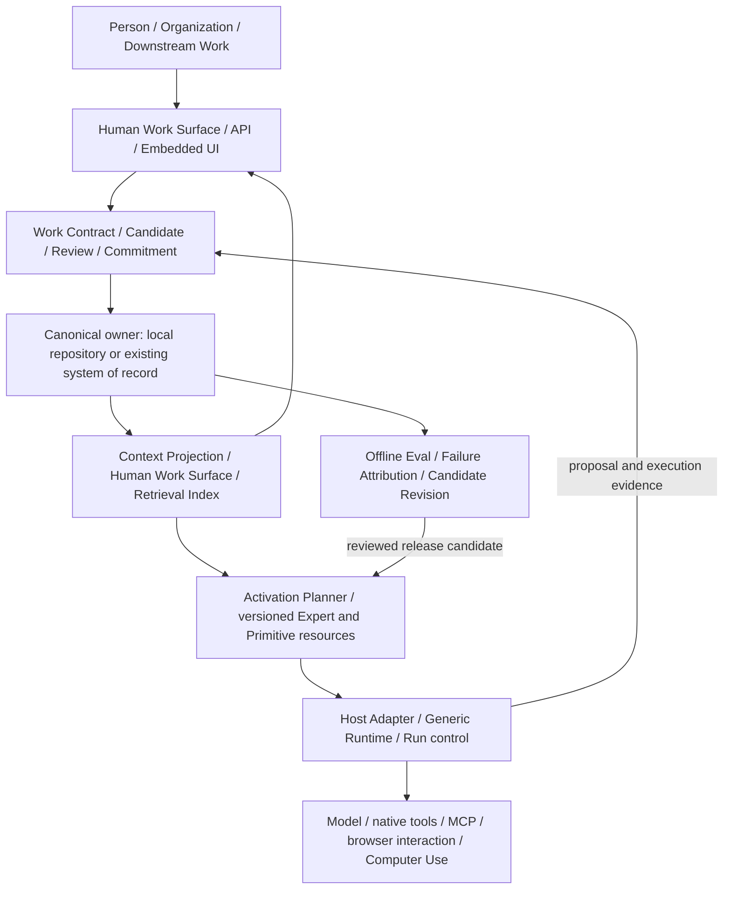

# Long-life Roadmap · 全场景与交互架构

## 2026-09-12 · Harness本轮授权排序

用户已授权[完整实施包](release/harness-implementation-2026-09-12/README.md)登记后串行推进。本段覆盖下方历史“待用户排单”。首节点MCP正确性/DeepSeek协议与GUI已获相应证据；后续按用户[保留Pi与局部Expert裁决](release/harness-implementation-2026-09-12/harness-dogfooding.md)优先coding dogfooding，第二Runtime替换不再是其前置。原P03/P04/DRT-03及完整Compiler、Core-free、同Expert验证保留按实际消费者落位。G1–G5保持原owner，当前状态见current。

2026-09-12：[Chat Memory Broker长期增量](research/chat-memory-broker-2026-09-12/README.md)接BE-19/20/23、LG/RG既有路线；Provider Session外的可选检索/编译与披露回执，不重写agent loop。只登记，用户仍独立审阅下一Harness节点后排单；不修改本次发布定义，不启动Provider接入或新memory API。

## 2026-09-12 · 资源、消息与持久成果治理准备

[RD-007](research/RD-007-resource-governance.md)和[分期roadmap](research/mature-practices-2026-09-12/roadmap.md)登记RG-BE-01…06 / RG-FE-01…03：来源保留与只读资源面→消息引用/保留关联→检索/版本注释→引用盘点及按需互操作。沿LG/DS/BG/Runtime既有owner，Core接受不与Library共享混同；DWB目录执行授权与内容关系分开。当前仅文档准备，不抢在途前端writer，不把九份消费稿当必须全部实施的承诺。

## Paper出版面 · 当前优先设计输入（2026-09-11）

优先消费[修订Paper发布版面](research/paper-publishing-2026-09-11/README.md)，Claude做原创编辑插画及出版view候选，Astra裁决，Luna索引。按[任务稿](research/paper-publishing-2026-09-11/CLAUDE-BRIEF.md)从独立SE Paper真实源和CourtWork角色token出发，保留双语/三卷/主题；不将发布面9月11修订替代论文内容版本。本项是出版设计优先，不重排独立在途产品writer或关闭下列产品门；当前交付为入账/索引/任务稿，未宣称Paper UI已实现。

2026-09-11输入接续：[Work临时能力消费](research/work-capability-input-2026-09-11/README.md)登记WCI-01–05，分别接DRT身份/profile、RD-005有界执行、context重投影实验、CUA待核与后置局部UI；未选择拓扑或启动实现，不改当前Claude Pages派单。

2026-09-11接续：[A/B v2接收](research/se-control-design-return-2026-09-11/v2/README.md)与[Pages独立任务](release/fresh-claude-pages-2026-09-11/ONE-SHOT.md)准备完成；待修候选按正式裁决消费，CR-05接DR-04，未新增产品接受。

## 2026-09-11 · 架构消费与发布准备

[DEC-013概念与DRT-01–04](architecture-runtime-canon.md)纳入本路线：本轮先完成架构、README和[图合同](release/architecture-reconciliation-2026-09-11.md)，随后用户独立架构review，Claude可视化串行；产品实现仍依基本GUI/通用Harness→自足节点→runtime替换证明。DeepSeek优先作协议与解耦probe，不自动改默认provider或自研loop。[Chat阅读CR-01–04](design/chat-reading-2026-09-11.md)补入DR-04；浮现、syntax color、MD与色阶/weight已登记可消费，未称已实现。后端候选和图表准备不关闭现有产品门。

2026-09-11 · WO-VS-01本轮本地候选已完成，产品f99af46，767/767及smoke通过。[交付与范围](../evidence/semantic-polish-20260911/README.md)记录逐表面处置、非作者修补闭合与作者视觉证据；13个Pages截图位保持pending，原生与既有产品门不关闭，未合推/部署。以下准备条目保留历史时点，当前状态以current和本轮执行附件为准。

## 本轮polish准备入口（2026-09-11）

后续用户补充已并入[P0.5 Product Semantics Registry计划](execution/2026-09-11-semantic-polish/semantic-registry-plan.md)：semantic与glyph分层、single/multi-purpose、六族碰撞审查、跨App/Pages映射及机器gate；复用现有renderer与来源账，不开始实现。

用户指定先入账、review、explore、plan，merge清洁节点后再施工。[WO-VS-01语义与界面polish](execution/2026-09-11-semantic-polish/README.md)统一消费语言/图标/Representation/Trace/Pages与已有SD、EX-IC2、WO-PG-01、CC-I、截图节点：基线盘点→原合同修约→Inspector/Activity→Telemetry/Usage→Attention/Settings/Home→Pages→真实视觉收束。Astra持架构、裁决、节奏、模型瓶颈实现；Luna fast explore与成熟有界实现，非作者验证独立。此入口仅准备，不重开在途writer或宣称下列历史节点已验收；基本GUI/通用Harness优先的总顺序保留。

## 当前串行执行入口（2026-09-10）

最新核账（2026-09-11，接单main `9097cbf`）：[Luna三路审计与Astra合推节点裁决](execution/2026-09-11-merge-node/README.md)确认下一产品节点为Summary D1/D2修复→CI-B/F × CS-01固定组合独验；当前NOT_READY。WORK-3采纳两行起步行为门，Card/Entry增量不捎带旧条件接受，EX-IC2 C等待固定基线。Harness并行P00现状/版本清账，首个产品候选为MCP结果保真及实际SDK接缝，RV26-Q03独立串行接收；BE-41择后续清洁节点。远端Benchmark/Pages Draft后置，研究入账不计产品完成。保留[前次核账](execution/2026-09-10-next-round/consumption-audit.md)原时点与[主题准备](execution/2026-09-10-next-round/README.md)，本段覆盖其中候选状态和WORK-3待裁定描述。

### 用户后续排序修订：基本产品与通用 harness 优先

本段覆盖下表原先以 BE-41 并行片作为近期主导的排序，不删除历史派单事实。先以基本前端产品面的完整交互反推后端缺口，同时检查无可见按钮的取消、恢复、权限和持久化基础能力；再收敛为自足稳定的通用 agent 节点。tool / skill / MCP 管理、普通自然语言 memory、web fetch、多级 prompt 编排均进入现状核验，不因用户报告缺失就跳过代码证据，也不因已有底层模块就称 GUI 闭环完成。

当前可先执行 [Pro 标杆与 harness 评审单](execution/2026-09-10-harness-pro-review.md)：先对标、缺口和复用选型，再生成有界施工合同，由本地 Astra light 实现、非作者复核。Claude 前端继续，本 session 接收合流。BE-41 保留既有请求记录，但不是通用基础完备门的前置，不扩展为 Spark/自研优先路线。

顺序为：基本 GUI 与通用 harness 闭环 → 自足稳定节点 → 自研编排封装的前后端合流及独立 runtime 替换验证。Courtwork 封装 Codex、Attention Assistant 封装 ChatGPT 网页端属于后续候选消费场景，不宣称已有受支持接缝。Rust 重构在稳定节点后按测量收益与迁移成本裁决；长期架构与 GUI 宿主方案现在可评审，不现在重写。通用 agent harness 与 Semantic Work Core 分开；自然语言 memory 不成为正式成果/决定的第二真源。

用户授权本 session Astra 统一清账与接收 Claude，并同时开独立 Astra light 后端 task。此处是唯一总顺序入口；[current](current.md)仍拥有实际交付状态，专项合同与证据保留各自事实，不另建平行总 roadmap。接单基线本次读取为 main `1992e90`，每轮必须重新读取实际 HEAD、工作树与交付 SHA。

| 顺序 | 工作 / owner | 合同与依赖 | 下一动作 / 完成条件 |
|---|---|---|---|
| 1 | Claude ChatSpace/composer → 本 session Astra 接收 | [控件施工稿](design/chat-controls-2026-09-10/pr-plan.md)；按作者实际交付逐片确认范围，不能把 specimen 当产品 | 等固定代码/证据 SHA，核对施工基线、单 writer 与负例；非作者复核后组合验证、合流和更新 current |
| 并行施工，串行接收 | BE-41 / 新上下文 Astra light（Astra low） | [冻结 DTO](design/spark-surface-2026-09-10/be41-dto.md)、[裁决](design/spark-surface-2026-09-10/integration-ruling.md)；只读现有 Core/project 事实，不依赖 composer 改动 | 已请求创建独立 task；后端实现与有界测试后交固定 SHA，不自行合入 main；本 session 在清洁接收点复核真实接线、缺测与快照边界 |
| 2 | 组合接缝 / 本 session Astra | 前两项实际交付；未交付的能力保持不可用 | 逐片串行合流，不将前端合成 fixture 或设计裁定算后端接受；已验事实入 current，未完限制留原台账 |
| 3 | 后续积压 / 本 session Astra | 本文长期路线、专项 PR 计划及 current 的未完门 | 前项清账后从实际状态选择下一有界单；本表不自动授权其余后端积压、部署或真实付费运行 |

每轮遵循：核对基线 → 读取合同/证据 → 确定单 writer → 有界施工 → 非作者复核 → 组合验证 → 合流 → 更新 current 与本入口下一动作。独立后端可以并行生产，但 main 接收由本 session 串行执行。Astra 负责架构、关键契约、迁移与集成；Luna 可做有界探索、分配实现及另一作者的独立验证；Claude 持有前端施工面。作者检查不构成独立接受。Fresh 只指新上下文，不是第二产品开发线。

2026-09-10 全交互范围补充：[Chat space 全量控件与 Product icon grammar](design/chat-controls-2026-09-10/README.md)已落[本地 PR 施工稿](design/chat-controls-2026-09-10/pr-plan.md)。包括全量按钮及 hover/focus/浮层、消息与文件动作，缺后端/宿主逐项登记；按清点→specimen→有合同的最小接线推进，不以界面参考创建能力或修改已接受的 icon family。

状态：长期架构设计，2026-09-08建立，2026-09-10补入多专家全turn与long-life消费路线。当前实现与验收只见 [current](current.md)；模块所有权见 [architecture](architecture.md)，提交与恢复契约见 [core-contracts](core-contracts.md)。本文件定义覆盖方向、依赖和证伪门，不把设计目标计作已实现能力。

“全场景”指不同工作能够以适当厚度接入同一套语义与治理边界。“全交互”指人在不同工作表面提出、检查、修订和裁决时，状态后果保持一致。覆盖地图需要完整，施工按最小消费者递进；不要求先建设全平台，也不以一个法律 demo 代表全部工作。

工程按DEC-012绑定 [PAPER.md](../PAPER.md) 中的 SE 9.6 / `d78fd312955c1f594e59cbdcbb0d3074ac355940`；9.3及候选坐标保留为历史研究输入，后续实现以9.6条款复核。源坐标、候选字节与本地覆盖差异见 [研究证据](research/longlife-2026-09-08/README.md)。R0–R5 保留为研究与验证阶梯；[PT0–PT9](pre-takeover-roadmap.md) 保存历史施工与资格设计；main已按用户授权先行接管，未完成的产品验证转由 [本轮公开完成度](execution/2026-09-08-main-round/public-readiness.md)承接。R0–R5、Runtime R2–R6与H0–H5是不同编号体系，不互相换算，当前实施按 [派单](execution/2026-09-08-main-round/README.md)。

## 1. 以工作需求决定治理厚度

每个新场景先回答四个问题：**什么留下、什么失效、什么阻止行动、下一次先看什么。** 再分别判断 judgment density、continuity requirement、consequentiality；行业标签不能代替这三个判断。

| 工作条件 | 合适的最小形态 | 必须保留 | 不默认增加 |
|---|---|---|---|
| 低后果、低连续性，如探索、改写、即时比较 | 普通工具或 copilot，加有用的 review 表示 | 当前输入、输出用途与适用的资源权限 | Matter、正式账本、额外批准流程 |
| 单次发送、发布、合并、批准等 consequential action | Commitment scope | 明确候选/动作意图、Authority、适用检查、效果回执与未知效果处理 | 为一次动作建设完整 continuity 系统 |
| 高连续性、稳定低判断的流转工作 | 现有 workflow/system of record，加必要模型步骤 | 状态、截止/等待、责任、幂等与恢复 | 把确定性流程全部换成 Agent |
| 高判断且跨时间、人员或版本持续的工作 | Continuity Profile；需要时采用 Professional Work Runtime | Matter、Assignment、Evidence、双轴状态、Review、开放义务、Context Projection、accepted outcome | 因模型更强而省去专业语义和问责 |

这些是选择配置的条件，不是新 ontology，也不是固定四套产品。一次探索只有在具体输出需要保存、委派或取得正式效力时才晋升；晋升绑定选定内容、来源与版本，不把整段聊天自动变成事实。原始轨迹仍可按需披露，不能为追求 State-only 丢失尚未编订的观察。

## 2. 贯穿长期路线的三条工作链

| 链 | 架构闭环 | 长期资产与出口 |
|---|---|---|
| A · 专家经验编订 | Demonstration → intervention/correction capture → 区分领域规则、机构配置、Matter 要求与个人习惯 → Candidate Contract/Expert → 原作者离场的 E2E → 有权发布 | Work Contract、Evaluator、适用/排除范围、HITL、release evidence、版本与弃用路径 |
| B · 工作执行与提交 | 当前状态/来源 → 三种投影 → Model/Human Proposal → Candidate → Evidence/Completion/Authority/Review → Committed Change → 新状态/成果/未决 → 下一次工作 | 生效成果、可信 Decision、Evidence 关系、恢复点与可承担后果的下游交付 |
| C · 生产反馈与改进 | 使用/Review/Revision/Failure/reversal → 保留可观察事实并标记推断 → Failure Attribution → Eval/Environment/Regression → 选择修订对象 → 独立验证与版本裁决 | 可解释的失败分布、Contract/Context/Tool/Harness/Evaluator 改进、经许可的训练候选 |

A 的发布不等于 B 中任何成果被接受；B 的接受不证明 A 可跨用户分发；C 的评分提升不授予发布或业务 Authority。首先通过现有模型与成熟基础设施证明工作收益，selective post-training 与 governed meta-improvement 保留为有条件研究分支。

## 3. 目标架构与所有权

这是逻辑责任图，可在一个应用内实现。人与 Agent 的提议进入同一领域写入规则；读取、运行、提交、外部效果和版本发布具有明确但不同的 owner。保持现有 M01–M14 模块编号，不另建一套并行平台分类。

| 责任面 | 现有模块 | 稳定契约 / 必要自研 | 优先复用及扩展触发 |
|---|---|---|---|
| 执行与接入 | M01–M04、M13 | 绑定版本和能力、终止/取消/未知效果、执行身份、admission 与执行处一致 | 现有 Pi、control plane、工具/MCP adapter；实际长任务需要时比较成熟持久执行服务 |
| 正式状态与连续性 | M05–M07 | Candidate/Committed、可信 Decision、版本/证据/效力、幂等/CAS、单一权威关系 | 复用 evidence-memo 开发 Core 与成熟存储；接既有系统时通过 adapter 提交，不复制批准真源 |
| 稀疏激活与投影 | M08–M09 | Contract/role/stage 与版本绑定；上下文选择/遗漏/失效；preset → Expert routing → bounded composition | 复用资源/profile/extension、索引和检索；按规模反例增加投影策略，不预载所有能力 |
| 人的工作面 | M10–M11 | typed decision、来源锚点、可见后果、view/version 一致、适用动作、历史 fallback | 复用现有 actions/surface 接缝与 UI 组件；专业字段和裁决语义由 Work Contract 提供 |
| 发布、评测与维护 | M12、M14 | 版本/依赖/rights、失败归因、独立评测、作者离场、revalidation/rollback/deprecation | 复用测试/评测/包管理/可观测设施；业务接受、Expert 发布和依赖升级各自验证 |

当前具体起点仍是 Pi + control plane + trusted extension + evidence-memo Core。该 Core 的已有提交能力值得复用，但不视为完整通用 Matter API；host 的运行 Artifact 与领域 Accepted Artifact 保持不同身份和效力。`/sessions/:id/actions` 是 mutation，`/sessions/:id/surface` 是 read projection；未来跨 session 的领域查询必须明确身份和 owner，不能假装现有 session 路由已经解决。

2026-09-08的覆盖快照见 [本地覆盖证据](research/longlife-2026-09-08/evidence/local-coverage.md)，不作为后续实现现状。2026-09-10研究基线 `8b1e0b1` 已有Core历史/producer缺席读取、AM-B持久只读adapted任务、Thread本地通信与BG-02同Session失败Run lineage；仍不能称自动后台自治、生产child/handoff或外部效果对账闭环。具体限制沿 [async](../app/docs/async-tasks.md)、[coordination](../app/docs/coordination.md)、[run-attempts](../app/docs/run-attempts.md)；后续接单重查current与实际HEAD。

## 4. 全交互覆盖：从用户意图到状态后果

下表是交互契约覆盖表，不是一次性按钮清单。动作只有改变 validation、Authority、状态、成果或下一次 Context 时才值得显式化。

| 交互族 | 用户可完成的工作 | 语义与服务要求 | 决定性反例 |
|---|---|---|---|
| 探索与引入 | 提问、检索、比较、导入材料、澄清目标 | 输出可暂存；引入来源/对象时保留版本和权限；按具体用途晋升 | 聊天建议、检索命中的旧观点被自动当成生效事实 |
| 人工直接工作 | 写文档、改表格、补证据、标注、修改 proposal | 草稿编辑可直接发生；正式变更由可信人机身份走适用提交协议；编辑形成可追踪版本 | 人工编辑绕过来源/版本约束；模型冒用编辑者身份 |
| 委派与执行 | 定义目标/成果/截止/范围、启动、steer、暂停、续行、取消 | Assignment 与 Run 状态分离；版本绑定；continue/stop/return/escalate gate 外置 | Run 结束被视为工作完成；取消被视为外部效果已撤回 |
| 检查与定位 | 摘要→逐项→原文/证据→历史/trace | 以 decision unit 编译最小充分 packet；同时看证据状态与机构效力 | approved 被显示成 true；隐藏 conflict/uncertainty 改变裁决 |
| 修订与补足 | revise、request work/evidence、qualify、defer、waive、escalate | 新候选、未决义务、限定、明确 waiver authority 和责任人；不擦除原判断 | 退回等于删除；豁免义务被解释为证据已充分 |
| 接受与取得效力 | accept/reject/approve/publish，按 Contract 允许的动作执行 | Candidate/version/actor/scope/检查/后果绑定；work acceptance 与外发 effect 分开 | 旧页面接受新版本；tool allow 被当成成果接受 |
| 改判与恢复 | supersede、withdraw、重开、替换 session/executor、灾后恢复 | 补偿/取代记录、active pointer、下游失效影响、trusted recovery | 为恢复重跑所有工具；已撤回内容被检索重新晋升 |
| 持续跟进 | 等待资料/人/远程任务、日程触发、监测、分批工作 | 持久 obligation/checkpoint、唤醒去重、过期授权重验、预算、通知偏好 | 重启产生重复任务/外发；无关变化持续打扰用户 |
| 协作与交接 | 换人、Reviewer 分歧、委派、并行 Lane、必要的独立 Operator | 共享工作对象、受限 scope、版本冲突、reconciliation、责任和最终问责 | 多 agent 共识冒充独立验证；共享材料跨 Matter 泄漏 |
| 配置与能力选择 | 用户/机构固定 preset，选择 Expert，未覆盖时扩大受限搜索 | 安装/启用/附着/运行/权限分离；升级不改变历史版本绑定 | fallback 扩大权限；后台换规则而 Reviewer 看旧版本 |
| 编订与改进 | 记录纠正、候选规则、评测、发布/回滚 Expert | facts / inferred semantics / authorized promotion 分层；多条 release authority 独立 | 高频习惯被自动升为规则；系统修改自己的评分器宣称进步 |
| 生命周期结束 | 归档、导出、移交、失效、按政策删除/匿名化 | 对象级 retention/rights、tombstone 或可解释缺失、恢复与导出边界 | 删除 session/插件误删工作；不可变历史阻碍合法数据处置 |

自动化不要求每个动作都让人点击。已授权、低判断、可判定的步骤可以由确定性政策放行；不可约专业判断与显式要求的批准仍交对应角色。系统不得用“全交互”给所有路径加一层通用确认框。

## 5. 多种工作表面与执行通道

Context Projection、Human Work Surface、Retrieval Index 来源于同一权威状态及版本，服务不同 attention 需求，不必采用同一表示。

前端复用的具体责任见 [Work Surface语义与组合边界](design/work-surface-boundaries.md)：Chrome提供共享表面，领域owner持有正式状态；Review、commit与外部效果分别绑定真实契约，Expert组合复用组件并保留专业责任。当前Fable施工沿其既有契约推进。

| 表面 | 首要工作 | 共享边界 / 扩展准入 |
|---|---|---|
| Chat / inline card / detail panel | 探索、委派、渐进披露、局部提案 | 不以聊天记录作为 Matter；卡片 action 绑定服务端对象与版本 |
| Document / spreadsheet / artifact workspace | 直接编辑、批注、diff、局部证据核对 | 共用领域状态与来源锚点；编辑器缓存和协作文档不自行取得正式效力 |
| List / table / queue / portfolio | 扫描、分批裁决、覆盖缺口、跨 Matter 排序 | Portfolio/Queue 组织 Matter；不合并权限；批量操作逐项保留合法性和结果 |
| Tree / graph / timeline / matrix | 范围、关系、生效时间、依赖和冲突 | 仅在该表示改善判断时增加 renderer；节点与动作仍由领域 Contract 定义 |
| Embedded surface / CLI / API / headless | 接既有产品、自动步骤、远程运行 | 不依赖专用页面；通过相同身份/版本/效果边界；无 UI 时不能伪造已取得的人类 Decision |
| Voice / image / multimodal interaction | 快速表达、现场材料、辅助访问 | 先生成可核对输入/候选；指代、识别和版本不确定时澄清；呈现渠道不新增 Authority |

Native API、structured browser interaction、Computer Use 是执行访问通道，与上述人的表面独立。优先选能表达前置条件、授权和结果核对且维护成本合理的通道；纯像素成功不证明外部成果已生效，API 返回成功也需遵守业务效果契约。高频通道才考虑编订为可复用 Primitive。

UI 的 loading、空态、失败、等待、断连、过时、部分完成、缺权限、冲突和恢复均投影真实状态。键盘、读屏、缩放、reduced motion 与多端同义是每个相关切片的基本要求；不等“最终 polish”才补。动态或生成界面只能通过受约束 renderer/action registry 调用能力，不能由任意生成脚本赋予正式写权。

## 6. 部署、状态所有权与信任分别选择

| 选择轴 | 长期支持方向 | 不变量 |
|---|---|---|
| Runtime 封装 | host-loaded Work Extension / embedded module / remote service-sidecar | 包的加载和停止不改正式对象的 canonical owner |
| 正式状态所有权 | 既有 system of record / 既有产品内部 / 新 Work 产品按对象持有 | 每类正式对象只有一个 owner；引用外部版本和回执，不双写互相独立的批准状态 |
| 执行供给 | provider-managed runtime / 私有薄 runtime；主权、私有、SaaS 模型与工具 | 用所需能力验证兼容；provider 质量与 Contract 有效性分开；模型和工具外发分别检查 |
| 人与组织 | 单人、角色交接、多人机构、外部 Reviewer | Operational Responsibility、Authority、Accountability 分别建模；机构身份和权限撤销不从 UI 标签推断 |

先用本地首方 extension + 领域 Core 跑通可见闭环；再做一个既有系统为 owner 的 sidecar 对照，验证无需接管系统也能取得治理收益。第二宿主、第二模型、第二 renderer、第二存储分别验证对应替换轴，不以一个 adapter 测试宣称全部可移植。

既有系统中的人或原有workflow直接提交时，以该owner的正式版本和回执为准。sidecar核对事件/版本后更新投影、标记旧候选过时并重新检查适用性，不要求外部人员重复经过SE批准，也不能把本地旧快照覆盖回原系统。轮询、webhook或同步adapter只是取得这些变化的通道，跨系统复制的先后顺序与权限仍需验证。

本地持久化不保证外部 exactly-once。外部提交需要 action intent、授权版本、接收方幂等或查询/对账、result reference、unknown 的升级路径；unknown 不得盲目重放。MCP Tasks 或供应商 job handle 只是其中一种 transport/lifecycle，不能替代工作接受和效果核对。

## 7. 长程执行、协作与稀疏 Attention

长期存在的是工作、义务和版本；Run、窗口与 executor 可丢弃。恢复重建当前有效成果、Evidence、开放义务、未确定效果与必要历史，不能只找回 UI 或重放模型思考。

- **时间：** 事件/计时/人工答复可以唤醒工作；调度只触发新的受绑定执行。过期授权、资料或规则必须复核。通知按有意义变化、完成、失败或所需决策组织，不把每次心跳变成用户任务。
- **并发：** 同一 Operator 的并行 Lane 共享运行义务；只有 scope/Authority/完成与升级路径相对独立时才增加 Operator。先用版本化 Candidate/branch 汇合，再按需要增加 messaging；版本冲突不会因并行成功而消失。
- **容量：** Store 总量可以增长，单次 Context、tools 与人的 Review 面主要随当前 Assignment working set 变化。同时测遗漏、污染、错误版本回引和 accepted outcome，不能只测 token 降低。
- **真源：** provider/session checkpoint 是执行恢复材料；Matter/System of Record 保存工作效力。UI/view/producer 卸载后由独立读取路径提供版本化 fallback，不能为显示历史偷偷恢复旧执行代码。
- **直接协作：** 多人编辑的草稿同步可以复用现成编辑器/协作技术；草稿一致性不等于正式接受。每次生效仍按领域 policy 处理版本、角色、冲突和异议。

先证明单一执行者可恢复，再按真实等待、吞吐或责任分工需求增加调度和并发。自治长度是可调整的运行配置，不能决定是否拥有更多正式权限。

## 8. 代表性验证组合

覆盖单位是责任结构与可观察边界，不按行业数量计分。无需穷举“场景 × 表面 × provider × 部署”的笛卡尔积；选择最小见证集，并对涉及同一边界的组合做配对实验。

| 验证任务 | 检验的差异 | 首选交互/结果 | 与 NDA 的关系 |
|---|---|---|---|
| 结构化对象逐项裁决 | 规则、Evidence、Candidate、Review、版本 | NDA 固定 playbook → ledger/diff → 接受/退回/恢复 | 保留首个有界主样本，沿 H0–H5 |
| 主张与来源校勘 | 支持/反驳/限定/时效、开放搜索、不确定性 | 研究 memo 或主张表 → anchors/relations → qualify/supersede | 检验 schema 不把不确定性压成合规分类 |
| 整改与跟进 | finding/control/evidence/owner/remediation、截止和重开 | 审计/工程问题集 → queue/timeline → 补证据/延期/完成 | 检验跨时间、换人、义务而非单份文档 |
| 弱 commitment 对照 | review 表示的收益与建模成本 | 一次性比较/摘要，表格或 diff 辅助审阅 | 允许不建 Matter；若结构无收益就删除 |
| 单次高后果动作 | 低 continuity 仍有承诺边界 | 隔离环境的发布/发送 intent → 校验/回执/unknown | 不让 NDA 的完整 Matter 成为所有动作前置 |
| 已有 system of record | sidecar 不接管正式对象 | 外部版本→候选→原系统提交→回读与冲突 | 检验真正部署可替换性 |

前三类来自 Practice 的共享场景要求，弱 commitment 是其必要对照；后两类验证 commitment scope 与部署边界。领域示例可替换，不能省去被它检验的责任结构。软件工程利用已有 repo/diff/CI，只补意图、架构、兼容、完成与 release authority 的缺口，不复制工程师已能低成本完成的手动 loop。

## 9. R0–R5：按证据依赖递进

这些阶段是可复用的检验阶梯。每个局部可按风险进入相应阶段，R5 的维护纪律从首个持久对象就开始；不要求所有场景同步过门，也不把 R3/R4 改成无限扩张清单。

| 阶段 | 架构交付 | 退出证据 | 缩小/停止条件 |
|---|---|---|---|
| R0 · 覆盖与局部选型 | 场景三轴、交互族、owner、已有资产、成熟来源和差异；四个最低问题 | 每个所选切片能定位消费者、所需边界、owner 和未知项 | 只能列功能/行业，没有可观察治理增量 |
| R1 · 契约与实验 | 最小 Work/Review/Completion/Search 契约、输入/动作/效力、版本、对照、Reviewer、适用部署 | 成功与失败可判定，gold/holdout 与权益可获得，复杂度预算明确 | 无法区分事实/效力、无法确定接受者或观测后果 |
| R2 · 组件与边界 | 复用 runtime/store/editor 等组件，完成必要薄适配与反例；实现当前消费者所需接缝 | 提交、取消、恢复、权限、projection 与 source/version 门分别有固定证据 | 必须长期 patch 上游内部；正式状态可绕过；恢复/外部效果不确定却被当成功 |
| R3 · 有界端到端采用 | 首先 NDA 主样本；逐步补主张校勘、整改和弱 commitment 对照的最小见证 | 一类任务可完成提案→修订→接受→恢复；独立合格使用者能判断成果；真实链与 fixture 分列 | 作者持续代驾；Review/恢复成本不降；不确定性被隐藏；则缩小 Contract/交互 |
| R4 · 组合、替换与分发 | 第二任务结构、独立 UI channel、已有系统 sidecar；需要时第二宿主、provider、并行或远程任务 | 对被替换轴保持规定的语义；原作者离场；AOT/JIT 与权限等价；声明范围内 E2E | 语义需重写则缩窄可移植性；没有第二消费者就不抽通用 SDK |
| R5 · 长期维护与经验编订 | 真实升级/撤销/恢复/归档；漂移、分歧、reversal、修订和重发布；权利与依赖退出 | 至少一次真实变化前后可追溯；迁移/回滚/历史读取有证据；收益持续且维护成本可说明 | 维护/捕获成本超过收益、上游已补齐、训练只过拟合接口；删除胶水或收缩产品范围 |

R3 的任务集合表达覆盖目标，不要求第一轮并行做完。R4 的验证逐轴开工，不一次替换全部技术。真实身份/外发/多人/复杂文件格式按各自证据门推进，不能借 NDA 或 baseline 测试提前关闭。

[Design D0–D5](design/prototype-plan.md) 仍承担来源、原型、真实纵切与持续体验验证，可与相应R阶段并行；[完成面](design/completion-surface.md) 是产品体验目标，当前Work Surface Kit是有界施工范围，两者不互相代替。fixture可提前验证交互和投影，不能据可点击原型宣称真实执行或正式提交已通过。

## 10. 当前切片与扩展触发

### 多专家讨论收敛：长期工作先于运行时扩张

[全turn研究账](research/multi-experts-2026-09-10/README.md)消费23个turn、44条消息与44个唯一显式URL，保留缺失回复、原文中断及外部核验边界。[选型/负索引](research/multi-experts-2026-09-10/selection-index.md)将Expert/presence、Spark、检索、归档、runtime与21种模式映射到现有owner；[PR施工稿](research/multi-experts-2026-09-10/pr-plan.md)逐项归并原HC/RA/AT，不建立平行队列。

| 顺序 / 阶段 | 长期工作增量 | 证据门 / 缩小条件 |
|---|---|---|
| 先确定性治理 · R1–R2 | ME-01并LG-00…04：manifest、来源身份/版本、rendition、exact/lexical与增量失效 | 无模型仍有效；重建等价、权限和路径边界成立；无收益不增加语义索引 |
| 再派生与恢复 · R2–R3 | ME-03/04：Spark候选、当前context、closeout/rehydrate、安全遗忘 | 正式事实不依赖Spark私有memory；无旧chat仍保留义务/冲突/unknown；通用archive等真实领域消费者 |
| 稀疏人类Attention · R2–R3 | ME-06并原Attention/HL：event关联、预算/去重、重要变化与受控新Run | 少通知且不漏关键事项；新运行重验权限；BG-03之前不自动重放未知外部效果 |
| 薄执行与替换 · R2–R4，独立于前述价值 | ME-02/05/08：Pi默认，角色/配置清晰、符合性、一个第二runtime | 单轴七删除测试；native/adapted/unsupported如实；无第二消费者不抽SDK，不先Rust重写 |
| 外部agent消费 · R4，按需 | ME-07：同owner只读MCP/CLI；有用后再MCP App/tunnel；Google后置 | 同权限/版本/效力，capture只是Source；不能因外部界面扩大权限 |
| 长期产品与学习 · R3–R5 | ME-09从第一片计成本，ME-10经权利与独立证据再编订规则/训练 | 成果质量和全生命周期净收益双门；保留失败/reversal，无PMF/训练收益不扩张 |

[2026-09-11命名参考裁决](design/spark-surface-2026-09-10/naming-reference-2026-09-11.md)采纳稳定产品名与模型档位分层；自治控制面/自动续行仍按原ME与后端合同探索。本路线中的Spark是资料与派生维护责任名，Attention是人的筛选与动作队列；不因名称另建canonical store。Expert不等于runtime，presence/selection/working/Assignment/权限分别表达。默认Pi由T19最终讨论收敛；Codex/ACP是替换候选，Gemini/Antigravity、PTY与原生TUI后置。并行是局部瓶颈方案，未测得收益前不建DAG/多agent平台。

[长期验证](research/multi-experts-2026-09-10/benchmark-plan.md)沿既有强T/S/E基线，覆盖首次摄取、增量、重建、执行、恢复、review和维护成本；tokens/cache只是分项。Long-life处理有限的机器和人的attention，不靠固定窗口大小定义价值。删除/降级/取代/压缩/过滤须保留真实义务和适用关系，外部pattern/厂商性能不自动成为SE或CW结果。

### 本地资料治理 / Explore 的后续输入

[全量来源消费与自研准备](research/local-governance-2026-09-09/README.md)为R1–R3补充只读Intake、rendition、可重建索引、typed findings与有界Explore路径；[PR施工稿](research/local-governance-2026-09-09/pr-plan.md)按LG-00…04分批，[评测](research/local-governance-2026-09-09/benchmark-plan.md)先比较冷读与exact/lexical，再按瓶颈考虑语义或并行。正式状态复用Core，运行复用Session/Run；全部为planned，不改变当前产品施工顺序。依赖仅索引，未采用。

### 运行时局部解耦 / 长期维护

[架构研究并账](research/architecture-maintenance-2026-09-09/README.md)沿M01…04/M08…11/M14补[AM-A…F](research/architecture-maintenance-2026-09-09/pr-plan.md)：固定能力与最终请求基线→只读异步纵切→按缺口补生命周期和前端贡献→独立维护演练，对齐Runtime R3→R4→R5。它消费前述LG/EX的工具与控制需求，不新建平行loop/ledger；全部是后续施工计划。正式选择仍需固定版本、权限/恢复/缓存证据与退出成本，不做全局插件化改造。

### 数据系统原则 / 后续验证增量

[DDIA研究消费](research/data-systems-2026-09-09/README.md)从状态持有、确切接受、派生重建与长期解释需求推导[DS-00…04候选PR](research/data-systems-2026-09-09/pr-plan.md)：先状态/写者清单与回执核对，派生重建并入LG-02/04，兼容/替换并入AM-F与ES迁移，外部效果对账等实际消费者触发。复用M01–M14与R0–R5，不另造正式状态owner，不默认引入event sourcing、outbox或workflow平台；报告六周日历与建议分数不成为工期/验收标准。本包仅规划，产品顺序及G1–G5不变。

### NDA / Experts 验证路径

[NDA 与热插拔研究](research/experts-hotplug-2026-09-08/README.md)、[H0–H5 PR 施工稿](research/experts-hotplug-2026-09-08/pr-plan.md) 和 [验证设计](research/experts-hotplug-2026-09-08/validation.md) 是 R1–R3 的第一条具体路径：H0 固定实验；H1 复用领域 Core 补规则/修订/投影契约；H2 顺序执行；H3 真实 Review 与 fallback；H4 按缺口补生命周期；H5 配对裁决。NDA 的规则结构和人工审阅强度不升为所有工作的固定模板。

| 证据触发 | 后续施工单的最小责任 | 已有依赖 / 明确门 |
|---|---|---|
| H1/H3 的同源 state/action/projection 成立 | 第二个主张校勘或整改 Contract 的有界试装 | 先用新责任结构做删除/泛化测试，再抽共享 payload/renderer |
| 等待人、资料或 deadline 开始占主要恢复成本 | 一类持久等待/唤醒与去重 | 现有 Run owner + obligation/checkpoint；先比较成熟机制，不新造调度平台 |
| 真实流程要求发送/发布或远程持续工作 | 一个可对账的 external-effect/remote-task adapter | 明确 owner、版本、授权、回执与 unknown；不预先做全套连接器 |
| 一个已有业务系统愿意承担正式 owner | 一个 sidecar 读/提案/提交/回读纵切 | 不复制正式批准状态；验证断线、远端已变更与重复提交 |
| 顺序执行出现实测 latency/context 瓶颈 | 同一语义下的 Lane/branch/reconciliation 对照 | 不先增加独立 Operator；质量与冲突不因吞吐提升而恶化 |
| 两个任务或用户重复需要稳定能力 | 最小 Expert 发布/兼容/稀疏路由 | E2E、原作者离场、scope、freshness 与 rollback；不自动建 marketplace |
| 多人对同一成果产生真实冲突 | 一个角色交接或多人裁决纵切 | 机构身份、权限撤销、草稿同步与正式接受分离，Accountable Principal 可查询 |
| 一个正式成果需要另一种工作表面 | 一个 editor/API/embedded/voice adapter | 保持 decision/Authority/state 后果等价；voice或CUA不额外赋权 |

当前 Work Surface Kit 的 question/permission/outcome 范围仍独立成立；NDA 的领域 Review 不借其验收。真实 provider 继续走用户 Web UI 配置与相应证据路径。路线设计不创建定时任务、不启动新运行服务，也不改变 main 接管资格。

## 11. 专家发布、生产学习与退出

Compiled Expert 先是经过验证的激活配置。稳定场景用 preset，有限歧义在批准的 Expert 集合内路由；未覆盖事项进入受限 primitive composition 或人类判断，保持 Candidate-only 和可见升级。新的纠正作为候选规则保留，不能原地改 active version。

每个发布版本至少保留 owner、适用/排除范围、来源示范与 correction、Contract/依赖/模型/工具版本、评测样本与 Reviewer 分布、最后验证时间、freshness trigger、abstention/fallback、rollback/deprecation。示范作者、规则编订者、Evaluator 作者与最终接受者的关系必须可见；同模型多次同意不算独立专业验证。

正常编辑、Artifact diff、Review 和结果优先提供低负担记录。先区分自动事实、推断语义和授权晋升；再将错误归因到 Evidence、Contract、State、Context、Tool、Harness、Evaluator、Model 或机构分歧。label 碰巧正确而理由错误时，不把错误理由作为下一轮规则或训练监督。

训练只在复用权、隐私/机构范围、可靠归因、held-out Work Eval、风险分层和后续现实反馈成立时成为候选。先比较改 Contract/工具/上下文与更换现成模型的收益和成本；不以未来训练飞轮为当下产品价值担保。系统提出对自身规则或 evaluator 的修改也须独立评价、受权发布，并可恢复旧版本。

## 12. 横向验收与长期持有纪律

当前节点的UI/runtime合流、候选push与工程/发布双线安排见 [阶段发布计划](release/2026-09-08/README.md)。README、预览Pages、可构建GUI DMG和独立网页review分别绑定实际版本与证据，不替代本路线的领域/研究验证门。

| 维度 | 关键证明 | 不足时撤回的主张 |
|---|---|---|
| 权威与效力 | Candidate/Committed、actor/scope、CAS/幂等、外部回执、dual status | 正式提交、自动外发或组织级可用性 |
| 连续性 | session/executor 替换、失效/撤回、义务、证据与 trusted recovery | State sufficiency 或长程自治 |
| 投影与交互 | 相同 snapshot 的三种投影、不同 renderer/action 后果、Review sufficiency、可访问性 | 全交互等价或用户可独立裁决 |
| 稀疏与组合 | capacity scaling、omission/pollution、scope、AOT/JIT、branch/reconciliation | 稀疏通用性、零语义迁移或多 agent 增益 |
| 产品与编订 | accepted work product、实质修改、later reversal、Review/capture 成本、原作者离场 | 专业可分发性、组织学习或独立产品机会 |
| 生命周期 | reload/unload/absent producer、schema/依赖升级、备份、retention/删除、rollback | 热插拔、可迁移或长期可维护 |

Evidence 分成源码机制、确定性 fixture、真实 runtime/provider/外部系统、独立使用/专业成果和长期结果；每项绑定实现 SHA、输入与依赖版本、范围和复核者。组合实验只能支持组合收益，组件因果要做可实施的消融；弱 commitment 对照允许结论为“不需要这些结构”。

每次新增字段、服务、renderer 或依赖都问：删除它是否使权限、完成、审阅、恢复、成果采用或维护成本明显变差？没有可测价值就删除或降为按需材料。新市场/新行业不是自动扩张理由，新的责任结构、消费者和可观测失败才是。

维护触发包括来源/法律/机构政策、模型/工具/宿主、schema/Artifact 格式、Reviewer 分歧、reversal、权益/许可、依赖停止维护和文档负担变化。按触发器重开受影响局部；定期人工复核依赖与恢复路径是维护建议，不是已部署的监控。来源探索和只读 diff 由 Luna 承担，Astra 负责架构、必要自研与集成，代码作者不自称独立验收；沿现有前端单一 writer 机制合流。

Paper 的回流只包含有固定工程 commit 与证据支持的泛化观察，在唯一 Practice Index 裁决。日常状态留 current、模块责任留 architecture、具体实验留 RD/研究证据、本文件保留长期覆盖与依赖，避免再建立平行 revision ledger。

## 2026-09-11 · 系统Design送审

[SE控制面one-shot](design/se-control-one-shot-2026-09-11/HANDOFF.md)覆盖DG-01–09、Scout分层摘要和Taste Memory；用户提交独立Design后Astra裁决再拆施工。发布26图已有a01/34563551594回执，深色气泡修正另记5e3a504，不把送审计划写成产品接受。

Design返回接收完成：[Astra裁决与DR-01–06](design/se-control-one-shot-2026-09-11/return-intake.md)登记7页/19板、45行审计、五处分歧。DR-01来源/裁决已交付；DR-02图标/header、DR-03真实控制面、DR-04Chat/Composer/Settings、DR-05隔离样例、DR-06Pages按各片合同继续，候选资产不自动成为canonical。

## 2026-09-12 · 工作义务闭环登记

[Attention/Spark闭环](research/obligation-closure-2026-09-12/README.md)接ATT/ME-06/LG既有路线：先带版本的采用、消费、实现和检查回执，现Core owner负责关闭。Spark核查不自动resolve，heartbeat不证明完成，Tension仅投影候选；调度规则与执行留后续，不改发布面或当前Harness排序。

2026-09-12整体模型：[governed work loop及独立review入口](release/governed-work-loop-2026-09-12/README.md)采用四职责围绕受治理工作状态，沿现有BE/LG/RG/ATT/ME路线消费，不新增四agent架构或扩大自动关闭权限；review先审owner/回执/披露与实施缺口，再决定下一节点顺序。

2026-09-12 Chat收敛：[薄能力层](research/chat-memory-broker-2026-09-12/thin-capabilities.md)采用人主导讨论与有界执行互补，按需补足检索/来源；模型能力与Harness效果不作未经验证的强弱/因果结论。仅登记main，沿现有路线消费，不改发布或排单。

2026-09-12：[工作现场恢复](research/obligation-closure-2026-09-12/recovery-surface.md)接ME-06/LG与既有Core读面，先获准工作集合、版本证据和恢复理解，后定义巡检调度；不把输入生命周期枚举或跨Runtime恢复承诺当作已实现。
