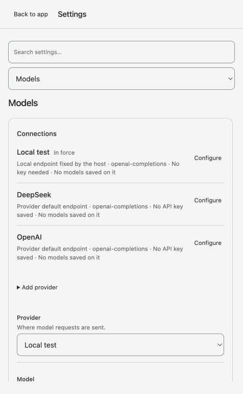
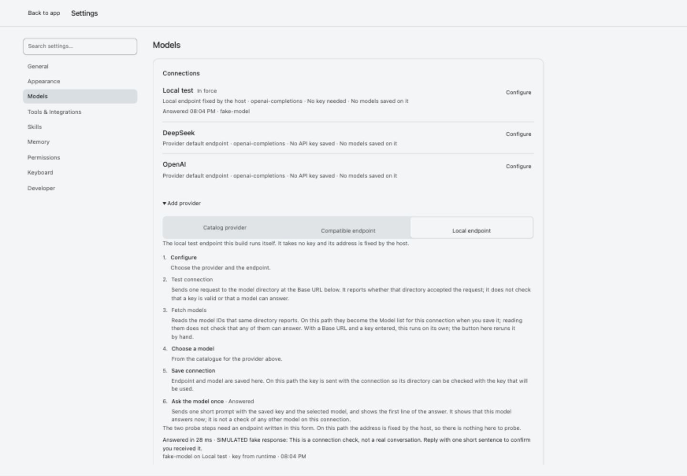
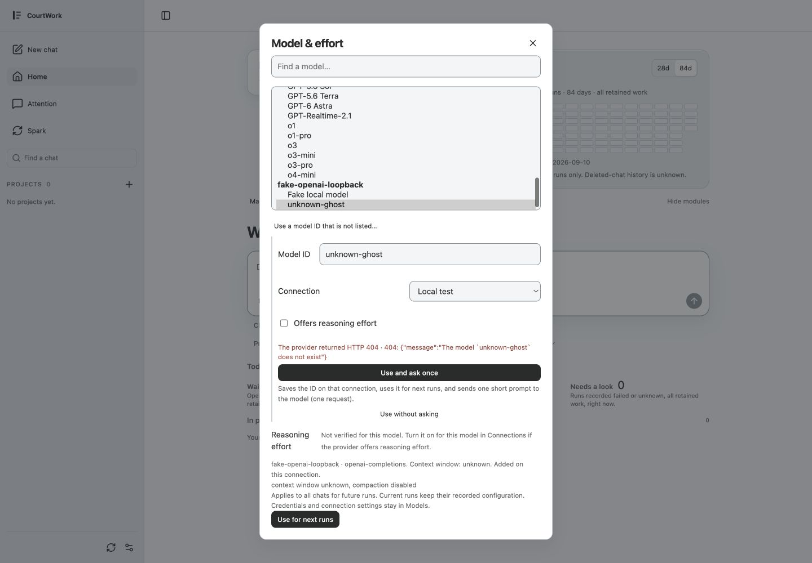
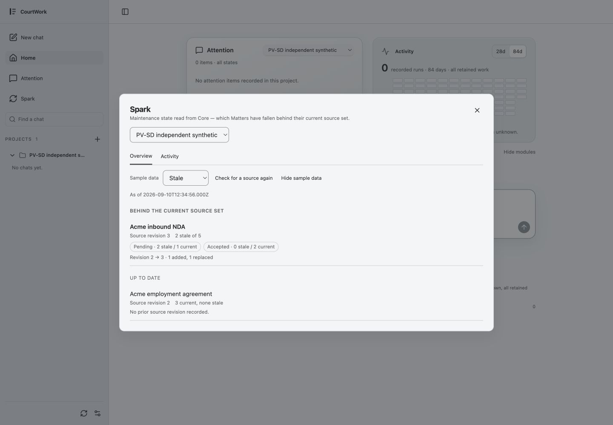
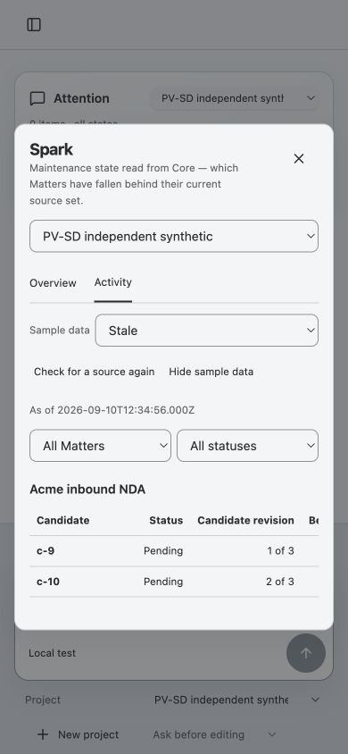
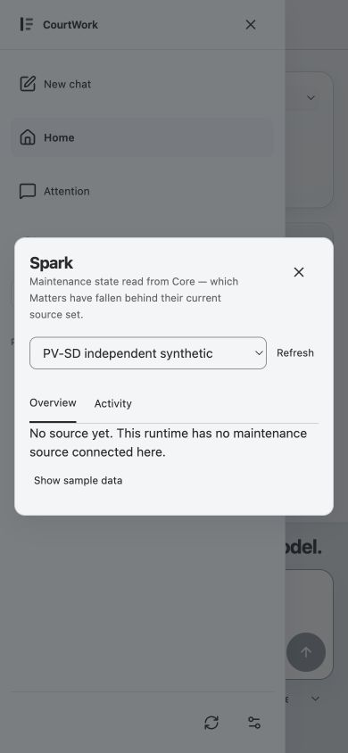
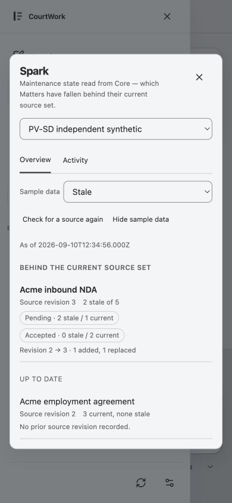

# Astra · actual in-app flow audit

2026-09-10. Synthetic data only, loopback port 19345, actual Codex in-app browser
controls and screenshots; no injected live payload in this capture set. Images
were saved from the browser and the saved files inspected before acceptance.
01–05 show the initial integrated UI (`d4819ec`); 06–07 follow a server restart
and page reload on fixed product `654411e`. The browser viewport was restored.

| Step | Task and health | Evidence |
| --- | --- | --- |
| 1 | Settings → Models: pass. Connection identity and configuration entry are visible; catalog and compatible entry meanings remain distinct. | 01 |
| 2 | Local Save and ask once: pass. Answer, SIMULATED content, timestamp and connection receipt appear. Subsequent Save-only clears the displayed receipt rather than claiming a fresh answer. | 02 |
| 3 | Custom `unknown-ghost` → Use and ask once: pass as failure handling. Explicit HTTP 404 is displayed, not recast as a successful connection or a guessed model-not-found category; model remains selected and context/effort unknown. Closing returns focus to the connection trigger. | 03 |
| 4 | Spark → Show sample data: pass. One Sample data label; stale/current sections; titles read-only. Check for a source again preserves sample on actual 404. | 04 |
| 5 | Spark Activity at 390px: bounded pass. Controls reflow and candidate table has horizontal overflow within its own region; rightmost columns require horizontal scrolling. | 05 |
| 6 | Fixed version reload → Spark: pass. No source yet, no automatic sample. | 06 |
| 7 | Fixed version Show sample → Check again → Hide → Escape: pass. 404 retains sample, Hide returns to no-source text; Escape returns focus to Spark navigation. | 07 |

## Scope and remaining observations

Strengths: source and verification outcomes are textual, explicit preview is
reversible, unsupported facts stay unknown, and sample IDs are not actionable.
The table's narrow-screen discoverability and raw ISO As of text remain polish
observations (the latter is already SD-21), not new authority or backend work.
The raw provider error is verbose but deliberately preserves upstream wording.

Screenshots do not establish full accessibility conformance, touch behavior,
screen-reader announcements, real-provider outcomes, or slow-body race safety.
The last is checked separately by the non-author synthetic race probes; this
audit does not pretend the absent BE-41 backend is live. Independent FE evidence
also covers 390px dark; the root capture set here is light.

## Accepted screenshots

### 1 · Models entry

### 2 · Local answer receipt

### 3 · Unknown model HTTP failure

### 4 · Explicit stale sample

### 5 · Narrow Activity

### 6 · Fixed version no-source entry

### 7 · Fixed version explicit sample

