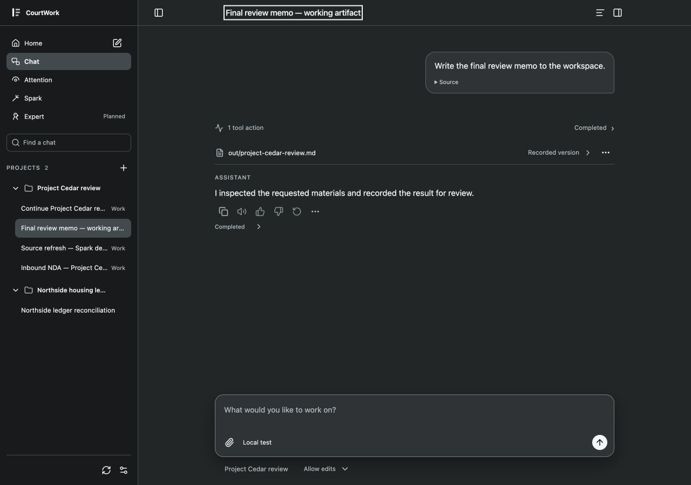
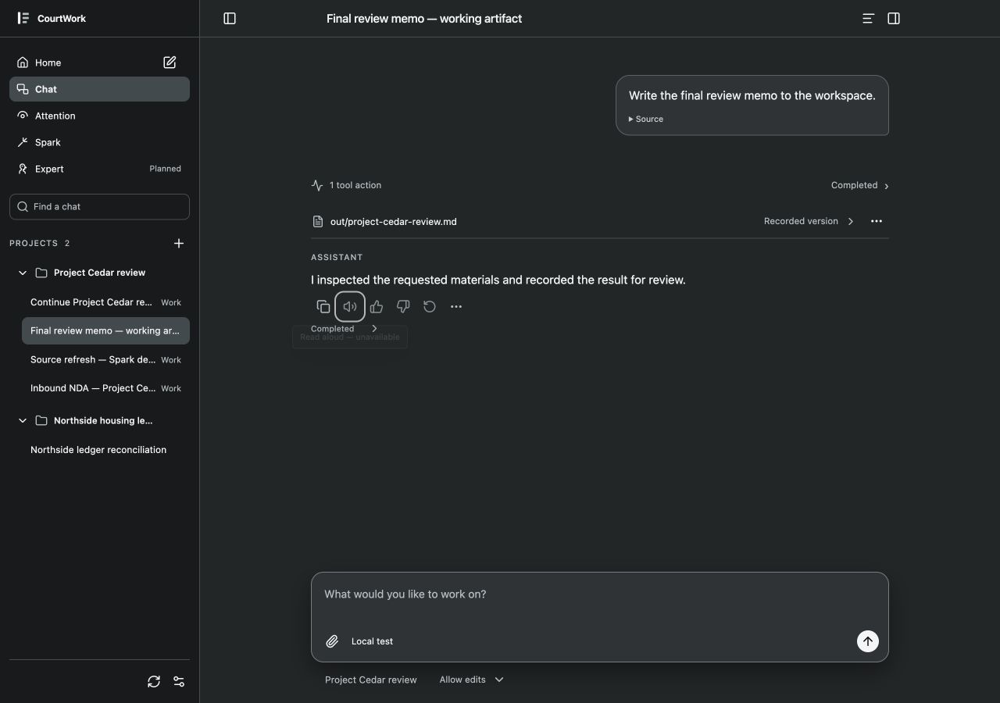

# Response actions · optical audit

2026-09-12 · User requested Luna audit and governance under existing grammar. Source fixed at07688226330121e5877a6ff1e09e6ebf82995ae3. Root captured native in-app browser; Luna independently inspected the saved current screenshots, supplied crop, CSS and Lucide sources. No source patch was recommended or applied.

1. **User reference — apparent size difference.** [Supplied crop](00-user-reference.png): Read aloud has a rounded hover tile. It is not a larger button.
2. **Current complete Chat — geometry passes.** [1280 dark](01-before-1280-dark.jpg): all six visible buttons32×32, icon slots18×18, gaps2px; centers414/448/482/516/550/584. All centered within about0.5px. Approximate bright-pixel bounds: Copy18×17, Read aloud16×13, Like16×17, Dislike16×16, Regenerate14×15, More14×3. These are different native Lucide path silhouettes, not inconsistent layout boxes. Ellipsis intentionally occupies little vertical area.
3. **Keyboard focus — passes within scope.** [Focus capture](02-focus-1280-dark.jpg): actual Tab from Copy focuses Read aloud; shared2px outline/2px offset with no reflow. No message action invoked. Accessible labels, aria-disabled and tooltip support are present in source.

Nearest precedents: `app/web/ui-controls.mjs` iconButton; `app/web/styles.css` shared focus/icon-button and response-action-row rules; `app/web/chat-actions.mjs` capability/action assembly; shipped Lucide symbols in `app/web/vendor/icons.svg`. Slots and stroke family remain unified. Do not introduce per-icon scaling, transforms or padding to make painted areas artificially equal. Full screen-reader interaction, touch operation and all action backends are outside this optical audit.

